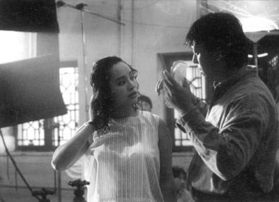
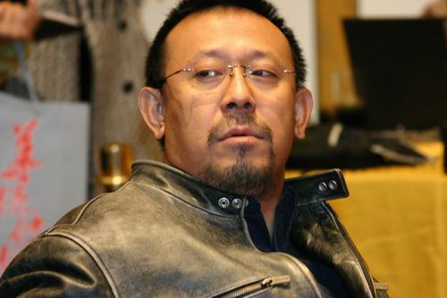

# ＜玉衡＞岁月的愁容

**跌宕起伏的剧情、黑色幽默的风格、含沙射影的技法、久石让的配乐、大牌飚戏的快感……这些都是《让子弹飞》冲突5亿票房的砝码。终于有一位华语大牌导演不需要我们去记忆里寻找本真，因为姜文犯坏的样子像极了躁动不安的马小军，谈不上“以不变应万变”的高深智慧，或许他是怕步子迈大了扯着蛋。** 

# 岁月的愁容

## 文/ 张开埠（江西财经大学）

三年之后，我们又等来了姜文，这一次他站着把钱赚了。

姜文总共拍了四部电影：意识流的《阳光灿烂的日子》、现实主义的《鬼子来了》、魔幻现实主义的《太阳照常升起》、荒诞派的《让子弹飞》，部部都是经典。

我们都爱一个叫做姜文的坏家伙，他像个不更事的调皮鬼，撕扯着大佬们的楚楚衣冠，冲他们做着鬼脸，执拗地在岁月的愁容上涂抹着亮色。套用老流氓王朔的话就是：他是我们生活中的一道汤，没他不好玩。

1994年，《阳光灿烂的日子》很火爆，姜文还年轻。可就在那个时候，已有人称姜文为“中国最好的导演”，而姜文早已借咕噜木之口做出了回应：傻逼！当年的姜文或许桀骜，抑或狂狷，但绝对诚恳，他试着记录的年少感动了无数大院里长出来的孩子。

而我们今天看到的姜文总是叼根烟，有点轻蔑地看着这个世界，胡渣长起来了、皱纹多了、眼神狡黠了，但腰板依旧笔直。拍过两部叫好不叫座的片子之后， 姜文意识到纯文艺的东西在中国总是显得过于矫情，于是，他学会了克己。在《阳光灿烂的日子》里，马小军喜欢拿自制的“望远镜”对准米兰的小粗腿、小蛮腰、大胸脯，荷尔蒙的味道扑鼻而来。而在《让子弹飞》中，张麻子对花姐的情愫却掩盖得纹丝不露，最激烈的时候也只是眼神有些黯然。临别时，给心爱的人送上两把枪，有人说这就是成熟，而我觉得这才是浪漫。

姜文的成熟迷人之处在于：有克己的智慧，没求人的姿态。影片结尾，曾经口口声称最爱听“穷人得钱后的欢呼”的“革命者”却在讨论“去上海，还是去浦东”，更加讽刺的是他们坐的还是昏官用过的小火车。花钱买官进城当县长，得钱辞官出城去上海，革命的意义难道只是杀个恶霸，告慰一下自己英雄情结？驱散了城里的阴霾却助长了心里的贪念，百姓有了钱没人管比没有钱有人欺更可怕，因为秩序才是王道。

如此赤裸裸的政治寓意竟没有被广电总局那帮审片的老头打包退回，由此可见，在这片苛刻的土地上，屈服退让的反义词并不总是宁死不降，有时候还可以是 见招拆招，只不过这一次特洛伊木马里藏的不是攻城的士兵，而是常识。正如老罗所言，有能力的人总是可以把理想主义和现实欲求揉捏得很好。

跌宕起伏的剧情、黑色幽默的风格、含沙射影的技法、久石让的配乐、大牌飚戏的快感……这些都是《让子弹飞》冲突5亿票房的砝码。终于有一位华语大牌导演不需要我们去记忆里寻找本真，因为姜文犯坏的样子像极了躁动不安的马小军，谈不上“以不变应万变”的高深智慧，或许他是怕步子迈大了扯着蛋。

“那年我17岁，她也17岁。”一群老男人所有的怀念都凝聚在这一句了，而他本可以像《非诚勿扰2》那样狗血，唠唠叨叨地坐在观众的床头倾泻无望的梦想及远古的乡愁。但是他没有，或许他望着岁月的愁容时，不想像王朔那样光会唉声叹气，他或许觉得这个操蛋的世界还有救，而他只是想试试。

 

（采编：林静；责编：陈锴）
