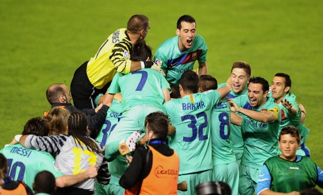
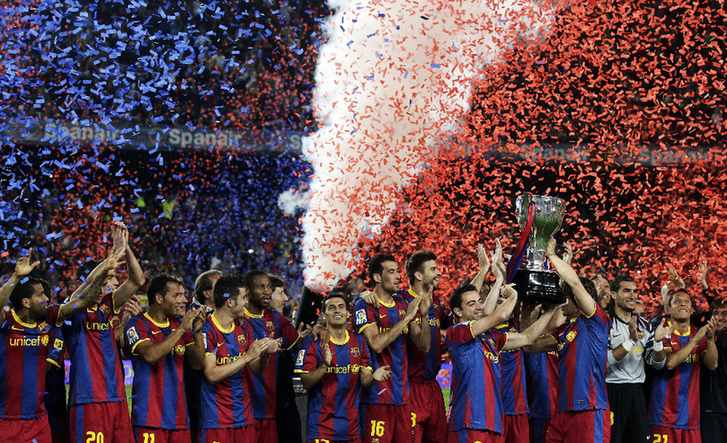

# ＜玉衡＞巴塞罗那，面对着你的我不知道如何是好

**套用一句话，你们咒骂我，那是因为你们害怕我。即便反对的声音很多，但是，巴萨很强大，是我不可以选择性无视的事实。他们习惯了面对着压力而战，他们开创了一个属于他们的时代，会被记进足球的历史。各种灵活的穿插跑动，各种见缝插针的直塞球，巴塞罗那在演绎着一种与众不同的足球艺术。**

# 巴塞罗那，面对着你的我不知道如何是好

## 艾黎（上海海关学院）

 也许我是个萨黑。不过今天不是。 提前两轮夺冠，也许是本赛季四大联赛的主旋律。巴塞罗那也没有逃出巧合的五指山。 512，汶川地震三周年祭日。巴萨在这天夺冠，也许可以些许弥补了去年访华时对于绵竹受灾儿童的一些不尊重，让那些喜欢巴萨、喜欢梅西的孩子们可以开开心心地继续生活下去，不再有哭喊和迷茫。 

不用回到诺坎普，巴萨全队在瓦伦西亚市政球场就迎来了三连冠的狂欢。球员们拥抱着，记者们簇拥着，一个赛季过去了，他们没有让穆里尼奥抢走原本属于他们的荣誉。这个夜晚，他们是西班牙的焦点，他们是西班牙的宠儿，去他的假摔与红牌，去他的干爹和飞腿，今夜他们只想抱着奖杯入睡，一直到天明。 套用一句话，你们咒骂我，那是因为你们害怕我。即便反对的声音很多，但是，巴萨很强大，是我不可以选择性无视的事实。他们习惯了面 对着压力而战，他们开创了一个属于他们的时代，会被记进足球的历史。各种灵活的穿插跑动，各种见缝插针的直塞球，巴塞罗那在演绎着一种与众不同的足球艺 术。 当人们寄希望于巴萨的伤病使其实力被削弱时，当皇马球迷慨叹拿到这个联赛第二已经满意时，当巴萨一直排名欧冠夺冠赔率第一时，你必须有所意识，这是 一支几乎强大到不可战胜的欧洲之王。也许他们有一些身体上的缺陷，但是他们非常擅长他们擅长的东西，这是一支在一次又一次的苛刻训练中走出来的球队，这是 一支有时候让人觉得束手无策无可奈何的球队，这是一支爱他的人愈爱他恨他的人愈恨他的球队。 看着他们的阵容，其实每个人都应该吸一口冷气，这支球队可以强盛很多年，他们年轻，有活力，并且新人辈出。他们拥有自己的足球哲学，他们对此坚信不疑，他们对此执行彻底。 这个赛季，巴萨的核心阵容的运转仍然非常优秀。他们有着不一定是最锋利但是最有杀伤力的剑，散发着让所有人都不寒而栗的剑气。 “MVP”组合中，梅西冲着他的第三个金球奖呼啸而去，他跟C罗的对飚堪比任何史上最伟大的双星对决。比利亚没有以前那么多的进球了，但是他明显比伊布更适合巴萨的打法。佩德罗则保持了他良好的射术后，在皇马的伤口上撒了一把又一把的盐。 引以为豪的中场里，哈维老了一岁的腿传出精确了一倍的直塞球。小白从把别人当成自己的模板的球员成为了被别人作为他们的模板的球员。布斯克茨一如既 往地将自己的作用稀释到球场的每一个角落。凯塔打进了决定夺冠的那个进球。马斯切拉诺也许不再是英超的那个铁血马斯了，但是他还是带来了巴萨稀缺的凶狠防 守。 经受住考验的后防线中，皮克虽然在赛季后经历了低潮，但是他并没有失去什么，而且也收获了和夏奇拉的爱情。普约尔伤了又伤，但是只要队长上了，巴萨 就不曾输球。阿尔维斯，如果说进攻是最好的防守，那么他就是那个最好的右后卫。阿比达尔，所有的媒体都给他打出了10分，他拥有稳健的表现，然后他也战胜 了命运。阿德里亚诺，问问C罗，他有多难缠吧。巴尔德斯，他还是被低估了，但是，那又有什么关系呢？ 还有很多人，一度表现出色但是入厂大修的博扬，时起时伏但是在欧冠上送出致命助攻的阿费莱，下一个天才球员蒂亚戈，低调出色的马克斯维尔和米利托，还有场上场下都不含糊的平托，他们都有闪光的地方，都是巴萨夺冠路上不可缺少的拼图。 

把掌声送给他们吧，这是巴塞罗那的时代，不管这是最好的时代，还是最坏的时代。 29号，温布利，不见不散。 

（采编责编：黄理罡）
