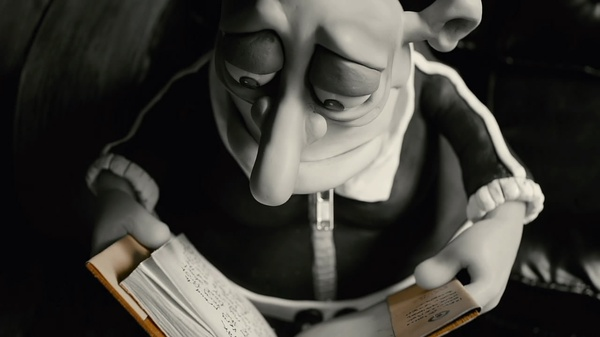
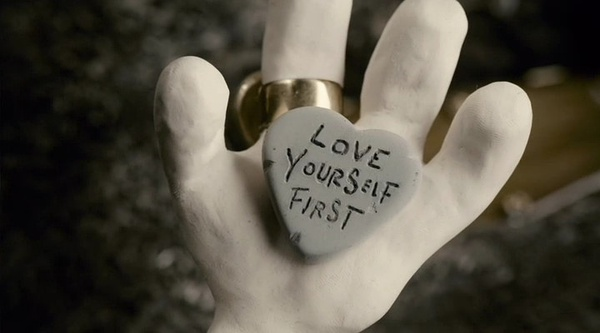
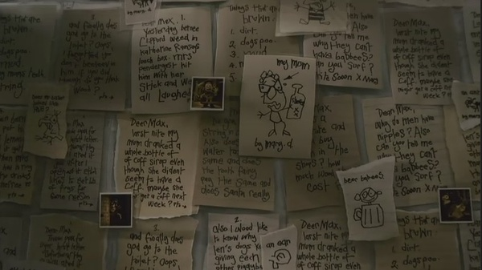

# ＜玉衡＞很高兴，我能活在你的心里

**这是一则关于倾诉和倾听的美丽童话。得以倾诉是一种赏赐，得以倾听是一种荣幸。没有一个人有责任和义务去倾听另一个人所说的，无论那是哲理或歪理。“便纵有千种风情，更与谁人说”，“栏杆拍遍，无人会登临意”，这种无法倾诉，或倾诉而不被理解的苦闷，并不是一两个人才有的，也并不是这个时代的人才有的，这种苦闷，就像爱情一样，早已被无数才高八斗的诗人哲人反反复复说了还说，因此似乎无论再怎么表达，都不会令人吃惊。**  

# 很高兴，我能活在你的心里

# ——评《玛丽与马克斯》

## 文/ 苏格猫底小姐（北京大学）

  **我的心不习惯幸福，也许活在你的心里更好，那样这个世界就看不到我了。** ** ——《茶花女》** ** ** 有一种人，他们永远与这个世界格格不入，你很难解释这其中的理由，就像你很难解释为什么有些人就是不爱吃茄子一样。有的人善于表达，想和这世界发生关 系，他们是思想家，比如萨义德；有的人只懂得沉默，想和这世界脱离关系，他们就是失败者，比如电影里的马克斯。与世界格格不入的人，是孤独的人。婴儿初降 人世第一声总是啼哭，仿佛，是为来到这个不怎么有红晕的人间而感到悲伤。人类没有权利选择不踏进这个世界，因此有的人只能采用权宜之计，他们躲避这个世 界。他们躲避光线，轻轻地行走生活，不惊扰任何人，不惊扰这个世界，也企求这个世界不要惊扰他们。他们就像一艘无舵的船———迷茫、失落、孤独。他们笨拙、害羞、紧张、恐惧，他们在自己身边筑了一道墙，永远住在那道墙后面。玛丽和马克斯，曾经是各自筑就的这堵高墙后面唯一居民，直到他们遇见了彼此，这是一个你所能想像的奇迹中的奇迹。马克斯改 造世界的理想没有实现，韦伯预测的悲观结局却似乎来临了。当你看着这个世界一点一点离你远去，当你在孤独中越陷越深，在你之上人欲纵横，色相驰骋；在你之 下，却除了深渊还是深渊。在无数个悲伤却流不出眼泪的夜晚，你想要找一个人交谈，你把那个时刻的心情写成一行文字，却不知道该寄给谁才好，你感到自己已经 沉到最低，最底了，希望躺下去以后黎明永远也不要到来了，在这个时候，有一个你素未谋面的人，给你寄来她的眼泪，这是多么奢侈，奢侈得除了上帝，你再也找 不到其他的人去感谢。马克斯和玛丽，这两个地球上两个不受欢迎的居民，需要找一个能够容纳他们的地方，而那个地方，是彼此的内心。 

马克斯好像是那个永远不会变老的彼得潘，他有很多奇妙的想法，但这个世界粗壮的腰枝很难容得下他诗意的栖居，正因为如此，他永远被封锁在黑暗里。他不理 解这个世界，这个世界也不理解他。直到有一天，他收到了一个八岁的小女孩玛丽千里迢迢从澳大利亚寄来的信，远在世界的另一端，他遇见了另一个自己，一个小 小的自己。小女孩一行一行稚气的，还带着些许文法错误的文字就像阳光一样，照亮纽约拥挤的街道上那破败的小公寓。那些他未曾说出口的疑惑和秘密有了一个出 口，所以当他收到玛丽的书时才会感到被出卖的愤怒和痛苦，因为马克斯自认破损、伤残，他已被孤独摧毁了自信，甚至是作为一个人的尊严，他不爱自己，他不希 望被这个世界看到他伤痕累累的心灵，而玛丽，他是因为信任，才肯向她敞开内心里幽深的禁地，不羞于向她展示自己的伤疤，可是，她却用那样一种方式让世人来 羞辱和亵渎他最后的平静和愉悦，他被暴露于聚光灯下，仿佛一只被剥去壳的，无法自卫的蜗牛。这是怎样致命的背叛啊。而马克斯终究原谅了玛丽。当玛丽生活中 的一切都弃她而去，是马克斯的温柔与宽容挽救了她，让她重新看到了这个世界的意义，和生活下去的理由。 

这是一则关于倾诉和倾听的美丽童话。得以倾诉是一种赏赐，得以倾听是一种荣幸。没有一个人有责任和义务去倾听另一个人所说的，无论那是哲理或歪理。“便纵有千种风情，更与谁人说”，“栏杆拍遍，无人会登临意”，这种无法倾诉，或倾诉而不被理解的苦闷，并不是一两个人才有的，也并不是这个时代的人才有的，这种苦闷，就像爱情一样，早已被无数才高八斗的诗人哲人反反复复说了还说，因此似乎无论再怎么表达，都不会令人吃惊。这种苦闷很多情况下就是孤独的来源，你想说的，说不出来，或说出来了，没有人理你。因此，如果能遇见一个人，他不吝啬自己的时间和精力，肯陪着你说话，肯倾听你的诉说，那就是最无价的奖赏和恩惠，必须以涌泉相报。 

最后，当那个依然不美丽不聪明的玛丽终于到达纽约的时候，马克斯已经在睡梦中离开了这个世界——他 的离去就像他的到来一样，没有惊扰任何人。玛丽自己多年的来信被马克斯熨烫得平平整整，贴满了整个墙壁，无异于一件艺术的杰作。知道自己那么多年来被一个 人如此用心地珍视与呵护着，那将是一辈子孤单的玛丽下半生最珍贵的财富。虽然他们到最后都未曾作过一次对话，但那对于彼此的珍视，一定令他们如沐甘霖。 有人也许会说《玛丽与马克斯》不过是一个故事，你怎么能奢望遇见一个人会这么温柔和宽容。不过爱因斯坦说，永恒的只有两样东西，一是宇宙，二是人类的愚 蠢。说上面这句话的人要重新思考爱因斯坦的名言，尤其是后半句。没错，你也许不会这么温柔的一个人，但倘若一个故事能够具有任何流传下去的意义，那便是让 人们阅读以后得到片刻的温暖，让人们看到，生活中有比呼吸排泄更赋予意义的事情；让人们熄灯躺下去时，期待第二天的到来。 不习惯活在这个人与人必须粗暴对待彼此才能维护自己生存领地年代的马克斯，得以成为玛丽心里的永久居民，那是他残缺的生命里最后的补偿了。  

（采编：陈锴；责编：陈锴）
