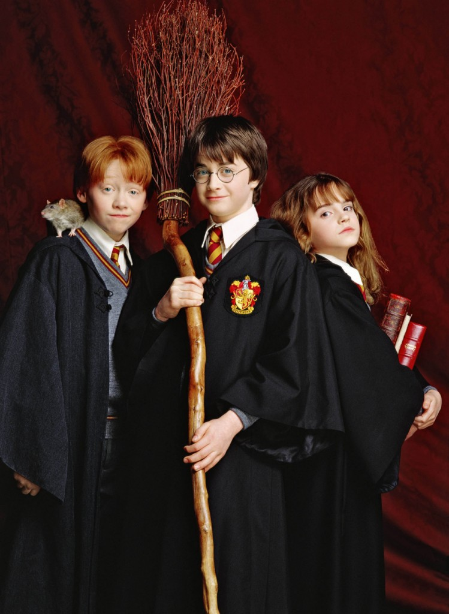
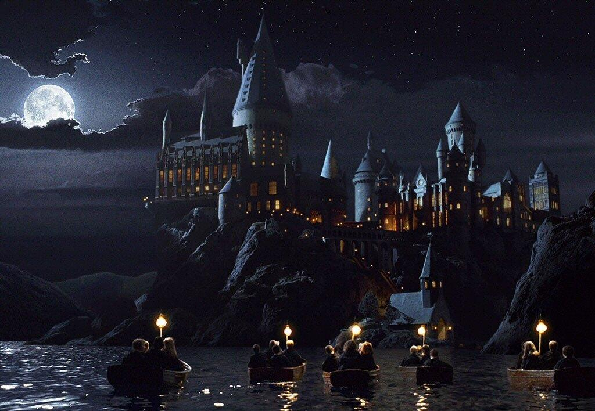
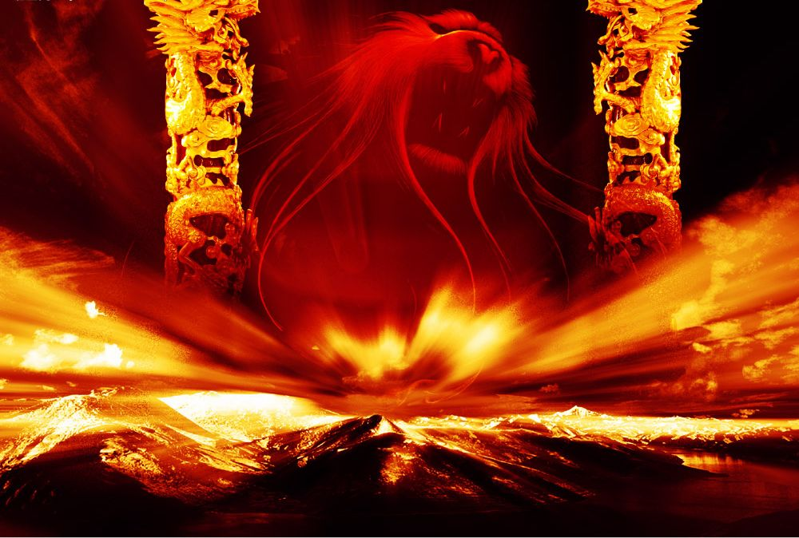

# ＜玉衡＞恶灵退去，童年亡佚——纪《哈利波特与死亡圣器下》

**哈七里，历经万难的的哈利，一人单挑伏地魔。橙红色的火焰江河般喷薄而出，终于将那个被符号化的伏地魔，化成漫天白羽。然后镜头上抬，灰蒙蒙的云没有精神的铺在天空上，于是我们知道，所有的故事都将会结束，所有的神奇都将会封闭。这个充满奇幻异色的魔法世界，在离我们远去。恶灵退去，童年亡佚。**  

# 恶灵退去，童年亡佚

# ——纪《哈利波特与死亡圣器下》

## 文/ 徐定之（中南财经政法大学）

 

人来人往的国王十字火车站，陌生又熟悉的九又四分之三站台，37岁的哈利送自己11岁的儿子到开往霍格沃兹的火车上，光阴荏苒。这个当年一副稚气的小正太，到了如今，也全然是一副大叔的模样。而当年同样稚气的我初识哈利时，断是想不到，那漫长看似没有尽头的哈利波特系列，居然，也被罗琳大婶写完了，甚至，还被一群导演拍完了。在最后的时刻，我拿下该死的3D眼镜，有点感伤的望着大屏幕打出哈七下的演员表，一种被时光调戏的感觉，荡漾开来。

一直很羡慕哈利。这个大难不死的男孩，11岁抢魔法石，12岁砍蛇怪，13岁单挑一百个摄魂怪，14岁参加三强争霸赛，15岁保护预言球，16岁跟邓布利多破坏魂器，17岁打败魔法界BUG般存在的人物——伏地魔。然后，成为整个魔法界的英雄。不能否认，每个男孩子的心底，其实都有个英雄梦，绚丽的夺目的但往往只能深藏在心里的英雄梦。

然而赤裸裸的现实是，我们大部分人都不是英雄，我们所有人，都不是巫师。没有会飞的扫帚，没有惊喜无穷的魔法糖，没有帅气的魔杖，没有小精灵，没有巨人，没有火龙，没有充满玄机的城堡。很抱歉诸位，这就是我们的世界，这里真的没什么神奇的事情，所以凉宫春日才会感慨，世界真无聊。无聊到那年少的英雄梦，一点一点凋零。

所以哈利波特才那么受欢迎。罗琳大婶用奇幻的语言，构建了一个全然不同的世界。这个世界的主人公，和年少时的我们，又何其相似。一样的稚嫩，一样的好奇。于是我们都情不自禁得将自己代换成哈利，随着那圆框眼镜下的深蓝色眼睛的好奇目光，神游霍格沃兹。跟着小说或电影，我们也一同抢过魔法石，砍过蛇怪，单挑过摄魂怪，参加过三强赛，保护过预言球，破坏了所有的魂器，然后干掉那个长得奇丑的伏地魔。终生欢呼：哈利是我们的英雄。我们仿佛听到了自己的名字，开心的不成样子。虽然第二天我们还要面对这个平淡无奇的世界，这个没有魔法也没有英雄的世界。

小说和电影，最美好的地方，就是架构一个有别于无聊现实的世界，给深受无聊之苦的我们，聊以慰藉。但再漫长的小说，也有结局的时候，再漫长的系列电影，也最终会完结。而这暗合着我们童年的哈利波特系列，到了今日，也走到了尽头。

哈七里，历经万难的的哈利，一人单挑伏地魔。橙红色的火焰江河般喷薄而出，终于将那个被符号化的伏地魔，化成漫天白羽。然后镜头上抬，灰蒙蒙的云没有精神的铺在天空上，于是我们知道，所有的故事都将会结束，所有的神奇都将会封闭。这个充满奇幻异色的魔法世界，在离我们远去。恶灵退去，童年亡佚。

但是我不想单单只写到这里。

童年亡佚，我们被岁月推到了成人的台阶。恶灵亡去，但那只是哈利的故事。

我知道在今天，在我感怀年少时光不复回的今天，一座城市的名字被列为禁忌，一座城市的人为了自己生的权力，在做艰苦的斗争。

我还知道，就在昨天，西南的一个省的名字被列为禁忌，那些群情激奋的面庞，那些不屈悲苦的故事，我们无权看到也无法听到。

我依然知道，就在前天，西南一个省将重工业的废料推进江河，然后很多同胞就这么亡去。打开电视，那些正儿八经的人说这个和那个是没有关系的。

我突然发现，原来自己生活的世界，不是那么平淡。这个国家，远比我想象的要神奇。哈利的恶灵只是一个跌落在欲望里的汤姆·里德尔，而我们要面对的恶灵，却是一个体制，甚至是我们自己，我们自己身上的劣根性。

而我们，不会魔法，没有天助，普普通通的好像可以随时掐死一般。

但这才是我们自己的故事。

哈利亡命守候的是伙伴，是师长，是他的家园。而我们的伙伴，亲人，家园，也许哪天便会被恶灵缠身，一句阿瓦达索命咒，便带走全部。童年已然亡佚的我们，没有主角光环，没有罗琳大婶的偏爱，要以更弱小的力量，去抗衡更强大的恶灵。希望格兰芬多的勇气和胆识，能跨越漫长的地平线，保佑东方的我们。

（采编自投稿邮箱；责编：陈锴）

 
