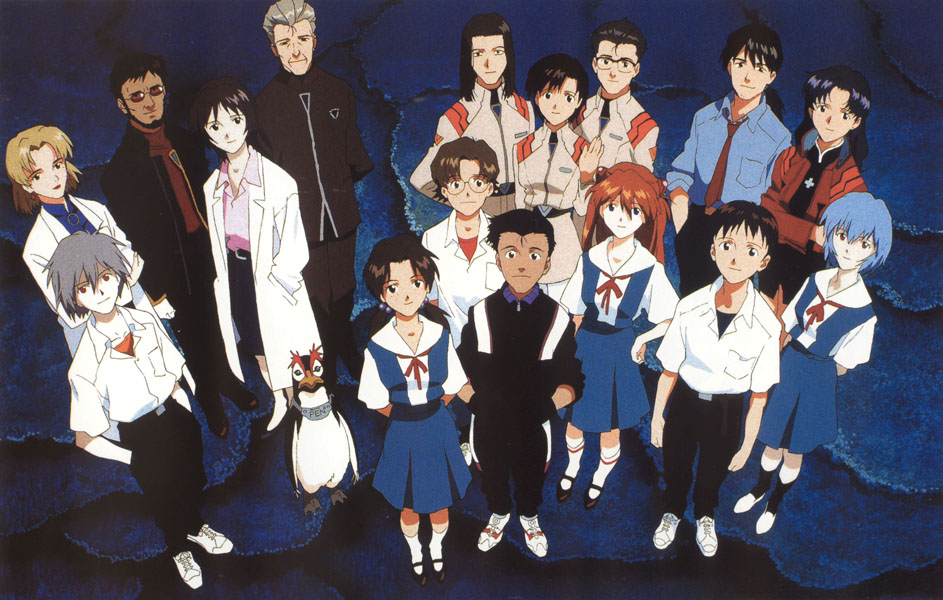
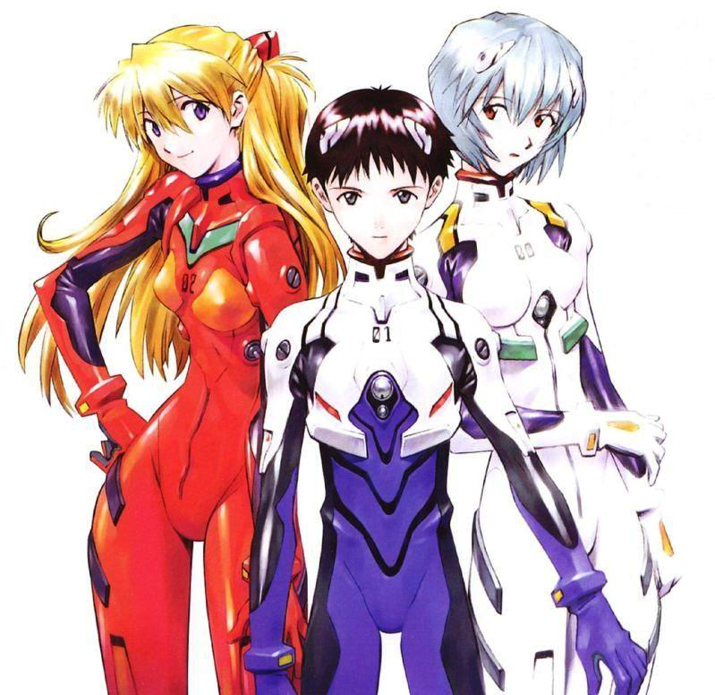
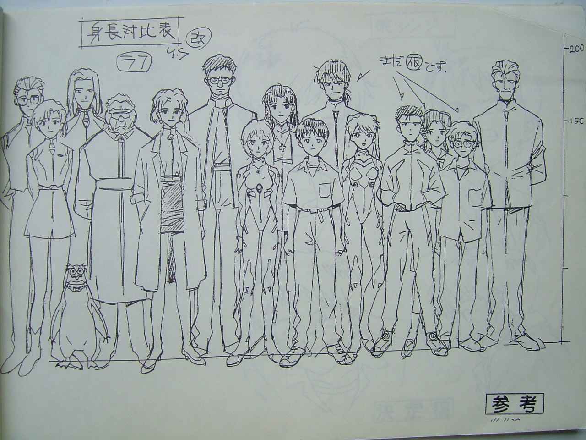

# ＜玉衡＞成人与孩子的永恒命题

**“所以这里，又要说回一开始的话题：当一位有着饱经世事的成年人身份的监督，试图去刻画一个“抗拒成人社会的少年”的故事，那么他想做的，到底是宣泄从少年时代压抑至今的对社会的反抗，还是修补年轻时因为抗拒、叛逆与迷茫所造成的伤害与犯下的错误？”**  ** **

### 

# 成人与孩子的永恒命题

## 文/伊谢尔伦的风（武汉）

 这其实是个已经不再需要剧情简介的故事： 公元2015年，14岁少年碇真治应父亲的要求来到第三新东京市，同日，被称为使徒的巨大怪物来袭。因为第一适格者绫波丽重伤未愈，从没受过任何训练的真治被推进了人形机器人EVA初号机的插入栓，并成功殉灭使徒，然后一到新班级就成了英雄。 如果这个故事的内容真有上面这段小学语文缩句训练式的概括这么简单，那么它会是一部最普通最正常的“萝卜片”，而让它之所以成为EVA，并且使无论看没看过的人都可以耳熟能详地说上几句的关键词，是史上最软弱男主角的惨叫，冰冷少女的微笑，“天才阳光女孩”的崩溃，最后一个使徒的笑容，残酷父亲的隐情，宗教神话的隐喻，弗洛伊德式的意象，大量晦涩难懂的专有名词，看不懂的TV版最终两话，更加看不懂而且颇为“恐怖”的剧场版，出了N个版本骗钱的片尾曲和OST，以及从1995年播放开始延续至今十几年不停的周边抢钱计划……喂，离2015已经只有八年了。 这依然是个值得一再探讨的故事： “少年对成人社会的抗拒”是个动画中经常出现的主题，但因为动画的制作者都是成年人，所以一开始，故事就陷入了一个悖论：以一般少年的能力，确实很难出色地阐述这个主题（漫画或者小说，倒或许还可以让一个孩子独力完成，但制作动画基本是没可能的），而成年人身份的动画制作者，在经历了主观上的岁月侵蚀与客观上的商业考量和妥协之后，又怎么能保证故事的主题不会变质？——哪怕是拿着自己十四五岁时写的故事做原案，到最后做出来的，也一定已经不是原来的那个故事了。 人们常说成功的艺术家，都是些永远长不大的孩子，这句话套在这里也许不大恰当，不过忘记了少年时代叛逆与困惑心情的制作者，是很难把这种题材真正做得打动人心的。但庵野秀明其实并非仅仅是躲在胡子拉渣的大叔皮囊下的彼得潘……他首先是个疯子，整个GAINAX公司都是疯子。 该公司的其他著名疯癫事迹因与主题无关恕不一一举例，单讲EVA，虽说它当年的走红也离不开放映前后一波又一波的宣传攻势、机体模型的热卖（这是最初的也最正常的周边，至于现在出的使徒抱枕、LCL入浴剂之类匪夷所思的囧产品则是后话了）以及漂亮姑娘们的魅力，但归根结底，在95年的时候能划时代地推出那么一个前无古人的没用男主角来，本身就是一种疯狂的勇气。 

 男主角真治的存在，其实可以说是绫波与明日香之间的一个折中。他软弱，自闭，抗拒他人的温暖，坐着新干线无目的离家出走，让许多观众心有戚戚焉。有些时候他也想变坚强，想要成长——在被骂“你可是男孩子啊！”的时候，被绫波救的时候，被明日香鄙视的时候，决定放弃做驾驶员却遇到给西瓜浇水的加持的时候……然而让人胸闷的是，世界并未因为这个少年的试图努力而发生任何美好的改变，即使获得了一再的胜利，也只是意味着更加接近破灭的终局。 这样的剧情发展别说95年，即使到了现在，也不是我们所喜欢与习惯的模式。更何况真治原本就是个有些自卑的懦弱的孩子，他不像鲁鲁修，清醒地知道自己在破坏，也知道自己在成为修罗，但坚信也必须坚信，将能使世界得到新生——可真治还是个对许多事情都不愿意想太深并以此自保的少年，驾驶初号机给了他一个每个男孩子骨子里都有的“成为英雄保卫地球”的梦……可他却越来越觉得这个梦不是那么回事，并且越来越看不清路在何方。 而绫波，作为史上最著名的三无少女，“绷带装”潮流的引发者，因为冷漠沉默、冰清玉洁、不食人间烟火的形象而被捧为女神的存在，其实是三位主角中最希望成长、或者说（原本应该）成长得最明显的一个。身为真治的亡母碇唯的复制人，被碇司令养大的她，眼睛里曾经只有那个男人，那个碇唯爱过的，并且也是现在全世界唯一关爱她的人，尽管他向着她微笑时所望着的或许其实是死去的妻子。至于她一开始留意真治，到底是因为灵魂深处碇唯的母性本能，还是因为她自己的心意，很难断定很分清（不过到底有没有“灵魂”、“心”和“自己”，绫波本人也不是很清楚），但是改变与波动是显而易见的，午夜的魔法开始生效，不是“没有”，只是“不懂得”感情的这个人偶娃娃，很快就会成长为真正的少女……只是魔法还没完全显灵，她就选择了自爆，光与热淹没一切之前，最后浮现眼前的幻影还是碇司令的脸——之后裹着根本不需要的绷带、沉默地在医院里听真治说“太好了，你没死”的，是忘记了魔法的另一个人偶。 至于明日香，这个十四岁就已经大学毕业的骄傲的天才女孩，讨厌同龄死小鬼、只爱慕成熟男人加持良治的早熟少女，反倒是对成人世界最抗拒的。在EVA的前中段部分，明日香的红发红衣和红色机体是整个故事最鲜亮的色彩，也是她登场前片中少有的欢笑来源。但自负和自卑从来就只有一线之隔，她越装作坚强，越显得高傲，越想要出色，越掩饰伤疤，最后就崩溃得越彻底，沉沦得越绝望。被选为了保护人类的驾驶员又有什么了不起的呢，如果妈妈宁可上吊自杀，自己不过是那个被扯坏的娃娃。肮脏的成年人的世界到处都是谎言她没有地方回去，失神地瘫坐在废墟中的浴缸里。 如果按一般思路，这样的三个孩子凑在一起所发生的故事，应该是不懂感情的娃娃怎样变成真正的人类，软弱的少年怎么学会真正的坚强，高傲而脆弱的少女如何露出真正的笑容……但是，在这个同样也属于成人的现实又疯狂的故事里，他们来不及。 EVA里的大人们，任何一个都做不到所谓温柔与宽容的注视，更谈不上成为能让心里带伤的孩子们痊愈并且成长的“环境”，因为他们实在没那个空闲——顶多提供一些礼貌性的安慰，或者心有余力不足的关注。真治的监护人，开朗邋遢的傻大姐美里，已经算是最有“家长”感觉的大人了，可她首先对自己心存疑虑。 

像所有少年机器人动画的成人配角一样，她对自己必须靠一群孩子去保卫世界感到无奈；而作为一个大人，必须对孩子说教一些自己都不信的话也是必然矛盾，何况她还质疑着自己所属的组织；作为葛城美里个人，她对自己的目标、爱情以及往事也有许多烦恼……但她是成年人，痛苦不能宣泄，困境无处可逃——一如为了追寻真实断送生命的加持良治，一如一直压抑而沉默地嫉妒着的赤木律子，一如没有人能说清到底是毫无感情地为了事业利用妻子、还是因为失去妻子太过伤心而变了个人的碇源度司令。 尽管一开始就看过许多EVA神话出典考证与宗教角度的EVA分析评论，但面对这部我从小看到大的动画，作为一个根红苗正的唯物主义者，我还是更愿意放弃一切象征与隐喻，把它当最世俗最凡人的故事来看，在读中学时，第一次看EVA的时候，我总会毫不犹豫地说，喜欢美里和加持，还有渚薰他很美型，不喜欢真治，至于对明日香和绫波，喜欢的程度差不多。而到了现在，再回头看这个故事，我还是喜欢美里的性格与作派，加持的执著与风格，但已经没有了对比自己出色和自由的成年人的仰慕，更多地看见的是他们的徘徊与挣扎；渚薰还是很漂亮，可身上人类的气息太少，不该与其他五个人一起评价；对绫波和明日香的喜欢里，类似“对少女偶像的喜欢”的那种感觉也已经消失，不过还是很难分清更喜欢谁一些——因为那三个孩子，我总是放在一起看，看见在他们身上三极分化的那些个性、情绪、感觉，以及骨子里一样的烦恼和不安，其实我们都曾错综复杂地体会，所以这又叫我怎么分得开，到底谁是谁，又怎么忘得了，在从少年蜕变为成人的过程中，由EVA的陪伴一直走到今天的时光——当年总会对那些孩子产生强烈代入感的我们，现在竟然也都成长为了还算正常、至少没危害社会的成年人。 

所以这里，又要说回一开始的话题：当一位有着饱经世事的成年人身份的监督，试图去刻画一个“抗拒成人社会的少年”的故事，那么他想做的，到底是宣泄从少年时代压抑至今的对社会的反抗，还是修补年轻时因为抗拒、叛逆与迷茫所造成的伤害与犯下的错误？

庵野聪明并且讨巧地没有说。解不开的谜题才留名万世，不完美的结局才被人记住，下不了定论的命题才值得一再诉说——正如看不明白的动画片才是EVA。

但最后，就像一个真正的《五星物语》FANS绝不会随便拉无辜路人去跳那个特大号天坑一样，作为EVA的多年观众（像我这种连所有使徒的名字都背不全的大概不能算FANS），我也要严肃地提醒大家，跳EVA的坑一定要慎重，因为，

这绝对是个千万不能相信主创团队人品的故事：

首先，以当局者迷的角度，让我们来回忆一下大部分EVA观众所共有的甜蜜青春：最初，上世纪末，在大堆新生动漫资讯志的狂轰滥炸之下知道了EVA。接着，因为从宫崎骏动画的制作名单上发掘出的庵野党党人和电视上播过许多遍的《蓝宝石之谜》，觉得自己遇上EVA简直命中注定。然后，本世纪初，遭遇《天鹰战士2000》，此后的我们刀枪不入，就算面对邪神SABER和“中文小说版”《棋魂》也一样钢筋铁骨。再后来，2005，EVA十周年，到了当年的穷学生中的部分人现在有能力也有热情去买原版周边的时代，大家都开始感怀青春，以为EVA已经成为一代人最重要的回忆之一……最后，2006，我要讲一小段不那么有普遍性，却非常之囧的往事： 

06年初秋，应9月13日第二次冲击纪念（也是渚薰生日）的景，我很有感情地写了一篇EVA怀旧文，而就在那篇感叹着“EVA已经成了一代人的回忆”的文章发表的前几天，当期日本《NewType》（也是应9月13日的景？）宣布：《新世纪福音战士 新剧场版》07年初夏（最新消息是跳票到今年九月了）公开，共四部，（至少）放映到2008……

得知这个消息的那一瞬间我的心情如同暴走的初号机般澎湃，关于青春的时光的人生的满腔感悟都与被补完的人类一起变成了咕噜作响的LCL——我到底在浪费脑细胞抒哪门子的情怀哪门子的旧啊我！庵野你这痞子都十年了还抓着同一部片子骗钱，不如干脆一直骗到2016然后直接成为人类补完第一人算了！

咳，怨念发泄结束，回到旁观者清的身份继续说。

所谓EVA新剧场版，现定为前篇、中篇、后篇和最终话四部，STAFF依然是疯子公司GAINAX的原班疯子人马，CAST阵容也照旧——便是那传说中的“龙套到姓名不详的明日香她爹是大关，而比真治惨叫更让人刻骨铭心的初号机咆哮是林原”……据介绍，新剧场版将以“平行世界”的名义，用旧画面加新画面的模式来阐述时间轴与TV版相同、但内容完全不同的新故事，还会追加大量全新设定却不会再让人觉得晦涩（谁信啊！）并“顺便”发售新设定集，而其他周边自然也更加变本加厉。

虽说我看着新剧场版前篇的预告版，听见2007年版的《FLY ME TO THE MOON》时，也有那么一瞬间怀旧得想哭，但更多的感想还是“全都是幻觉！全都是骗局！”就连那个时断时续地连载到现在才刚刚杀掉渚薰的漫画版，也从“画起画来挺精致认真的贞本难道都被痞子病毒传染变成富坚那一流的拖稿王了么”的疑似证据，变成了“阴谋！根本就是个阴谋！漫画版特地拖了十几年就等着正好和新剧场版一起出结局是吧！”的铮铮铁证——到底要怎么样的阴谋，才能让EVA凭着仅仅一部作品，而非UC高达式的若干世代，整整十二年风头不减？

而终于，最后一次说到痞子教主庵野秀明，那个或许存在的大阴谋的始作俑者，GAINAX公司众多疯子中的一个。忍不住想问他的是，你到底是成人还是孩子，还记不记得怎么褪去胡子拉渣的大叔皮囊变回彼得潘？你还抓不抓得住自己的淘气的影子，有没有忘记回永无乡的路？把自己最珍爱的玩具一次又一次地向我们炫耀，你会不会觉得累？而你又知不知道，怎样的玩具才能讨现在的孩子喜欢？还有永无乡，那个许多曾经的孩子依然听得见它拍岸的涛声，却再也无法登岸的永无乡，你到底，是想把它蒸发成难以碰触的海市蜃楼，还是改建成万民同乐的迪斯尼乐园？

（采编：陈锴；责编：陈锴）
