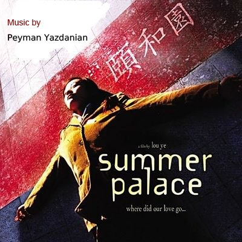
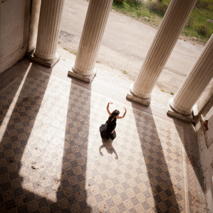

# ＜玉衡＞成长的祭奠——《颐和园》影评

**每段成长都充满了晦涩的隐喻。以死亡作为青春的祭奠，以遗忘作为最终的告别，理想的追求与幻灭，激情的迸射与消弭，在这样的致意中逐渐明朗而清晰。喜欢娄烨在片尾的字幕：“无论自由相爱与否，人人死而平等，希望死亡不是你的终结，憧憬光明，就不会害怕黑暗。”**  

# 成长的祭奠——《颐和园》影评

## 文/施旖旎（南京大学）

 

个人不是很喜欢看电影，昨日看了娄烨导演的《颐和园》，心中总感觉有东西憋住了，想表达出来。《颐和园》算是我看过比较好的一部国产文艺片。但它成了禁片，导演娄烨因此禁拍五年，我真觉得这是一种讽刺。

难道，是它美丽的让人畏惧么？

故事很简单：余虹，一个漂亮的青春女生，1987年考上北京的大学，经历了疯狂的1989，越过2000年。2003年与从柏林回来的大学恋人周伟相遇。但是同样经历了很多变迁的大学恋人突然在见面之后离去。从此之后，两人所处的地点虽然并不遥远，却从不相见。

喜欢的人会很喜欢，不用多说。吸引人眼球的要素都会具备：性爱+青春毁灭+特殊年代的事件。还有很不错的音乐。复古的风格，无论是黑豹的Don't break my heart，还是罗大佑的青春舞曲，都是有深深的涵义。

电影后半段，也就是失恋后的余虹，日子过得局促狼狈，二十岁的皎洁面颊失去光彩，她烫头发，穿颜色款式都陈旧呆板的外套，她依然还写日记，但分析多过于抒情，有一个人爱慕她，追求她，她说：一个人可以拮据度日，但要是换作两个人，这样的生活只会让人心生憎恨。说起来这还是文艺青年的底子在作怪，情感与观念太多，行动太弱。但这里已经有了一种她年轻时从来不去着意的平衡感。过了多年，她当年的恋人周伟回来了，他们相聚在北戴河畔，她为恋人去买一瓶酒，去了一夜，当她走在回来的路上时，他开着车疾驰而去。他没有等她，他等不了一夜那么长。

当余虹又回到小城里继续生活的时候，当年抢了她男朋友的女朋友，李缇，已经在德国的一个公墓里沉睡了。无视规则的，却又能给自己的无规则找到生存空间的李缇，忽然有一天就从高楼上笑着倒下去了。她留给丈夫和情人一个悬空的笑容，仿佛《爱丽思漫游奇境记》里的那只柴郡猫。

这就是娄烨电影中的女性，就像《苏州河》里的两个周迅。她既心藏烈火，又情意绵长。她在付出与索取时，从不遮掩，无论身体还是激情。这种激情又将身体折磨得厉害，折磨得对方/自己/观众都尴尬于面对。这是青春，又是性格，还是天赋。她的恋人周伟没有这样的天赋，年轻的时候，他不能理解所以离去，当他渐入中年才明白其中的难得，但就算他再回来了，他还是没有。他不能坚守，只能喟叹，他是一个觉新式的多情与感伤的人，常常被人误作情种，结果当然是对不住别人也难以面对自己。

我生于91年，看了本片却又很多感触，或许是我在北大，熟悉影片里面的很多场景，又或许是我骨子里面仍然有一股伪文艺劲吧。我似乎在这部电影里找到了某些共鸣点。它的拍摄是真实的，来源于生活又高于生活。它的迷茫、无所适从、较劲、天真、浪漫、踌躇、自私看上去都那么的生动。

在无数的寂寞青春期，我一直幻想能和余虹这样的女生谈一场轰轰烈烈的恋爱。但是越往后长大，我就发现电影描绘的也好，现实生活也好，这样的女生往往会越来越不幸福。当一次次把感情投入的时候，那么最后必然会产生恐惧与害怕的情绪。就如同郝蕾在电影里所描绘的那样，忽而歇斯底里，忽而呆若木鸡，忽而判断力全无。

所谓青春影片之所以感人，只是因为曾经的自己。讲到最后，我们难过不是因为电影主角的命运，而是因为他描绘了古今中外都共通的道理——过去我们曾经做了很多傻事。我们害怕见到过去的自己。我们努力做很多我们认为正确的事，最后还是一无所获。

平平淡淡终其一身，很不情愿地忘记年少时的梦和很多誓言，泯灭忘记。

片名为什么叫颐和园?娄烨说：我认为余红和周伟最美好的瞬间是在颐和园湖面上泛舟的场景，虽然这个场景很短。

每段成长都充满了晦涩的隐喻。以死亡作为青春的祭奠，以遗忘作为最终的告别，理想的追求与幻灭，激情的迸射与消弭，在这样的致意中逐渐明朗而清晰。喜欢娄烨在片尾的字幕：“无论自由相爱与否，人人死而平等，希望死亡不是你的终结，憧憬光明，就不会害怕黑暗。”

（采编：何凌昊；责编：黄理罡）

 
