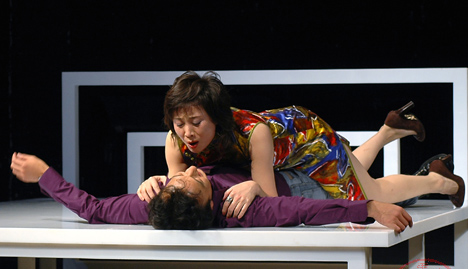
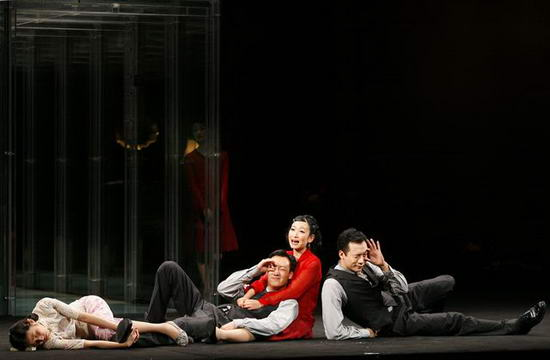
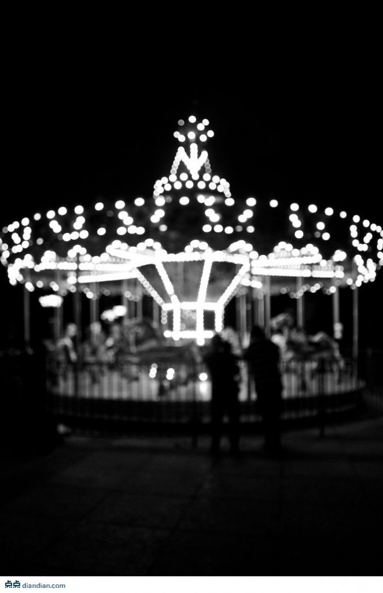

# ＜玉衡＞我看过的那些床戏

**话剧里的床戏之所以让人觉得有意思，主要因为它直接告诉观众“我不可能玩儿真的”，然后要通过“非真实”的形式，用象征的手法表现出这个过程。如果平时给你表演那么一个动作或者营造那样一个舞台效果，你看不出；而当导演把故事、情绪、节奏各个方面都推动到那个“火候儿”上，酝酿的东西一爆而发——你就能懂了。倘若再加上导演聪明、排的好，你会发自肺腑地觉得“唉，真牛逼。”** 

# 我看过的那些床戏

## 文/ 刘莐（北京大学）

 

好像是09年孟京辉排《爱比死更冷酷》的时候，说过这么一句话：“世界上最难排的戏有三种：床戏、儿童戏和动物戏。”当然他指的是戏剧。

这个时代的戏剧已经告别动物很久了；真正能给孩子看的儿童戏又几乎没有，反过来，给成人看的戏却内容庸俗化、智商低龄化，渐渐向“儿童剧”靠拢；唯独床戏一直在舞台上活跃着，各路导演不敢小瞧，因为这是显真本事的时候，极易露怯。

我室友说：“啊，舞台上演床戏？那导演不是聚众淫乱么！”我一摆手：“你以为照电影似的真演呀？真演你就弱爆了！”

在电影的商业运作中，那些制作人们就都喜欢给电影里插一两段儿半露不露铤而走险的床戏，然后在放映前将其全部剪入预告片儿，大造声势，作为一种宣传手段。当然导演肯定会说出好多这里面用了艺术手法，可观众的期待却仿佛一直停留在“逼真”这个标准上——能靠借位啊光线啊什么的拍得很真，就说明这导演牛逼。

而这些东西到了法律人眼里，就变成另一回事儿，尽是各种“授权”和“限权”。昨儿看了一个报道，说美国娱乐法律中在与演员签约的合同文本里，会做出各种关于演员在荧幕中裸露程度的具体细节性规定，从剧本上的“上床”这俩字儿到合同上复杂的条款，都要由律师来完成，才能避免那么多因为“一脱成名”的纠纷——而这些，在中国几乎没有。

可惜看过电影中的床戏后，观众的感受基本一样，那就是失望，因为“权益”导致的限制总使得它变得遮遮掩掩，而观众却永不满足地希望它能再真一步，最后索性还不如直接去看AV来得真枪实战。

可戏剧不一样，戏剧舞台上的床戏总给人满足的感觉。

而且现在我觉得，一个戏的好坏，以及导演的聪明程度，只要看他排的床戏就能看出来。

想想这些年来剧场里看过的那些床戏吧——这时候人艺那些经典剧目就扒不上槽了！你想象不出来老舍和曹禺要是写床戏会是什么样子（不过这倒是个有意思的话题，改天可以琢磨琢磨）。话剧里的床戏之所以让人觉得有意思，主要因为它直接告诉观众“我不可能玩儿真的”，然后要通过“非真实”的形式，用象征的手法表现出这个过程。如果平时给你表演那么一个动作或者营造那样一个舞台效果，你看不出；而当导演把故事、情绪、节奏各个方面都推动到那个“火候儿”上，酝酿的东西一爆而发——你就能懂了。倘若再加上导演聪明、排的好，你会发自肺腑地觉得“唉，真牛逼。”

小剧场里，孟京辉肯定算排床戏最多的吧，先甭看质量，至少产量在那儿呢。《恋爱的犀牛》08版里面舞台上加了一个大跑步机，在上面演绎了最著名的那段儿床戏：明明在陈飞生日那夜等待陈飞未果，便把蛋糕和礼物全给了马路，苦恋的马路终于得到明明，如同满血复活地拥抱她——传送带转起来，他们在那个跑步机上奔跑、追逐，以张开怀抱的奔跑喻之：先是马路追逐明明，后来又是明明追逐马路，以两人前后交换位置来比喻体位的变换；这场床戏的节奏就是由这段儿音乐控制和调整的，一首充满狠劲儿充满力量的《氧气》释放出整个气氛，真的让人感觉“所有的力量都向我涌来”。同时，跑步机不单取代了床，它也表现出了多层次的韵味：他们向同一个方向奔跑，向同一个方向热爱，因为传送带的转动，却永远无法触及——对比表层的高潮，我更喜欢这层意思，无奈得让人热泪盈眶。比起这一段儿，这出戏后面黑子和丽丽结婚照相后有一段儿过门儿似的“真床戏”，就只能当做纯搞笑了，搞笑多了也就没意思了——比如今年的2012版，这块儿就被删了一些。

再说《空中花园谋杀案》里的床戏。孔艳艳第二节那段儿，她和赵医生达成“空中花园”的交易之后，答应了医生提出的上床请求。舞台前半区站着医生，手握一杆笔，在快节奏下颤抖、画圈儿、不断往下戳，孔艳艳挥动双臂在后半区的床垫子上大力又匀速地跳，激动地说：“你了解我吗？你了解我的过去还是现在？你怕我吗？你喜欢我吗？你爱我吗？爱我那就大声地说出来呀！”——好多观众没看出来，其实这就是一段儿床戏。节奏和灯光甚至取代了肢体动作，把这个过程隐藏在一根握在手里的笔中。

再看大剧场的《柔软》，这个故事里的床戏是寒冷而坚硬的感觉。这故事讲的是女医生爱上了她的男病人，而男病人即将在女医生的主刀下做变性手术成为女人。廖一梅大段儿大段儿直接的如《阴道独白》一般的性描写，被郝蕾淡定地如同读产品说明书一般读出来。在变性之前的那夜他们上床，舞台上被搭成如同镂空格子一般的空间，床被竖在上层的一个格子里，于是演员只要站着就能表现躺在床上的动作，体位变化过程就被“立体”在观众前。而这戏里我最喜欢的是变性手术的开始，女医生缓慢从上层给往下扔黄豆，成堆的黄豆洒下来连成一条线，越积越多，正好砸落在男演员的胯下——这个过程充满了噼里啪啦的黄豆落地声，你能感受到的，不仅是男主角生理的撕心裂肺，也是女主角心理的撕心裂肺。

《江小东和刘小文》的床戏有两段儿，分别是男女主人公结婚和男主人公的出轨。两段儿用了相同的手法：男女演员面对面站着，深呼吸，配有大声深呼吸和喘气的背景音效。观众在声音的起伏中看到他们胸腔的起伏。单看挺有意思，可是放在这个戏中，这两段儿就有一种突然而来的压迫感，被突兀出来了——不过这也可能是导演的刻意追求。

在去年北大剧星演出的剧目里面，中文系有一个好戏，值得一提——《苹果》。当年它赢得了观众和评委的一致口碑。其中也有一段儿床戏：一个男人有了外遇，为了躲避老婆便装健忘症住进精神病院，女警察来代表“党和国家”巡视精神病院，才发现女警察就是那个小三儿。两人见面先是吃惊，随后便来到病房外面，这时灯光变换颜色，轮番闪耀着俩人，他俩按着灯光的节奏和鼓点儿做起了广播体操。因为两个男演员饰演一个男人，所以在聚光灯下，两男中间加一女警察的“扩胸运动”，一个八拍之后还侧转，继续做，表现体位的变换，看起来十分喜感。

虽然我最不喜欢田沁鑫的戏，可这些我看过的所有床戏中，《红玫瑰与白玫瑰》（经典版）那段儿“四手联弹”的床戏却是我最喜欢的。佟振保由两个男人饰演，红白玫瑰歌由两个人饰演，舞台空间被门和玻璃分割成相同的两半儿，佟振保和两个女人的爱情在遇到床戏时则合二为一，两个红玫瑰给他弹琴，于是在欢快的四手联弹音乐中，他们跳起了开心的舞蹈——丝毫都没有性的元素，却把这个过程完美地展现在舞台上。

最后再回到最开始说的，《爱比死更冷酷》，这几乎上演了真实的床戏过程，没用任何表现主义的象征手法，却依然使用舞美和灯光把这段戏变得与众不同——舞台和观众通过玻璃隔绝，灯光一秒钟两次的快闪，让舞台的景象在眼前若隐若现，真实又虚幻。其实这和前文所述的方法都一样，营造一种离间的感觉，这个离间与电影中的追求逼真形成对比——电影里透过屏幕可以看见真实，可终究是虚伪；剧场里真人实景呈现，却让你触摸不到。

此外，貌似《未完待续》《琥珀》《艳遇》《阳台》这些戏里面也涉及有那么一些小H，记不太清了。《白鹿原》是一个实验床戏的好本子，当年我以为大导会好好利用一番，没想到它却走了另一种含蓄的路线，只有一段郭达和宋丹丹的对手戏，还仅仅停留在真摸大腿。

我室友从我身边走过瞄了一眼我的电脑，惊呼：“你居然在研究床戏！”我说对呀。

可是，盘点完我看过的所有带床戏的戏剧，就表现形式来说，也不如最近打着“新浪潮”旗号的多媒体话剧：《雷雨2.0》。我刚看完剧本，不禁拍着大腿感叹起来——“新浪潮”是幌子，床戏是真牛逼真好玩儿呀。不过这戏还没演呢，就不多贫，想拍大腿看的咱剧场见。

哦，忽然想起来，《西厢记》也有段儿床戏，这可谁都比不了——“不知东方之既白”，哈哈。

 

（采编：黄美琳；责编：麦静）

 
