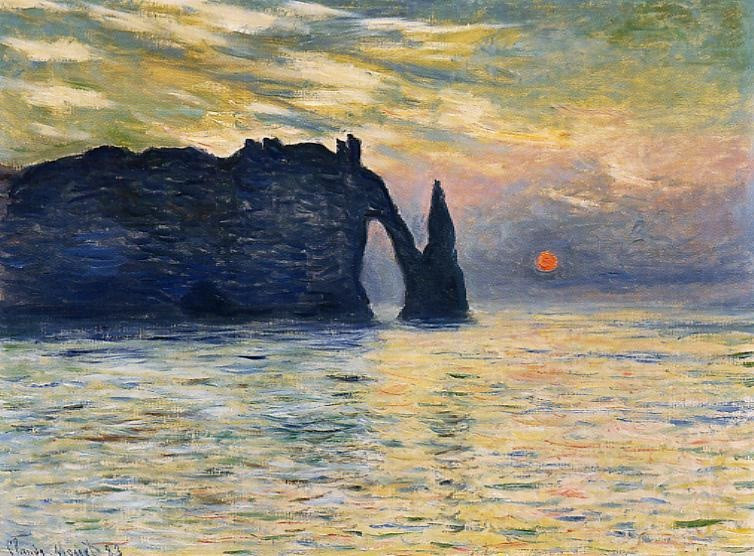
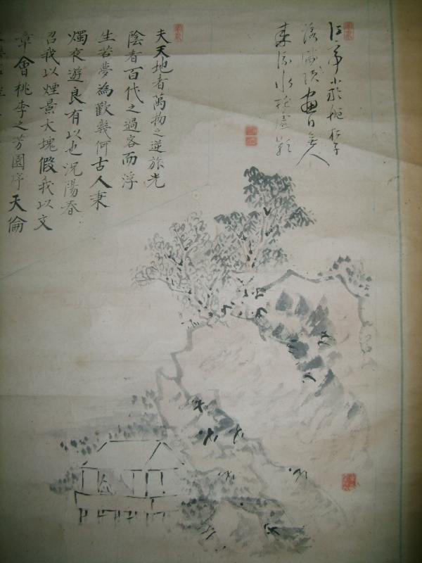

# ＜玉衡＞文人画的美学特质与中国画的评判标准

**文人画的这种人格化与道德化的艺术品性与书法艺术高度一致，它们不断地向创作者 与欣赏者昭告，在静止的、有限的、物态的图画、图形、图式之上，还有一种超越性的存在，不论称之为情感、精神、灵魂、理想、气格、韵味、神性抑或其它，我 们都可以用“道”来指代之，“道”的有无，才是文人对自己作品最关切的地方；而文人画的这种美学特质，也正是评判中国画优劣的最佳参照标准。**  

# 文人画的美学特质与中国画的评判标准

## 文/谷卿（暨南大学）

 

“中国画”概念的正式提出与西学东渐的历史文化背景直接相关，就像“国学”虽然 实际存在了数千年，但特地拈出这一概念则在十九世纪末二十世纪初，在西方文化大量涌入的清末民初时期，中国传统绘画艺术急需一种示别、示异的称呼，“中国 画”的名称遂应运而生。正是在与“他者”的比对之中，传统学术与文艺才渐渐发现了“我者”的存在之身与精神特质。

与西画相较，中国绘画的最首要特征即是对“道”的亲近追崇及对“技”的疏离鄙薄。中国绘画是一种人生的艺术，人们在笔墨色彩的世界里追求精神的高蹈和超越——即宗炳在《画山水序》中提出的“畅神”、“卧游”的理念，而非以精细描 摹、体现绘画技艺、为客观存在的人事物留影存照为目的。人们寄望于以艺术来摆脱世俗、政治、教化的束缚与钳制，从而获得一种身心的快慰和解脱。

百余年来，关于中国画评判标准的争论一直没有断绝，这是由于论者没有从中国画的 “我”之本体出发进行观照，盲目以西画的美学特质来对中国画之焦，从而得出许许多多荒谬的结论。笔者坚持认为，我们应从创作目的上来对最具中国画特色的文 人画加以考察，体味文人画这种作为美术与哲学共生的奇特产物的美学特质，再在此基础之上来进行中国画的评判标准问题的探讨，或许是一条可行之路。

二十世纪是中国知识人对待传统文化的情感最为矛盾的时代，既对自己由其中生长而 出的传统文化抱有极深的感情，又怒其不争，耻其难与西方强势文化抗衡。故而我们看到那时的很多学人，既是批评传统文化最为激烈的，同时也是对传统文化理解 得最为深刻的。其中对于文人画的理解和研究，康有为就直从批评入手，将近世中国画的衰败，完全归因于文人画。康氏之后，二十世纪初新文化运动的主将和拥 趸，也大多从科学和实证的角度对中西艺术之别进行了价值判断，将文人画的写意传统鞭挞得体无完肤，意欲借西方写实肖形的画风来改造文人画、来革文人画的 命，实际上也是在对中国画的评判标准进行解构。

文人画之所以别于“他者”，必然有自身独特的美学特质和精神品格，其最核心的问 题，就是笔墨语言构成的系统，同时在画法上，也不同于宫廷院体画，有着自己独特的表达方式。了解文人画的语言构成，才能如获得秘钥一样，解开它背后的众多 符码，对于理解其图像和物质层面的精神性存在，也有着巨大的功用。

笔者认为，文人画最大的形式特征，就是它是完全建立在笔墨的系统之上的，特别是 对于墨的运用与表现，在某一时段某些画家那里，直接地表现为以纯粹的水墨为语言，即以黑白两色、以笔运墨及水来表现其需要表现的对象，没有任何色彩的介 入。虽然墨的颜色永远是深黑的，但是有了清水的参与，墨就具有了多种形态，对于墨的运用也有了越来越多的方法，如墨能呈现出黑、白、干、湿、浓、淡等效 果，而对墨的运用，又有渲、染、烘、托等方式。特别是文人画最长表现的山水，正是水墨的绝佳用武之地，水墨本身的颜色与特质，恰好适合表现山水间黑白的质 感与气象。文人画的这种水墨系统的发达，直接导源于影响文人至深至远的三教思想，而宋元时期三教思想的高度汇通，直接激促了文人山水画高峰的形成。特别是 道家道教“见素抱朴”、“知白守黑”、“无色而五色成焉”等的质朴思想，影响着文人画的色彩取向。王维认为：“画道之中，水墨为上，肇自然之性，成造化之 功。”这就从绘画的色彩选择上也体现了对“道”的认同，在他们的心目中，只有朴素、简单到极致的东西，才能够架起同往“道”的路径，同时，“道”本身也是 朴素、简单的——体道必须是形式与内容高度统一的。先秦儒家伦理对于“色”也表现了排斥的态度，《论语·八 佾》中，子夏从孔子“绘事后素”的回答中体悟到人格化的“素”，受到孔子的肯定，这里的“素”也是一种伦理学而非认识论范畴的理念。而绘画史上从“丹青” 到“水墨”的整体性转变，不仅是从写意到写实的简单过渡，实际上也与绘画艺术中“人”的参与度的提高和人格化、道德化、技艺的精神理想化有着诸多关涉。

平心而论，水墨的表现力度远不及色彩，也难以具象化地表达一件事物，但通过特别 地堆积、运化，却能够显现出色彩所难以达到的效果。由于色彩表现容易坐实，故而难以赋予其传统文化中道德和伦理的内涵，正是由于其对于客观实际的表现力较 大，故而其在阐释空间方面就显得不如水墨那么宏阔了。

用笔方式的“书法性”是文人画的第二大形式特点。中国书法与绘画本质而同源，在 工具的使用上也都是毛笔，所以完全可能存在技法上的互通与互相借鉴。特别是在文人画刚刚开始萌芽的时候，绘画就开始向书法这一更加纯粹的文人化艺术学习笔 法，以期获得更自由、更形式化、更主观的艺术表情。以顾恺之为代表的早期人物画运用的是如篆书一般的粗细一致的线描，这种用于白描的铁线笔法直到唐代的作 山水皴法和人物衣纹时还在运用。宋代以后侧锋笔法的风行对宋元文人画影响甚巨。元四家中的倪瓒、黄公望、王蒙，都在笔法上继承了宋人的侧笔，足见文人画的 用笔技巧是较为丰富的。而赵孟頫的木石，则充分运用了“飞白”笔法，他自己也深刻地认识到这种援书入画、借书法为画法的重要性，所以在诗中写道：“石如飞 白木如籀，写竹还与八法通。若也有人能解此，方知书画本来同。”柯九思更在《竹谱》中详细述说了画竹如何借鉴各体书法：“干用篆法，枝用草书法，写叶用八 分法或鲁公撒笔法。木石用折叉股屋漏痕之遗意。”书法中所表现的文人化旨趣，就这样被绘画充分地吸取了，文人画在此基础上也获得了更多的个人化情调和自由 表现的艺术性。

书法入画的另一层含义是书法参与到文人画的整体建构中来，一是书法之美与画之美 并现，丰富了画面的美感内容；二是书法可以作为画面布局的填充与协调，对章法起到积极的调整与影响；三是书法呈现出来的文字可以对图画不能表达或难以表达 的意义进行充分地表达，从具象的图示引向画外无限的意义空间。而所有的这些功能，都是非文人群体所创作的画作所无法具有的。

清人笪重光在《画筌》中云：“点画清真，画法原通于书法。风神超逸，绘心复合于 文心。”就形而下的层面而言，书画是相通的；就形而上的层面而言，诗画是一律的。我们从文人画的语言构成与美学特征来审视文人画，愈加发现“人”的存在与 心灵、情感的存在，正是由于这种独特的性质，文人画成为了一种不具限制的美学体系，它的艺术内涵多义而不确定，决定于欣赏者的内心世界、情感世界、精神世 界而非感觉器官，与凭借光、影、色、彩等引起观者注意的西方视觉艺术完全不同，正如陈衡恪指出的：“西人之画，目中之画也；中国人之画，意中之画也。先入 目而会于意，发于意而现于目；因其具体而得其抽象，因抽象而完其具体，此其所以妙也。然行万里路又必须读万卷书者，正以培养精神，融洽于客体，以生画外之 韵味也。”文人画的这种人格化与道德化的艺术品性与书法艺术高度一致，它们不断地向创作者与欣赏者昭告，在静止的、有限的、物态的图画、图形、图式之上， 还有一种超越性的存在，不论称之为情感、精神、灵魂、理想、气格、韵味、神性抑或其它，我们都可以用“道”来指代之，“道”的有无，才是文人对自己作品最 关切的地方；而文人画的这种美学特质，也正是评判中国画优劣的最佳参照标准。

 

**（采编：安镜轩;责编：黄理罡）**

  
