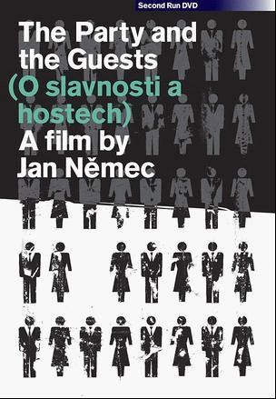
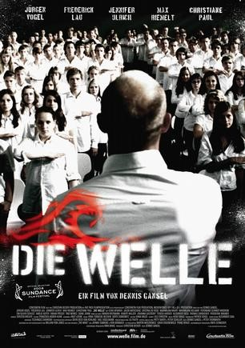
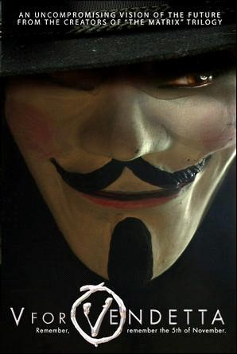
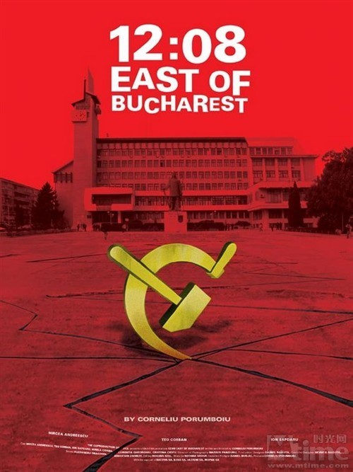
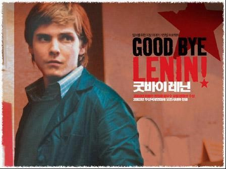

# ＜玉衡＞极权主义相关电影漫谈

** 法西斯并未离去，他随时就会出现在有抱怨的角落，他注定无法被根除，因为他的源泉就是人的内心。对富人的仇恨，对爱国主义的极端化，随时会将我们带入浪潮，不要高估我们的理性，进入浪潮的一瞬间我们并不会察觉到。**

# 极权主义相关电影漫谈

## 文/孙晓辉（北京电影学院）

极权主义这四个字用来概括一个时代一个国家未免显得太过抽象，我们需要一种媒介，来真正的感受这冰冷文字下的逻辑，以及这逻辑下一个个生命个体。电影给了我们那么一次机会，通过情景实验向我们解释这逻辑的源头，通过再现历史让我们回望过去。 **模型与实验** 1966年，捷克电影新浪潮开始露出眉目，被称为“可怕的孩子”的杨·内梅克（Jan Nemec）拍摄了一部极具政治危险性的电影《派对客人失踪事件》。受到卡夫卡影响的内梅克用一种荒诞与现实同在的风格讲述了一个政治寓言。电影开始七位朋友在森林中聚餐，当他们要离开的时候被突然出现的一群人带走，将他们架到一片空地中画地为牢。七个人完全不理解他们被带到这的原因，但是他们很快适应了这种环境，变得配合起来。七人中的一个人尝试反抗，但是这个自由派很快被用简单暴力手段制服。而这时候出现了所谓的宴会主人，他对于他的手下的粗暴方式严加呵斥，并且对待七个人非常客气，邀请他们参加一个盛大宴会。而这时候七个人包括那名反抗者在内完全顺从了这伙人。后来七人中的一人在宴会中中途跑掉，宴会主人非常生气，而剩下的六人同样气愤，决定帮助宴会主人找到并抓回跑掉的人。 

 在这个极权主义模型中，内梅克将矛头直指极权主义下的“顺民”，正是顺民维系了极权体制，而暴力机器只是辅助手段。这部电影被当时的捷克政府中的保守派大加指责，禁止放映。等到布拉格之春杜布切克执政后，电影才被允许放映，苏联入侵后再次被禁，内梅克逃往国外，直到捷克民主化后，才返回祖国。 如果说《派对客人失踪事件》的极权主义模型过于简陋的话，2008年上映的德国电影《浪潮》则完整地再现了极权主义必备的所有元素。《浪潮》描述了一个教师文格尔被迫教授独裁统治的课程。他利用为期一周的课程展开了实验，这一周内，文格尔将自己置于至高无上的地位，学生们必须服从。而利用社会矛盾等问题制造了一个理念，学生们逐渐进入了文格尔营造的“浪潮”中。学生们越来越重视纪律和团结的重要性，而随着实验的进一步深入，整个组织已经完全极权化。法西斯并未离去，他随时就会出现在有抱怨的角落，他注定无法被根除，因为他的源泉就是人的内心。对富人的仇恨，对爱国主义的极端化，随时会将我们带入浪潮，不要高估我们的理性，进入浪潮的一瞬间我们并不会察觉到。 

 除去以上两部，《索多玛的120天》和《狗镇》则提供了不同的实验思路。 **虚拟世界** “谁掌握过去谁就掌握现在，谁掌握现在谁就掌握未来。”电影《一九八四》以这样一句煽动性极强的话题开场。电影对于小说的改编并不完美，视听的具象局限性决定了它无法完全呈现原著中读者的想象性荒诞场景。《一九八四》作为一本政治寓言不断的被神化，被解读，它成了一种圣经。 1985上映的英国电影《妙想天开》是一部被低估被埋没的电影。影片可是说是卡夫卡《城堡》的翻版。电影描述了一个靠资讯部维持的社会，整个社会体制强大得无孔不入。而人的逻辑则是唯体制，唯技术。妙想天开中的社会将人的自主性与个体独特性压制到最低程度，标准化，无差别化贯穿着所有事物。人们只信体制，不信人。《妙想天开》在展现对极权的鞭笞外，也表达了对于工业文明将人异化的恐惧。 备受国内网友推崇的《V字仇杀队》假想英格兰成为了一个极权主义国度，有着领袖崇拜与对人性的压制。按照哈维尔的论述，电影中的英国更接近于后极权社会，思潮已经退去，体制依靠惯性和人们的恐惧存在。《V字仇杀队》展现了一种反抗的激情，而在看似正义的使命背后，这种激情其实也是一种“浪潮”。从影片一开始为炸弹狂徒福克斯翻案开始，就在用一套逻辑在为以暴制暴找借口。极权社会下没得选择，而后极权社会下革命和改良将是一个长久的争执。不拿刀的人未必不是英雄。 

**伤痕与回望** 东欧脱离极权已经二十年，时间的沉淀让东欧电影人有了更冷静的视点回望那段岁月。 罗马尼亚是东欧剧变中唯一一个流血的国家，齐奥塞斯库的长期统治让这个国度的变革异常艰难。当暴力结束，这个国家的民主化以枪杀前领导人这样一种方式展开。而正是这种武断的方式导致时至今日罗马尼亚对于那种革命，对于齐奥塞斯库的看法都有着巨大的裂痕。2007年的戛纳电影节，罗马尼亚电影荣获了包括最高奖“金棕榈”在内的数个奖项，而这一系列电影几乎都是反思齐奥塞斯库时代的作品。 在这些电影中，《布加勒斯特东12点8分》对于革命的态度最为暧昧。圣诞节前夕，一个小镇的电视台负责人策划了一档节目，而节目的内容就是讨论1989年12月22日12点8分（齐奥塞斯库出逃的时间）以前，这个小镇是否曾经发生过革命。而小镇人民对这一本该事实明确的事件却各执一词。除去小镇是否发生过革命，电影向我们展现了一个事实：曾经的秘密警察变成了富有商人，而穷人依旧是穷人，昏暗的街道依旧是昏暗的街道。影片对于革命没用改变这一观点迎合了不少罗马尼亚人的想法。而仔细想来，革命的意义关键在于你想得到什么。革命本身就是带有民粹性，穷人想打倒富人取而代之，革命对于他们的意义就是身份与财富的改变，他们永远会觉得自己通过革命得到的不够多。 

 而实际上，并非像《布加勒斯特东12点8分》描述的那样，革命没用带来改变。与之相反，罗马尼亚的民主化很大程度改变了齐奥塞斯库时代的荒诞政策。2007年荣获“金棕榈”的《四月三周两天》展现了一个罗马尼亚极权时代个体的悲剧。齐奥塞斯库为了让人口增加而禁止国民避孕与堕胎。女大学生意外怀孕 ，她和室友找到一个医生准备秘密堕胎。四月三周两天，正是Gabita从怀孕到堕胎的时间。极权体制下任何荒诞的逻辑都可能成为国家的法律。 《无主孤军》和《警察，形容词》则探讨了罗马尼亚极权体制下作为国家机器个体的困境。一方面，出于良心，具体到体制中个人他们有“把枪抬高一厘米的权利”。另一方面，在有着权利的时候人可能会陷入“路西法效应”，权利让人性之恶展现。我们该如何对待极权体制下的个体？他们是否应该被清算？这是个难以回答的问题，相对于这两部电影，《行刑者的下午》则把这一问题展开到极致。 在柏林墙倒塌许多年后的今天，东西德之间的隔阂依然存在。当时的狂欢已经褪去，现在只剩现实的问题。《通往自由的通道》简化了整个问题的复杂性，而仅仅将问题归结为自由与不自由。电影上映时德国统一只过去十年，思考缺乏沉淀。其后的《再见列宁》则直面了东西德合并中狂欢背后的问题。克里斯蒂娜忠心支持者东德的社会主义，而在她重病不省人事期间，东西德合并，东德的社会主义不复存在。 克里斯蒂娜的儿子怕母亲受刺激而营造已经逝去的社会主义时代给他。衣服，食物，服装，儿子尽一切可能让母亲以为她仍然活在那个过往的时代。极权时代的逝去远不是富有/不富有，自由/不自由这么简单，事关尊严，思维，曾经一生的信念。同为德国电影的《窃听风暴》则展现了体制中个体的善，将恶的责任归结为体制，想象性的弥合了东德地区普通人与前体制官员的矛盾。 

 除去罗马尼亚和德国，有着长期工会斗争历史的波兰的变革则更加稳健。瓦伊达的《大理石人》展现了社会体制下的造神运动，一个体制将一个或许根本不存在的人营造为劳动模范（类似于雷锋）。而基耶斯洛夫斯基的《机遇之歌》在展现波兰变革的态度显得有些暧昧。故事讲述了80年代的波兰，一个年轻人急于赶上火车，当他到达车站时，火车已经开动，他奋力追赶。在追赶中，出现了他的三种命运。第一种命运他赶上了车，车上结识了一名党员，在党员的引荐下，他成为了政府的工作人员。第二种命运，他追赶中被警察拦下并且关入监狱，在监狱中他成为了一名反政府人士。第三种命运，他没追上车，既没成为党员，也没成为反对派，但是他在坐飞机的时候飞机爆炸而死。人无法逃脱体制，无论你的政见如何，或者没有政见。 身处后极权社会的瓷器国，也有着回望的资格，只是这种回望是不彻底的。《芙蓉镇》、《蓝风筝》、《颐和园》，回望之中总是欲言又止。我想知道，多年以后回望今日，又该是如何的影像。 

（采编：黄理罡 责编：黄理罡）

