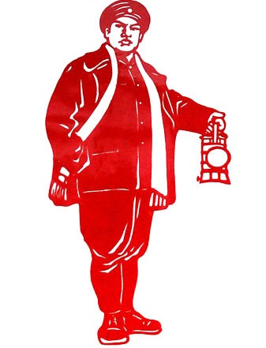
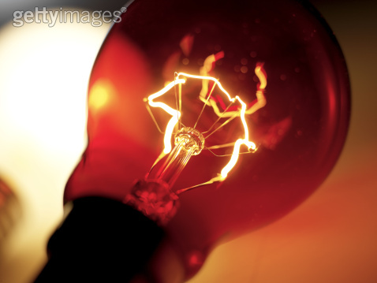

# ＜玉衡＞正能量与意识形态

**但是为什么我们这一代人就是无法感同身受地，坦荡豪情地唱出“属于我们八十年代的新一辈”这样的词呢？我们的青春记忆，乃至今天对生活的印象，基本都是疲软的。超越于个体之上的宏大组织，时代也好，国家也好，对我们早已失去了感召力。我们从那里找不到任何的信念依托。我们的语言里充满着调侃戏谑，也就是，解构的东西。**  

# 正能量与意识形态

## 文/阿氓（广西师范大学）

 

**1**

事儿要从我白衣飘飘的大学年代说起。那正是喜欢摇滚和颓废的时代。有一首歌，从当时喜欢到现在。喜欢的表现是可以单曲重复地听一晚上。那就是唐朝乐队的《国际歌》。那旋律与伴奏，那种声音，仿佛有一种穿透黑夜的力量。有意味的是，支撑着这种能量的，恰恰是虚无。是崔健歌唱过的“一无所有”，在支撑着“一定会实现”的这种呐喊。而它还真能支撑得起来——而这正是摇滚版的国际歌能够穿透黑夜的力量之所在。

当初听到这个版本的国际歌的时候，眼前是豁然一亮的。这个旋律我中学时候就熟悉，和国际歌相比，义勇军进行曲就是浮云有木有。在听到唐朝的摇滚版之前，国际歌没有什么特别的力量可言，但终究这是一首非常根正苗红的正能量之歌，不管是歌词还是旋律，都散发着一种振奋人心的东西。我被它感动，与英特纳雄奈尔这个词语所代表的意义没有关系，与其说是被这种理想感动，不如说是被“一定会实现”这种信念激发出了共鸣。比如，我要考上好大学这样的梦想“一定会实现”。

大学时候听摇滚版听到如痴如醉，从来顾不上反思这茬。但有过一次稍感不适的经历。那天文学社一干人等毕业聚餐喝酒至兴奋微醺，夜色中开去京师广场，坐在旗杆下面鬼扯。月明风清，甚是爽快。这时的意境极其适合唐朝的国际歌，但几个人手机里都没有。干脆一起嚎算了。记得当时在座的除了文学院的以外还有个数学院的和计算机院的，文学院的自然对这歌耳熟能详，俩理科生一个能跟着哼，一个就只能听着。我们嚎完了“一定会实现”以后，当听众的理科生吐槽了一句：这精神头不错，可以直接批准入党了。我骤感不适。这和入党有一毛钱关系？完全是背道而驰啊。

我是后来听莎莎说才知道，原来入党仪式上有一起唱国际歌的环节。当然了，唱的是磨磨唧唧的经典合唱版。

**2**

话题既然是从音乐开始，不妨以音乐延续。我另一首非常喜欢的曲子是《珊瑚颂》，是歌剧《红珊瑚》的选段。珊瑚颂这曲子听了很久之后，才知道歌剧红珊瑚，去查了一下，方知红珊瑚的情节走向是如此让人厌倦到作呕。还是劳苦大众水深火热中寻求解放参加革命的套路。忽略这个背景，《珊瑚颂》从歌词到旋律还是很招我喜欢。

“一树红花照碧海，一团火焰出水来，珊瑚树红春常在，风波浪里把花开。云来遮，雾来盖，云里雾里放光彩。风吹来，浪打来，风吹浪打花常开。”

这是红果果的正能量。它把在逆境之中坚持奋斗坚定追求这种普世价值，以具有质朴之美的词语体现了出来。其实这种正能量也存在于比如《风雨彩虹铿锵玫瑰》、《阳光总在风雨后》、《风雨中的美丽》这种意象里。但后面这些例子，都不如《珊瑚颂》强劲。交响乐宏大的配乐，饱满的女高音，旋律中低回与舒展的对比，都使得这种正能量被讴歌得淋漓尽致，绕梁三日。若不知《红珊瑚》，你很难从《珊瑚颂》中读出意识形态色彩来。

还有一首曲子，意识形态的色彩更明显——《映山红》。

“夜半三更呦，盼天明，寒冬腊月呦，盼春风。若能盼得哟，红军来，岭上开遍哟，映山红。”

民歌中惯用的比兴手法，使红军在这里披上了救世主一般的霞光。这歌我也是很喜欢放耳机里听的。除了宋祖英的声音实在完美以外，真觉得这歌有鼓舞人心的作用。或者用小清新的讲法，就是“治愈”。但很显然，我并不是在期盼着红军来解救。

如果说珊瑚颂歌唱的是逆境中的、黑暗中的希望，和坚持的信念的话，在映山红中，这种希望与坚持的信念便被施加了一个具体的对象：红军。之所以日子这样艰苦还有盼头，那是因为红军会来。红军来了，则满山花开——像不像风雨之后的彩虹更美丽的替换？

当我们在苦逼考研的时候，在住地下室，为某个梦想苦逼坚持的时候，总有个美好的未来，所谓理想者，在支持着我们对这种苦逼状态的忍耐与坚持。这是古往今来一切伟大事业能够成就的精神动力，也是凡人的日子中常见的情节。甚至包括减肥，都伴随着这样的心理程序——在减肥中，“红军”就是那个拥有了理想身材的自己。我们改出一个减肥版的映山红便是这样子：

不吃不喝哟，盼掉肉；精疲力尽哟，求掉肉，若是肉肉都掉光哟，满街都是哟，回头率。

**3**

“正能量”这个词流行很久了。从某个意义上说，这是意识形态萎缩的某种体现。是政府公信力下降，人们在对幸福生活的讴歌、在对理想生活的无数次渲染中感到了乏味和疲倦。比如那句经典的“我想生活在新闻联播里”。

人性天然是没有什么正能量可言的。草履虫都知道趋利避害——这是物种得以延续的基础本能。所以，当人们遭遇挫折、失败、不如意的时候，自发地只会激起负能量。这种负能量使生物避开使它痛苦的区域，去寻找舒适的区域呆着。而如果任由这种负能量发挥作用，人会在通往loser的大道上一路狂奔。

以前有首歌，叫《二十年后再相会》。有时候听到电视机里，或者爸妈哼出来，我莫名地相当受感动。里面有一句歌词是“属于你，属于我，属于我们八十年代的新一辈。”还有一首歌，叫《金梭和银梭》，唱的是珍惜时光好好把握，都是正能量。而我听到这些昂扬的、光明灿烂的歌词和曲调的时候，那种感动更准确地说是感伤。我从上一辈人的这种歌唱里仿佛能看到他们当年意气风发的青春，对未来对自己都有无限的希望，对生活充满热情。但是为什么我们这一代人就是无法感同身受地，坦荡豪情地唱出“属于我们八十年代的新一辈”这样的词呢？我们的青春记忆，乃至今天对生活的印象，基本都是疲软的。超越于个体之上的宏大组织，时代也好，国家也好，对我们早已失去了感召力。我们从那里找不到任何的信念依托。我们的语言里充满着调侃戏谑，也就是，解构的东西。

有一期非诚勿扰里，男嘉宾是做社工的。孟非花了几分钟念他的各项荣誉，这个十佳，那个杰出，这个优秀，那个先进，平时我们会觉得这些东西假大空啦~掺水了吧~敲门砖而已咯~有关系有背景吧之类，而因为当时看过了男嘉宾的VCR的缘故吧，孟非都说念完以后，内心一股熊熊的火焰在燃烧。很多女嘉宾都感动得流泪了。即使灭灯了也表示要加入他们的队伍。这样类似的带来正能量的男嘉宾还有很多，一个糕点哥的经历就非常励志，还有从汽车修理工做起，后来当兵，最后当经理了的。一个女嘉宾就说，谢谢你为我们带来了这样的正能量。很多女嘉宾为之落泪。

当意识形态无法支撑这个正能量体系的时候，这些平凡的小人物他们不平凡的经历，暴露了我们正能量的“饥渴”。

**4**

摇滚版的《国际歌》之所以拥有穿透黑暗的力量，在我的理解看来，就是它通过摇滚这样一种属于青年亚文化的方式，对抗乃至肢解了这首歌里本身包含的，或者说被赋予的意识形态色彩。当你听唐朝的这首歌的时候，脑海中完全不会浮现马恩的脸，什么共产主义啊，全人类的解放啊，全世界的工人阶级们，联合起来推翻资产阶级的统治之类，完全都没有存在，虽然歌词就是白纸黑字地“最可恨那些毒蛇猛兽吃尽了我们的血肉”。在这首歌里，歌词的意义仅仅在于便于传唱和抒情。你不会去仔细思考到底是什么“一定会实现”，只会有一种血脉贲张的力量在涌动，让你无比振奋地感到“我能做到”，所有梦想都会实现。

或者， 简而言之，它肢解了意识形态而仅仅留下了赤裸的正能量。但这种只存在正能量，而没有意识形态的情况是很少的。甚至，严格地说，唐朝的国际歌里也依然是有意识形态存在的。

单独的个体很容易体会到渺小与脆弱的，感到自身存在的琐碎与虚无。为了克服这种感觉，人们需要从“我是某个比我更强大更重要的事业上的一部分”这样的召唤力确认自身的存在价值和意义所在。如果觉得自己是社会主义建设大军中的一员，觉得自己在为全人类的幸福感而努力，那么，扫大街的清洁工也会觉得每天都振奋不已，觉得自己从事的事业光荣无限，而不是被惩罚的西西弗斯。在这个意义上，意识形态与正能量奇妙地媾和了。

就像我之前举的那些个例子，意识形态把珊瑚、红梅（如歌曲《红梅赞》）这些形象在潜移默化中等同于了统治者或其力量代表（如红军），借助于光辉灿烂的正能量的包装，顺利地实现了对群众的召唤。这种召唤实际上是通过正能量而实现的。这件事本身无可厚非，如果它指向的是一个具体实在之物，而不是捏造的乌托邦的话，不管是对整个社会的发展，还是对个人的进步，都有很好的促进作用。可怕在于，用灯泡代替太阳，使人们称为那个被香蕉指引的乌龟，最后只得如夸父，渴死路上。

所以依托在那些男嘉宾真实的个人经历上的正能量使人们感动落泪，引起共鸣，并产生了强大的感召力，而新闻联播就只能让我们笑笑。

**5**

最后要说的是，正能量就真的那么好吗？当我们缺少正能量的时候，是否就一定要焦虑不安？

没有任何一种主流意识形态不在积极宣扬正能量。希特勒对德国人民的许愿听上去也是很美好的。洛基让人们下跪的时候，说的话也是貌似很有其道理的。强大、光明、正义这些极易使人心向往之的东西，也许正是更大的深渊或阴谋所系。

事实上，也许最为强大的正能量，并不在于对强大、光明、正义、美好、积极向上的热切靠拢，而在于对弱小、疲惫、孤独、停滞、悲伤、痛苦这些负能量的淡定。本来就有能量守恒定律，况且光明与阴暗就是相伴相生。当你大踏步迈向正能量的时候，也许身后负能量的深渊正在积累。总有一天会产生吞噬的作用。

也许，父辈们虽然贫穷却依然充满希望的青春透支了我们这一辈的正能量，也许，整个国家都在忙着向繁荣富强，屹立于世界民族之林，中华民族的伟大复兴这样的正能量靠拢，而终于在每个个体身上投下了深刻的负能量的阴影，使我们终于体会到了与父辈们截然不同的青春。

其实我挺愿意被一个光明灿烂的正能量童话欺骗一生。一辈子都能乐观坚定地相信，我们都正在意气风发地走向新时代。像我高中的时候，就真心坚定地认为共产主义一定会实现。可惜，至少这辈子，做不到了。

而负能量，我们对它的正视，固然是痛苦与黑暗的，可也是觉醒的最初表现吧。不知道痛苦是不健全的人性，犹如《风景》里面的那个老爹，他身上就没有任何负能量可言。这种负能量带来的觉醒，也同时催发了新的正能量的增长点，我相信那来自于个体，甚至不是某个完整的个体，而仅仅是来自具体的事件、场景，一句话，一缕阳光，甚至更为琐碎的，那些带着治愈色彩的动作、眼神的正能量——这些正能量因其生发点之小，因而转瞬即逝，却因其生发点之具体真实，使得那些短暂的被正能量鼓舞的时刻，内心能感受到真正的温暖。而这才是人生实相——若以河譬，负能量就是那奔流不息的滔滔流水，正能量就是偶尔激起的浪花。

其实就一句话，如果正能量太多太密集，那肯定不是人生常态。肯定有问题。正能量本身不是健康的存在，犹如没有任何阴影的光明一样，都是鬼扯。总之，淡定才是王道。

（标题为编辑所拟，原标题为：聊几首歌，说说正能量与意识形态）

 

（采编：孙梦予；责编：徐海星）

 
