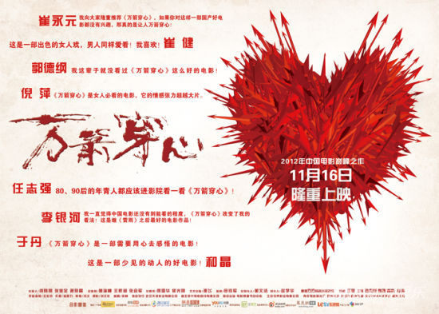

# ＜玉衡＞毁灭之家：李宝莉的关系失衡和不自觉

**她终于想通了，为了儿子的快乐，应该把自己拔出这个所谓的“家”；收拾行李时，她不再喊“奶奶”而喊“妈”。即使两手空空，至少李宝莉内心知道了她应如何重建一个家庭。**  

# 毁灭之家：李宝莉的关系失衡和不自觉

## 文/周利军 （华中师范大学）

 

在当代文学史上，方方是被划为新写实主义一派，并以许多直面现实悲剧的优秀作品而被载入文学史的。《万箭穿心》就是她的一部撕开现实表层，直陈内里血淋淋本质的小说作品。在处理小说中的现实这个问题上，电影很好地表现了小说所要表达的东西。未观影的同学们可要做好心理准备了。

托尔斯泰曾写过：“幸福的家庭都是相似的，而不幸的家庭各有各的不幸。”此片要展示的就是一个家庭悲剧，一个亲情悲剧，一个同处一室却感情疏离、仇深似海的家庭和情感悲剧。

影片开篇如同打开一扇光明之门，李宝莉和丈夫马学武忙碌着从租的城中村屋子搬进马学武厂子分的新楼里，然而李宝莉气势如虹、眼明嘴快、咄咄逼人，马学武却抑郁、拿捏、懦弱，张力尽显。第一晚，马学武坐在床上背对李宝莉，闷闷一句“我们离婚吧”，直接掐灭那点光明，电影急转而下，直奔悲情主题而去。看到影片下半段，又不由地想到日本中岛哲也的《被人嫌弃的松子的一生》。悲剧的情感力量如此相似，而从《万箭穿心》的人物关系中也能看到松子被“嫌弃”的影子。

在横跨二十年的叙事中，李宝莉在家庭关系中一直处以“被嫌弃”的地位。以马学武跳桥自杀为界，前段，一家三口，说不上什么原因，叛逆？心疼？被压迫？儿子自觉地站在父亲一边，从言语和行动上亲近父亲，而违逆母亲；后段，十年之后，一家还是三口人，儿子却已经天然地与奶奶结为同盟，如同被嫁接在同一枝上的果子，以家为据点，而流放母亲于家之外，李宝莉也自觉地以对儿子的亲情和责任用扁担撑起这个名义上的“家”。从某种意义上说，李宝莉其实是不属于这个“家”的，儿子不知何时已经不再喊她“妈妈”，她喊她的公婆也只以“奶奶”相称，从不喊“妈”，她唯一与这个“家”产生联系的机会只在每天晚饭的餐桌上把一天所挣交给奶奶，交待给儿子做好饭菜，然后对儿子只有日复一日的重复询问：作业做完没？学习怎么样？李宝莉没有意识到的是，她与这个家早已貌合神离，就像一根玉米杆被绑在两根甘蔗中间一样。最终儿子高考顺利，饭桌相庆时儿子却翻脸要切断母子关系，其实是早已注定的。

正是这种爱情和家庭关系中的失衡，把家里的所有人推向一个看不见却越来越深的深渊。正常的夫妻关系应是尊重、相敬、互爱，李宝莉却把较之丈夫的优越感无限膨胀，完全不顾及丈夫男人的尊严和感受，马学武开场的压抑沉默以及执意离婚也就可以理解；最终被李宝莉玩弄手段在工厂人格落地并因此下岗，也成了他生命不能承受之最后一根稻草。丈夫的遗书中只字不提李宝莉，更证明了她在爱情关系中的彻底失败。这种爱情中的失衡关系，为之后的家庭悲剧埋下了伏笔，显然这是李宝莉一手造成的。男人走了，剩下的老小由李宝莉一人来供养，三人重新组织成一个家庭。然而，这个家庭关系依然是失衡的。一家三口人围桌吃饭，没有欢声，也没有笑语，每个人都像在履行一道生活的既定程序：埋头吃饭，交钱给奶奶，问儿子学习。李宝莉的存在使三人的晚饭丧失生气，而儿子与奶奶却相互袒护、维系感情。爱情关系中，她太强而失衡；家庭关系中，她太弱而失衡。结局“家”只能是个毫无感情可言的物理搭构，散或不散，已没有本质的区别。

影片中更惊心之处，还在于家人之间感情的抽离。马学武跳桥自杀，在殡仪馆火化时，儿子扑到妈妈身上，如见仇敌，又哭又打：“你还我爸爸，你还我爸爸……”，对妈妈毫无依赖、爱护之情。李宝莉为了供养老小，挑了10年的扁担，如今已经被风吹日晒成了满面沧桑的大妈。有天回到家，奶奶对她说：“小宝也长大了，等他考上大学，你也就完成任务了……这房子是学武厂子分的房，过一段，你拿房产证把房子过户给小宝吧。”李宝莉似乎只是头为家里耕种了10年田的老牛，或者奶奶儿子家里的一台赚钱的机器，现在任务要完成了，你可以走了。人心冷漠，亲情关系之淡薄，由此可见一斑。

最后的演员见面会时间仓促，关于颜丙燕对武汉女人的性格理解的问题没来得及问，就匆忙结束了。以在武汉生活六年的所见所闻来判断，电影中对武汉女人的刻画是属实的。武汉女人敢拼、硬气，有一股子狠劲，加上以降调为主、发音夸张的武汉话，给人彪悍、泼辣的印象。电影中所展现的大多武汉女人也正是如此。外部表现之粗放与咄咄逼人的气势，内里清高的心气儿和狠劲儿，在李宝莉身上，以一种无意识的能量把家庭之舟推向了毁灭。前段之气盛与后段之悲情，两相比照，更增添了悲剧的效果。小景在渡轮上感慨道：“看看我们都四十多岁了，活成个什么样子……”，正是一种生活无意识前行、生活不自觉的体现。小景解释这些悲剧是风水原因，因为李宝莉住的房子是“万箭穿心”；李宝莉不信命，但她是否想得通：这一切本来应该美满的事情为什么如此悲剧地收场呢？

大桥上，焰火腾空，年轻人欢笑着一起合影，站在他们对面的是手举相机心痛、局促、迷惘的李宝莉。她终于想通了，为了儿子的快乐，应该把自己拔出这个所谓的“家”；收拾行李时，她不再喊“奶奶”而喊“妈”。即使两手空空，至少李宝莉内心知道了她应如何重建一个家庭。

 

（采编：许鹤立；责编：应鹏华）

 
