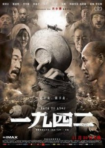

# ＜玉衡＞民都没了，国又何在？———《一九四二》观后

**在一个不民主的社会，不仅政府没有动力去解决饥荒，各种社会组织和宗教组织也没有多大生存空间。印度经济学家阿玛蒂亚森早已解剖出大饥荒背后的机理，饥荒的背后是权利剥夺，“从未有一个重大饥荒在民主国家发生，不管它是多么贫困……如果政府致力于防止饥荒的话，饥荒是极其容易防止的”，这在二十年后那场更大的灾难里表现得更为明显。**  

# 民都没了，国又何在？

# ———《一九四二》观后

## 文/张凯阳(广州)

 

我关注的不是这部影片，而是背后那段沉重的历史

 **“饿死还是当亡国奴”是个伪命题**

一九四二年，国民政府抛弃了1000万灾民，让他们自生自灭，把他们视作乱摊子抛给了日本人。在国民政府的眼中，几百万灾民的生计在抗战大业面前几乎不值一提，就像二十年之后几千万人的生存在国家建设的“大仁政”里也不值一提一样。抽象的国家宏大的需要压倒了具体国民的生死存亡。

“饿死事小，失节事大”，经由程朱理学所树立的传统道德观在国家层面就成了“宁死不做亡国奴”的道德律令。第一战区司令长官蒋鼎文的那段话堪为代表：“老百姓死了，土地还是中国人的；可是如果当兵的饿死了，日本人就会接管这个国家”。于是，我们看到，旱灾蝗灾并起之下，军粮照征不误；灾民的生死小业让位于抗战的生死大业。

美国记者白修德看不懂。没有经历过极权社会的美国人，政府权力受到限制的美国人，享受一流政治文明的美国人，当然看不懂。他们不懂“是饿死还是做亡国奴”的二分逻辑，也不懂为何一个政府能对几千万人流离失所置之不理。在他们看来，饿死和亡国奴并不是绝然对立的，任何战争最终为的都是一个个具体的国民的生存和尊严。民都没了，国又何在？

国民政府很快就吃到苦果。日军进攻河南，发放军粮，收拢民心，国军一败涂地。其间，甚至发生豫西山地民众截击国军缴械这些让后人不敢正视的历史。有多少民众“投靠”了日军我们不得而知，有多少是土匪和游击队趁乱抢劫滋事我们也不得而知。但让一个个吃完了观音土离死亡只有一线之隔的民众，担负起“不当亡国奴”的民族大任，不觉得担子太重了一些吗？

是谁把灾民推给了敌人，是谁让灾民只能做出这样的选择？政府抛弃了灾民，日军残忍，败军如匪，火上加油，反过来抢劫手无缚鸡之力的灾民，反抗日军的不正义被视为理所当然，这种来自自己人的不正义，难道就只能默默忍受吗？中国人不能被外人奴役，难道就活该被自己人奴役吗？“汉奸论”可以休矣。

 **“民族劣根性”论也可以休矣**

冯小刚避免陷入国族的宏大叙事里，也没有一厢情愿地塑造一个有气节的底层中国人。唯一死在日本刺刀之下的，为的是不可磨灭的亲情和记忆，而不是所谓的民族或国家。他深知在这种极端情境中的选择是没有选择，所以不可能苛求饿的奄奄一息的灾民按照社会的想象“气节”一番。这是冯小刚的进步之处。

这部影片现实得残酷，残酷得却不彻底。那段沉重的苦难让人备感压抑，而灾难中真实的人性则让人更加绝望。“饿殍遍野”、“赤地千里”是文人政客的含糊说辞。人命贱如草，生无尊严死无尊严。野菜、树皮、观音土，凡是能撑满肚皮的都成了口中物；荒野中堆满尸体，任野狗撕咬，路过的人在饥饿的威胁之下早已麻木不仁；人命成为交易，卖妻易子，只为几升小米；让这种灰暗的色调蒙上一层黑色的残酷的，是人吃人，至此，人已经失去了人之为人的意识。先是卑微的苟活，再是沦为野兽般的苟活，活着，成了唯一的本能。

所有道德溃败的社会无不如此，这与所谓的民族劣根性毫无关系，跟所谓的地域更是八竿子打不着。从这部影片中看到民族劣根性的人不仅失之对具体情境的理解和同情，更是深受意识形态教育流毒之害。有的社会发生大饥荒，却没有出现食人的极端场景，不是因为他们的人格更为高尚，而是因为有政府、宗教组织和社会组织的接济使他们不至于沦为目露凶光、只知果腹的野兽。

而在一个不民主的社会，不仅政府没有动力去解决饥荒，各种社会组织和宗教组织也没有多大生存空间。印度经济学家阿玛蒂亚森早已解剖出大饥荒背后的机理，饥荒的背后是权利剥夺，“从未有一个重大饥荒在民主国家发生，不管它是多么贫困……如果政府致力于防止饥荒的话，饥荒是极其容易防止的”，这在二十年后那场更大的灾难里表现得更为明显。

从这个角度来看，冯小刚又过于保守。他毕竟希望给绝望的人性留下一份温情的寄托。他知道，人性退居到野蛮只是在特定情形下的极端状况，要防止这种极端状况的不断呈现，我们需要的不是人性的改良，而是政府和社会的变革。

 **还有多少苦难需要打捞？**

一九四二，在抗战八年的宏大叙事中不值一提。正如刘震云说的，那一年，还发生了斯大林格勒战役、甘地绝食、宋美龄访美和丘吉尔的感冒，整个历史上却没有河南的位置。正因为如此，这部影片的上映，某种程度上打捞了那段苦难的历史。

片尾旁白问母亲一九四二年的经历，母亲说，那些闹心的事，我都忘了，你要写它，图个啥呢？

是的，图个啥呢?

 源地址：[http://blog.renren.com/blog/235121575/885612068?bfrom=011201092](http://blog.renren.com/blog/235121575/885612068?bfrom=011201092)  

（采编：杨成；责编：应鹏华）

 
