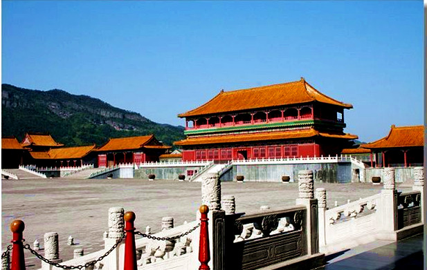
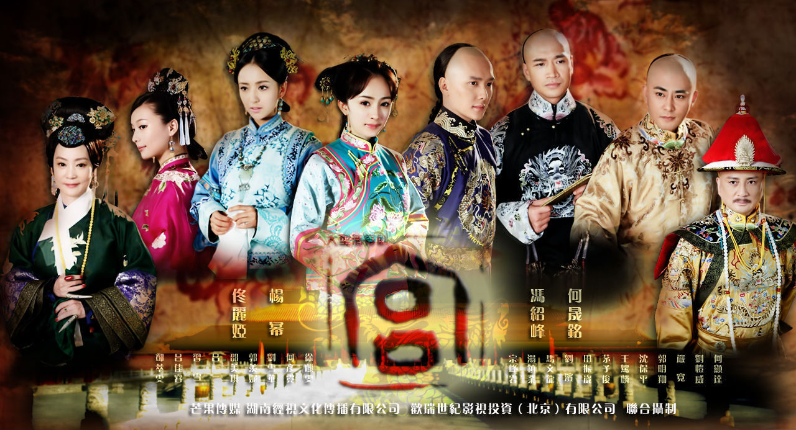

# ＜玉衡＞清宫戏的山寨精神

**值得讽刺的是，在我看来拍摄最接近清朝实际情况的，是电影《末代皇帝》。人家那电影是在货真价实的故宫里拍的，除了没有小脚之外，能接近实情的都尽力接近了。人家不仅真实还原了清宫，也还原了满洲国，更还原了那个真实的文化大革命的景象——顺带也超越了什么《激情燃烧的岁月》之类的红色题材片。或许人家唯一不真实的地方，就是在于所有的人都是说英文的。** **** ** ******

# 清宫戏的山寨精神

## 文/崔彧（清华大学）

今年是2011年，清王国灭亡99周年。清宫戏在新番《还珠格格》上映之时又成为了荧屏的闪耀一戏。真的，三四年前的清宫戏火爆势头连广电总局也看不下去，09年发布的电视剧备案公示通知只有一部宫廷戏。

清宫戏一直是影视公司热衷于拍的题材，一来每个中国人的骨子里大多都有荣华富贵的皇帝梦想，二来清宫里确实有一些可以爆料的绯闻，最后经过编剧们、小说家们的专业艺术加工，最后能够拍成一个四五十集每集四十分钟并且还能穿插放十来个广告不让观众换台的电视剧，而不是一集放了二十分钟就完事的纪录片。最后再把爱情故事的真实主角换了——现实里真不好看，只有换成了那些现在的当红演员们才能够让人看得下去。

当然，你为了追求清宫的真实效果，那还真没那么多钱让你来实事求是。首先你得有个宫，可是故宫不是一般人能够去拍的，电视剧这种低成本作品是不会花那么多钱来追求这个真实性的。于是就有了山寨版的横店故宫，就有了一个个影视城，让演员们过把皇帝瘾。

但是皇帝也不是那么好当的，作为一个清朝男人，没辫子简直就不是男人。女真族一路南下的时候，对于发型的政策就是“留头不留发、留发不留头”。电视剧为了追求那种逼真的感觉，那些男演员就得把头发剃光了，再把戴上个假辫子。郑少秋的阴阳头辫子堪称经典之作。但是即使是经典之作，从史料来看，这发型也不是正宗的乾隆发型。辫子的着发部位在头顶，称金钱鼠尾式。所以《康熙王朝》里的辫子是错的。清代中叶，头顶着发的部位不变，面积扩大至一掌心。所以《戏说乾隆》、《铁齿铜牙纪晓岚》里的发型也是错的。清代后期，发式逐步演变为将顶发四周边缘只剃去寸许，而中间保留长发、分三绺编成辫子，一条垂在脑后，名为辫子或称发辫。回想起来，《邓世昌》里的水手们的辫子是对的。

当然，和辫子的演变一样，清宫戏的辫子道具也是演变的。九十年代，一些电视公司开始偷懒，辫子大多数都直接从额头开始粘贴。后来有一些电视剧确实看着没那种阴阳头的感觉，于是造型师又发明了一种阴阳头套，一半是头皮颜色一半是头发，套在头上很省事儿。但是每次一看近镜头的时候，就能够看见那头套的痕迹了——这是我小时候的一个爱好。当然这种头套最经典的作品不是辫子戏，而是《少林足球》里的赵薇。所以到最后电视公司们还是回到了郑少秋的时代，让男演员剃个光头，再带上阴阳头套。而对男演员来说这就是个噩梦。比如说老是演黄飞鸿的赵文卓，比如说郑少秋，他们脱发了——当然脱发的原因是复杂的。

山寨的皇宫，山寨的辫子，山寨的人。当然其他的小道具更是山寨极了。比如皇帝阿哥格格们穿的衣服已经完全超脱了当时的观念，这才有了新《还珠格格》里那唱二人转的和扭陕北秧歌的衣服；这才有了新《还珠格格》里那皇帝手上带着一个铜钱戒指冒充钻石王老五，最后被网友骂成二百五；这才有了《宫锁心玉》里的皇帝拿着十块钱旅游景点买来的《四大美女图》纪念扇装13。

山寨是时代的精神，说得真没错。值得讽刺的是，在我看来拍摄最接近清朝实际情况的，是电影《末代皇帝》。人家那电影是在货真价实的故宫里拍的，除了没有小脚之外，能接近实情的都尽力接近了。人家不仅真实还原了清宫，也还原了满洲国，更还原了那个真实的文化大革命的景象——顺带也超越了什么《激情燃烧的岁月》之类的红色题材片。或许人家唯一不真实的地方，就是在于所有的人都是说英文的。

或许这个猥琐的山寨国度里，最懂中国历史的人或许不是现在的中国人，而是外国人。正所谓旁观者清，当局者迷嘛。

(采编：崔飘扬；责编：管思聪)
