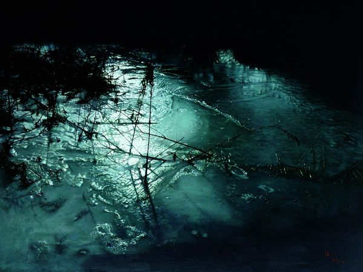

# ＜玉衡＞爱情短暂，人性永恒

**当人类流落海洋，爱情还剩几分钟？文明还剩几分钟？看完一个爱情电影，问这样的问题似乎煞风景。但这并非是唱衰爱情，哪怕这是一个不相信爱情几乎成为主旋律的年代。只能说，经过了15年的岁月打磨，我们的眼睛更愿意直面现实：爱情一定存在，但可能并非永恒。永恒的，是人性。**  

# 爱情短暂，人性永恒

## 文/顾燕（北京大学）

 

1998年看《泰坦尼克号》的时候还在读小学，当年实在是红得发紫，一向只放《妈妈再爱我一次》、《鲁冰花》等片子的学校，竟也破天荒组织我们观看。印象最深的一个镜头，是最后李奥纳多那张俊美如希腊神祗的脸，缓缓在冰水中沉没，永远消失。这种把美毁灭的悲剧感震动了我懵懂的心。当然还有爱情，不过因为年龄太小，对爱情只有一种美的直觉。比如两人在船头的经典Pose，在音乐浓墨重彩的烘托下，仿佛具备了永恒的神性。

十几年过去了，这部电影以3D姿态重出江湖，依旧是部好电影，依然给人感动和震撼，只是不再那么纯粹。岁月无情就无情在这里：成长了的我们看事物，在爱和美的轻灵之外，沉重的东西凸显了。

泰坦尼克号面临的实际上是一个冷酷的问题：在生存死局面前，谁更有权利活下去？被爱的人更有权利活下去，这是爱情故事的答案，也是导演和编剧的聪明之处。把Jack和Rose的爱情，放在一见钟情、热恋最妙的毫巅，为爱牺牲生命具有合情合理性。然而别忘了，在那群上了救生艇的贵夫人中，除了那位被讥笑为暴发户的布朗夫人，没有人出声赞同把救生艇划向落海的人群，哪怕被大声质问“难道那边不是你们的男人吗？”她们的脸上只有惶恐，因为涌上的人群可能危及到生存。难道这群没有主角光环笼罩的人们就没有富有牺牲精神的爱情吗？还是说当热恋的光芒褪去，枕边人变得平淡甚至面目可憎，牺牲就变成了一种艰难的选择。

生存死局面前，不仅爱情，伦理价值甚至也黯然失色。科幻小说《三体》提出了一个震撼人心的假设：“当人类真正流落太空，极权只需要五分钟。”海洋和太空是相似的，在其中人类注定无所凭依，永远漂移。生存资源有限，放任只会让事情更糟。一片混乱之中，依靠等级制建立的秩序反而是更有效率的选择，也更有可能保留生命和文明的火种。然而，这又与西方价值体系中最引以为豪的文明成果——普世性的人道价值相冲突。要保留文明，只能践踏文明，这是一个彻头彻尾的悲剧。让头等舱先走是泰坦尼克号里的现实选择，当然，它还没有那么残酷，那么彻底，至少秉持了让妇女儿童先走这一体现文明尊严的准则，哪怕仍是在等级的基础上。

如果注定没有生存机会了，怎么办？电影里，不认命的人们都哭号逃窜，只有认命的人最平静。这种认命有老夫妻平静相拥等待死亡的世俗慰藉，也有人试图回归到宗教羽翼下寻求解脱。在不断倾斜的甲板上，布道者念着圣经：“神要擦去他们一切的眼泪。不再有死亡，也不再有悲哀，哭号，疼痛。”人们用尽一切力气，抗拒着重力，向上触摸他伸出来的手，似乎那就意味着皈依和保护。此刻，人的骄傲和理性脆弱无比。这对泰坦尼克号起航时展现出的大工业的力量，和Jack在船头高呼“I am the king of the world”的意气风发，是一个绝妙而悲哀的反讽。

当人类流落海洋，爱情还剩几分钟？文明还剩几分钟？看完一个爱情电影，问这样的问题似乎煞风景。但这并非是唱衰爱情，哪怕这是一个不相信爱情几乎成为主旋律的年代。只能说，经过了15年的岁月打磨，我们的眼睛更愿意直面现实：爱情一定存在，但可能并非永恒。永恒的，是人性。

（采编：徐海星 ；责编：黄理罡）

 
