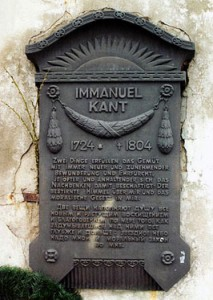
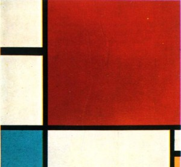

# ＜玉衡＞现代艺术真的杀死美了吗?

**现代艺术令康德自打脸了吗? 恰恰没有，因为康德的审美中有惊奇和敬畏(Bewunderung und Ehrfurcht)，而前卫艺术中那些骇人听闻之物，低俗恶心之物，又恰恰是感官世界中常常令人惊奇敬畏的元素。至于它会引发什么样的道德结果，这不关美的事。尽管在这一点上，康德没有像黑格尔那样明确无误地区分开来。我想它打的正是前卫艺术家自己的脸，他们永远没办法杀死美。他们杀死的，应是希腊人的美神，Barnett Newman曾表述：”希腊人发明了美，亦即，他们假设美是一种理想，这一直是欧洲艺术和欧洲美学哲学的怪物。**  

# 现代艺术真的杀死美了吗?

# ——兼论宗教信仰中的艺术创作该如何自处

## 文/张灵树(University of the Arts London)

 

康德在《实践理性批判》的结尾处有一句非常著名的话：

“两样事物以日益增加的惊奇和敬畏之心(Bewunderung und Ehrfurcht)充斥我的心灵，而且越来越频繁，越来强烈：我头顶上的星空和我心中的道德律。”

无独有偶，西斯廷大教堂的最初装饰方案就是把拱顶画成满天星空，直到1506年教皇儒略二世令米开朗基罗绘制了《创世纪》，虽然这一伟大创作至今仍让”全世界的人挤满罗马城，排队等待观看西斯廷的穹顶”，但这在我看来失去了康德称之为”崇高”的宗教特性。满头的星空，这意味着教堂内部进行的一切成为”内在的道德律”，内在所指与外在所指都赋予两个崇高以建筑象征——至少是崇高如何在艺术中作用的一个范例。

读三大批判时我还没看过毛姆的《随性而至》中关于康德生活琐事的小段子，我以为他必是周游四方的。因为他对人类精神生活中那些习焉不察行而不著者，竟能提纲挈领，尽管带着他那个时代的局限性——大致说是一种白人文化中心主义——此亦已难能可贵，特别是在关乎一切几乎是宗教性的崇高之美学而言。我曾以为前卫艺术将康德这个奉道德崇高为圭璧的老头的颜面打的”啪啪”作响，是的，我确实说过这句话：”艺术不负责出产美，艺术负责出产现象”，而达达艺术创始人兼诗人Tristan Tzara曾说：”我有一个疯狂的，星光闪闪的渴望：要谋杀美。”新艺术以它的叛逆之姿将许多看起来完全不美的，甚至”丑恶”的东西表现了出来，然而它谋杀掉了美吗? 没有。若仔细思考的话，美的衡量标准并不唯一，屎尿屁是丑陋的吗?

对人而言它们是臭不可闻的排泄物，对以之为滋养的圣甲虫及大部份植物，乃至嗜秽癖者而言，它们正是一顿美味大餐；自然是美的吗? 山川之雄奇，林溪之秀美转瞬之间也会变成天灾，吞没无数生灵。如果我们把审美与人类感官联系起来的话，那任何致命的，令人不适的东西都可以是不美的。可如果美它本身有独立意志的话，它大可嘲笑人类的这种”自私”的审美观：美正像神一样，它是全知全能，无所不包，它亦代表十方大千世界的全部现象。美像自然神，它可以一方面让康德惊奇于”闪光的天体”和”比埃特纳火山喷发出的深渊巨石”，让康德不住地交口称赞”巨石高悬头顶，巍峨险峻；乌云翻滚，电闪雷鸣；火山裹挟着摧枯拉朽般的狂暴飓风，摧毁大地；无边无际的海洋波澜诡谲；江河奔腾，飞流直下……”，它亦可瞬间将康德居住了一生的Königsberg小镇夷为平地，让这个叶公好龙的老头尝尝美的威力。美不应囿于人类情感，美正是无情的自然神，”天地不仁，以万物为刍狗”。

我曾经在宫崎骏的”幽灵公主”一片中感受过那种自然神一样的美，古老森林中的大魔神，它轻轻行在水面，仿若佛陀初生时”周行七步，足生莲花”，四蹄踏升间，奇花异草瞬生瞬灭；它不凭借好恶来判定生死，在它眼中一切天魔神自有大限时，待时到，它只须赐予一吻，不管是垂死挣扎的野猪神还是泰然自若的巨狼神，皆当下往生。这才是真正的”天地不仁”。有时我觉得人对美的态度与其对宗教和死亡的态度是很像的，美有毁灭性，因此康德的崇高式审美便有了敬畏(Ehrfurcht)。

现代艺术令康德自打脸了吗? 恰恰没有，因为康德的审美中有惊奇和敬畏(Bewunderung und Ehrfurcht)，而前卫艺术中那些骇人听闻之物，低俗恶心之物，又恰恰是感官世界中常常令人惊奇敬畏的元素。至于它会引发什么样的道德结果，这不关美的事。尽管在这一点上，康德没有像黑格尔那样明确无误地区分开来。我想它打的正是前卫艺术家自己的脸，他们永远没办法杀死美。他们杀死的，应是希腊人的美神，Barnett Newman曾表述：“希腊人发明了美，亦即，他们假设美是一种理想，这一直是欧洲艺术和欧洲美学哲学的怪物。人类用艺术表达他与绝对关系的自然欲望变得混乱不堪，且与创造完美的绝对主义混为一谈——与(美的)质量崇拜混为一谈。因此，欧洲艺术家一直不断地陷入美的观念与崇高欲望之间的道德挣扎中。”这就是为什么早期拜占庭艺术中的基督形象如此可怖，黑格尔对那个“备受折磨，皮开肉绽，惨不忍睹”的耶稣提出了一个深刻观点：“……备受折磨并被钉十字架的耶稣，成了万物中最丑陋的，在万物中，神圣的美历经人类的罪恶变成了最卑鄙的卑贱”。

而到了文艺复兴时期，这个藉由感官刺激来引发人们敬畏之心的基督形象变得美化了，那些可怖的伤口被弱化为一些固有的看似无伤的符号：几个不出血的钉痕，右肋下一道浅浅的伤口，荆冠亦令耶稣光洁的额头毫发无伤，那本该由剧痛引发的扭曲面容也淡泊了起来。正是这种希腊美学影响下的浪漫主义，消除了本该由感官引发的敬畏感，而黑格尔慧眼指出：“艺术恰恰是建立在感官基础之上，而且无法根除的。“如果我们要表现美的真实，那么那种理想化了希腊式美学浪漫主义才是要被杀死的，它遮蔽了美的本来面目，为其穿上了人本主义的外衣。维特根斯坦要我们保持世界被发现时的本初模样，就是要剥去这层虚伪的审美外衣。

欧洲艺术家过去的道德挣扎是我在认识清楚这个问题之前常常有的。对于一个没有宗教信仰的艺术家而言，他完全不需要考虑道德，不需要具有明辨是非的能力，甚至不需要有一个健全的人格——这些东西或许恰恰对其创作不利——他们只须忠实地表现自己。而一个有宗教信仰的艺术家，譬如我，这是个很大的难题。有时候创作简直就是在与修行作对，直觉告诉我自我表现式的作品是好的，我的手也在指引我这么画，然而大部份情况下，我想表现的那些主题和教义相悖。这使得我的情感在两边徘徊，艺术的，宗教的。如果这二者是黑暗与光明，那如何将它们统一? 这是最大的问题。

这个问题也同样曾令法国抽象表现主义画家夏加尔(Marc Chagall)困扰不已，夏加尔出生于一个犹太哈希德教派传统家庭，祖父曾是个犹太拉比。我们知道，犹太教义与形象艺术之间存在着本质上的紧张关系。康德在研究美学时注意到了这一点：

“也许在犹太人的律法中，最崇高的篇章要数诫命《十诫》。『你不可为自己雕刻偶像，做什么形象仿佛上天，下地或者地底下的百物』等。唯独这诫命当它与其它民族做一做比较，或者当它能够解释伊斯兰十诫所激发的那种自豪时，能够解释犹太人在其文明时代对其宗教的热情。”(《判断力批判》，p.116)

我们必须知道，犹太教严禁制造偶像(Bilderverbot/iconoclasm)这条律法的背后隐含着这样一种神学观点：任何以太过形象化的方式去呈现神性都是拟人形态论的危险尝试。甚至连教典文本中的具象描述都须小心不要触犯神人同形的底限。即使如此，《以西结书》和《但以理书》中的某些形象化的描述基本上已经游走在正统观点的边缘。从夏加尔的回忆录中我们得知，尽管他所处的犹太社群在某种程度上并不严苛，但幼年学画的夏加尔还是不得不遵守很多禁忌。他在自传中提到了一个颇有意思的回忆：”叔叔很怕让我吻他的手，因为人们说我是个画家。如果我画一张他的素描会怎样呢? 上帝是不允许的，那是一种罪行。”

由此我们可以得知，宗教可以说是阻止了犹太人或伊斯兰教徒成为艺术家，尽管自然像所有的诫命一样，在两大宗教中从过去直到现在仍然遭到违背，但是直到现代主义，如果不创作绘画的话，一个人没有办法成为艺术家。人们充其量可以从事装饰，我们看看伊斯兰教徒是如何将美的图形带入到他们的书法，器具和服饰中，而清真寺内则空旷无比。装饰是康德承认的唯一可以代替绘画的选择。如果绘画不是图像的话，那它在词义上也自相矛盾了。这实际上就排除了使得绘画成为崇高的可能性。但是现代主义开辟了反偶像(anticonic)绘画的可能性，这多少随之带来了作为可实现的美学的崇高的可能性。

在抽象主义绘画中，一即一切；极简艺术装置作品中那些与寻常物无二致的简单物体，打破了固有的艺术概念，使一个木块也可成为一种观念，当然如果你能自圆其说的话，它也可以是上帝。这使得艺术得以在宗教中完美自洽，且不受任何戒律所限。抽象绘画并非没有内容，相反，它可以最大化地呈现内容，而没有图像的限制。现代艺术使得一部份艺术家在不违背诫命的前提下，无意中发现了成为画家的方法。难怪Newman说，“崇高就是现在”，是的，宗教亦即是现在。

这解除了夏加尔的困境，并让他有了一个非常成功的艺术生涯，却不能解决我的难题。尽管早期的佛教和基督教也曾禁止立像与绘图，甚至不提倡任何仪式与其法器的存在。但现在已经不是问题。我的问题又涉及到了很多非常晦涩的，高度抽象的佛教义理/戒律与我所追求的艺术效果之间的冲突。这可能缘于我在修行和绘画上都没有投入大量精力的关系，体会亦不足。现在通过一系列的思考，我已经获得了一点感悟：有时艺术和修行没有什么区别，都是在固有的框架下寻求最大的甚至是完全的心灵解脱，拿起画笔的时候，让清净无垢染的心指引我前行。

 **源地址：** [ http：//blog.renren.com/blog/233958613/857240140?bfrom=011300082](http://blog.renren.com/blog/233958613/857240140?bfrom=011300082)  

（采编：杨成；责编：徐海星）

 
