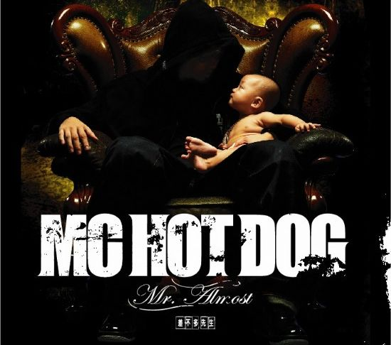

# ＜玉衡＞生活岂止一句“操你妈”

**我们无法要求一名歌手永远保持24岁的想法。我们更不能在他为圣诞节唱了一首祝福曲时，拍桌子大喊：怎么不骂圣诞节啊！我曾听过一句话，觉得很有趣：一个人在三十岁前不是愤青，那就是没有heart，三十岁后还是个愤青，那就是没有head。 **  

# 生活岂止一句“操你妈”

# ——评Mc Hotdog《贫民百万歌星》

## 文/mlln

 

### 【起】

去年七月，我偷偷跑去台北Legacy看了Mc Hotdog的演唱会。演出结束后，我找到其中一个rapper合影，然后说，热狗在哪里，可以和他照相么？

那个rapper说，这个可能不行，他在后台。

我很遗憾地摊开手：“我是听他的《1030》长大的。”

那个rapper明显愣了一下，我也觉得自己有点怪异……听《1030》还能这么安全地长大？于是我不好意思的脸红了一下。

 

### 【承】

关于他的回忆，我印象最深的画面，就是高中时候，回家的路上，我骑车穿过一条林荫小道，兜里塞着一台爱华随身听，嘴里跟着哼那首《1030》：“既来之则安之没什么好怕，但我一看到女孩的时候哦买噶。”

别笑我。我要是说，那首歌我曾经听哭过，你一定不信。也许是出于十七八岁少年的敏感，我听到那首歌中说道性工作者的辛酸，开始重新审视这个世界的无奈——“你还每天接客就像我每天写歌词，不变的生活就是例行公事。”

那时候在大陆，哈狗帮的音乐仅仅通过盗版磁带的方式，在学生口袋里偷偷交换。对此，新闻署还颁发过明确的禁令。多年之后，他唱到：“我的歌特牛逼，牛牵到哪里都是牛，我红到北京”。

我突然很高兴，他知道那时候的我们。

 

### 【转】

直到有一年的台湾金曲奖，他的唱片赢得了年度最佳专辑。他在领奖时说：我终于从underground里走了出来。希望其他地下音乐人也可以有这样一天。

他已经不再是一个成天在街上悠悠荡荡的普通人。我感觉非常不解。一个批判主流的歌手怎么被主流如此轻易地收编了？我甚至很惋惜，那个在歌词中fuck过Yuki，A-mei，Coco Lee的说唱歌手，最终还是被Coco Lee们fuck了。

这让我想起了约翰•菲斯克在《理解大众文化》中讲述的“牛仔裤发展史”。

最初，青年人喜欢上穿牛仔裤，因为它结实，又无需过多打理。可是突然有一天，一个小伙子用剪刀在牛仔裤上剪了一个洞。恶狠狠地说，妈的，老子偏要穿着破洞的牛仔裤，因为你们没权力规定，牛仔裤就应该是规规矩矩的样子。

于是，这个人被称为时尚，众人开始效仿。然后呢，直到有一天，牛仔裤的生产厂家崩溃了。妈的，老子辛辛苦苦缝好的裤子，被你们搞成了这副模样，好吧，不如，我们来批量生产破洞的牛仔裤。

于是，自由或者反叛，都被这个商业悄悄收编，露出狡猾的微笑。

 

### 【合】

因此，互联网上越来越多的青年人开始对他表达失望，甚至有人用哈狗帮早期的歌词来批评他：“这样没内容的歌也能当做主打，这个水准要比10年前来的更差”。

但我想我们不能如此武断。尤其是当我们不能当一辈子愤青的时候，更没有理由要求一个远在台湾的歌手帮我们骂一辈子娘。

一个残酷却不能逃避的现实是：几乎没有人能逃离社会收编的引力。热狗老了，我也从那个在作文中骂教导主任的高中生，变身为一名不合格的老师。上学期在某大学，还被巡查教导主任私下“批评”，说老师不能坐在桌子上讲课。我终于没有骂人，而是跳下来无奈的一笑。

我已经二十六岁。热狗已经三十四岁。我更高兴的是，他随我一起成长——那个在西门町嘲笑老年人嫖娼的小伙子，终于写出了《离开》这样的歌曲，关注科技的冷漠。在一次现场演唱前，他请求歌迷举起自己手中的苹果手机，然后不怀好意地笑着说：不好意思——Fuck iphone, Nokia forever。

是的，我们无法要求一名歌手永远保持24岁的想法。我们更不能在他为圣诞节唱了一首祝福曲时，拍桌子大喊：怎么不骂圣诞节啊！我曾听过一句话，觉得很有趣：一个人在三十岁前不是愤青，那就是没有heart，三十岁后还是个愤青，那就是没有head。

我喜欢那个嘲笑世界的hotdog，更赞赏这个思考世界的hotdog。因为这个世界远不止“正义”与“邪恶”这般简洁分明。

富二代能捐款，被撞者也会讹钱。城管会为生活惆怅，小贩也会卖东西缺斤短两。杀人者早已被杀，诛心者却未能正法。

你看，生活如此复杂，岂止一句“操你妈”。

 

（采编：宋晓慧；责编：徐海星）

 
