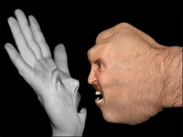
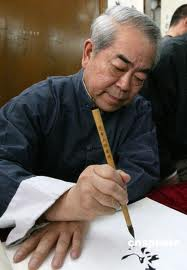

# ＜玉衡＞画坛“张悟本”与艺术品市场生态

**“画坛张悟本”们得以招摇撞骗、大肆敛财，与他们对文艺评论界的掌控有极大的关系。近日，受到艺术界、收藏界、批评界广泛关注的范曾诉郭庆祥、文汇新民联合报业集团名誉权纠纷案就是一个重要的标志性事件，案件最终以“郭庆祥向范曾书面道歉、赔偿范曾精神损害抚慰金七万元”为结果判决。**

### 

### 

# 画坛“张悟本”与艺术品市场生态

## 文/ 谷卿（暨南大学）

### 

### 

不久前，京城“神医”张悟本因连续遭到主流媒体和国家卫生部的质疑、调查而被戳穿“养生专家”的假面。从他暴得大名到翻船栽跟头，似乎是一夜之间的事，而由张悟本引发的关于中国民众健康需求、保健方式、医疗咨询途径、养生理念和医疗保健信息市场的讨论，也成为一时的重要议题。或许，“张悟本事件”已经成为人们反思中医养生与医学科学的一个良好契机。在这里，暂且不论医疗保健市场的“张悟本现象”，由此倒可以引发我们关于对书画艺术市场的一次重新审视：当今画坛和艺术市场又有多少“张悟本”呢？ 艺术属于人文学科的范畴，它与包括医学在内的自然科学不同，也与社会科学无涉，艺术并不解决“真”和“善”的问题，它只回答关于什么是“美”的这一提问，而恰恰“美”本来就是多样的，每个人对“美”的理解也不同，正是由于艺术没有严格的法条、律则和明确的规范，同时，当下艺术市场准入门槛极低，遂导致艺术市场鱼龙混杂、良莠不齐。更重要的是，我们还不能像出动卫生专家、医学专家来进行科学评定、监管一样来对艺术和艺术品市场进行品评和管理，也不能划定一个可以参照的标准来判定艺术品能否进入市场进行交易，更难以找到一个合适、合理的手段长期地、可重复性较强地来对整个艺术市场进行查检和整治。 

 早在十九世纪中叶，中国绘画就已经进入商业市场，并形成了商业性较强的海上画派。但二十世纪的动荡和变乱阻碍了这一进程，新时期中国艺术品市场的起步很晚，运作机制、行业规则同之；再加上适逢改革开放，经济政策较为松动灵活，各种资本与社会力量介入艺术品市场，使得其间泡沫大增，特别是当代书画艺术市场，规范性更令人堪忧。其实，就数据而言，当代书画艺术市场的交易额度是最不能反映艺术品市场发展的真实状态的。首先，参与购买、竞拍当代书画艺术的资金具有极强的投资性质，当代书画的欣赏、收藏功用远不及古代书画，故其最重要的属性为商品性，艺术性退居其次；基于第一点，当代书画作品的“价值”一般建立在书画家的声名和书画作品的“当代性”意义或价值上，而这些决定因素都是可以通过宣传、炒作来获得的，特别是在艺术批评活动以市场化、商业化方式运作和低成本的多媒介时代到来之后，这种“价值”的获得成本是比较低廉的；第三，由于近一段时期以来股市与房市的低迷，流动资金更多地转向艺术品市场，而当代书画艺术具有成品快、数量多、鉴真易的优势，成为人们进行短期投机的绝佳对象。在这一系列因素的作用下，当代书画艺术的创作、交易进入了一个不良的循环系统，至少存在着创作动机不纯、作品良莠不齐、炒作手段不端、藏家队伍不稳、交易风气不正等一系列问题，同时还影响和波及到艺术批评与学术界。这种艺术市场的生态环境中，必然会孳生出一大批“画坛张悟本”，他们最突出的特性就是，作品中传统底蕴缺失、艺术格调低下，因建立在量产上而导致自我抄袭和风格禁锢，以极端浮躁的心态求新求变，更通过舆论宣传对艺术批评进行影响，借助媒体来掌握一种对新的“艺术价值”、“美学意义”、“思想内质”的阐释和重新界定的话语权。 “画坛张悟本”们得以招摇撞骗、大肆敛财，与他们对文艺评论界的掌控有极大的关系。近日，受到艺术界、收藏界、批评界广泛关注的范曾诉郭庆祥、文汇新民联合报业集团名誉权纠纷案就是一个重要的标志性事件，案件最终以“郭庆祥向范曾书面道歉、赔偿范曾精神损害抚慰金七万元”为结果判决。 平心而论，郭庆祥对范曾书画的批评并无过激之言，也没有什么了不起的重大发现，只不过依据其“实”而不是其“名”很正常地讲出了自己真实的观感，不料范曾的反应却显得极不正常，这不仅说明他气量狭小、不能容人，更可见其对自己的艺术水平也是极不自信的。实际上，明眼人都能看出，这一事件表明范曾对媒体和批评界的影响力在减弱，已远不如从前了。早在多年前，范曾的字画在商界、政界和艺术品交易市场开始风靡之时，笔者就感到不解，但根本没有也认为不值得对之作特别的关注。直到近一段时期，范曾的名头越发响亮、书画作品连创拍品成交额新高，笔者依然对此莫名其妙，实在难以理解为何其人其作会受到如斯热捧，同时放眼望去，评论界也充斥着对范曾书画的溢美之辞，竟无一人对他的学问修养、笔墨技巧、艺术格调提出稍有份量的批评。而范曾常年热衷于在各种高端的政治、经贸、文化场合亮相，借助各种媒体和手段宣传造势，正是希望以此来增加其艺术性先天不足的作品的“文化价值”和“收藏价值”，在他享受着全民热捧的快感之时，突然出现了郭庆祥发表的这类文字，势必要打击之。可是，文艺评论原本就是见仁见智，我们不可能要求所有人对一件文艺作品持同一观点和看法。批评家或鉴赏人、观读者有对文艺作品进行评论、批评、研究、争鸣的权利和自由，这也是正常态的批评生态、文化环境和社会所必需的。但是，“范郭之争”闹到对簿公堂开了一个很坏的头，即法院、法律介入了作为文化与学术争鸣之一种的艺术批评领域，并以判决书的形式试图对艺术批评、批评家进行干扰、指向，这影响了正常的文艺学术活动和行为。若对于不同的文艺观点、批评意见不能容忍，甚或借助外力对之加以惩罚和打击，不仅是对艺术的亵渎和侮辱，更会助长艺术市场和现实社会上歪风邪气的横行。 

 笔者以为，当代书画艺术品市场生态的净化，其前提是市场参与者必须具备一定的艺术鉴赏能力。从目前来看，我们并不缺少“收藏家”，而是缺少“鉴藏家”，一个成熟的鉴藏家和投资者，一定是具有对艺术品优劣情况的基本辨识的，不论“张悟本”们与其同伙把牛皮吹到何种程度，个人的判断不会受到影响。这就像中医所说的治病贵在“扶正祛邪”，只要市场参与者的鉴赏能力达到一定的水准，“画坛张悟本”们的市场自然日益逼仄狭小，终会知趣地退出。 

### 

### 

（采编：安镜轩 责编：陈锴）

### 

### 
