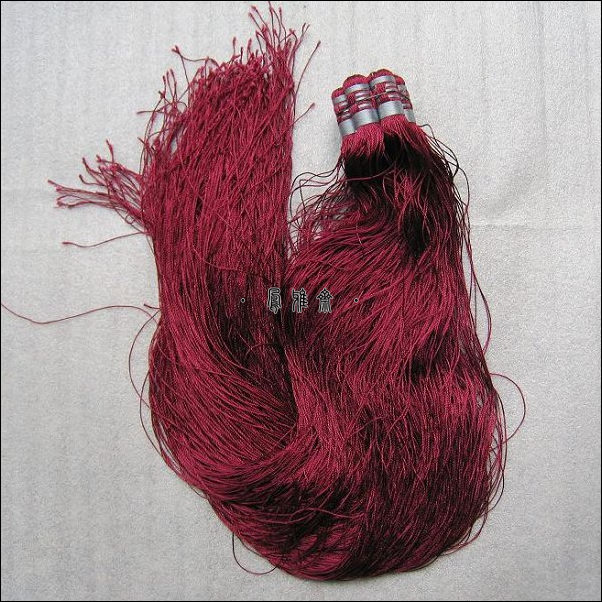
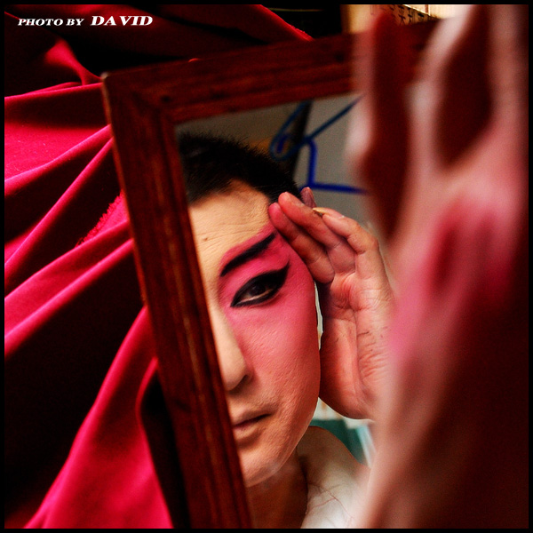

# ＜玉衡＞神乐

**音乐既修造人的自身，又协和整个世界。对于阴阳家来说，“礼乐之施于金石，越于声音，用于宗庙社稷，事乎山川鬼神”。因此在远古就有着宗教上的发端和功用；而另一反面，音乐确乎像一种宇宙的节律，犹如星廛日移——如同歌德在《浮士德》天上序曲里所描写的：太阳按着古老的调门，跟群星昆弟竞相合唱。她的步声像雷鸣一样，完成既定的旅程。”**

 

# 神乐

## 文/陈鑑（华东师范大学）

 

有一天，我在酱油管道里遇见李公子，我问她，我或许能做些什么？她回答我说：“神乐，你就写篇神乐的文章罢！”

“神乐”是李公子与我人参相谈时常提到的古怪名称，她大抵指一些她以为的美妙的胡音，而我眼前所浮现的场景却和音乐毫不相干。我实在能想象的是：阴昙天的小巷之间，巨力的万事屋赤傘持神乐君堵塞住莫名其妙的我，然后睡眼惺忪、含着醋昆布地咕噜出一句：你这个神乐阿鲁！

这种奇特的事情压下不提，我也可以怪腔怪调学着泼乐纽斯的声音回她一句：“若说世界上最翩翩的神乐，乃是傻大个下头骑着的笨毛驴。它可是演什么都是拿手——且听下文——无论演悲剧、喜剧、历史剧、田园剧、田园喜剧、历史田园剧、历史悲剧、悲喜历史田园剧，无论演剧中地点前后统一的古典戏，还是演一切规律都不守的新派系，悲剧不会嫌过分沉重，喜剧不会嫌过分轻浮，受严格限制也好，容许自由也好，都是独一无二行家。总而言之——但愿我能笨拙地去证明如此，也可以假定说——且听下文。”

稿酬就定为附葱姜和薄面饼的二斤烤鸭罢。但梅酱需得浓稠，甜而不泲，气味甘滑。

自古时代开始，音乐就是很高贵的事业。《周礼》中，音乐的最高长官大司乐分属春官宗伯一章，乃“掌成均之法，以治建国之学政，而合国之子弟。”“成均”是平准、调节音乐的意思，董仲舒解释作“五帝之学”。至于学政的事务，大司乐更乃是教育总长，春官里头前一半是王室仪典的司职，而后一半全是有关音乐和音乐教育。若说中国的教育事业从音乐生起的，亦不为过分。《尚书��尧典》有这么一段非常有名的话：

帝曰：“夔，命汝典乐，教胄子，直而温，宽而栗，刚而无虐，简而无傲。诗言志，歌永言，声依永，律和声。八音克谐，无相夺伦，神人以和。”夔曰：“於！予击石拊石，百兽率舞。

音乐既修造人的自身，又协和整个世界。对于阴阳家来说，“礼乐之施于金石，越于声音，用于宗庙社稷，事乎山川鬼神”。因此在远古就有着宗教上的发端和功用；而另一反面，音乐确乎像一种宇宙的节律，犹如星廛日移——如同歌德在《浮士德》天上序曲里所描写的：太阳按着古老的调门，跟群星昆弟竞相合唱。她的步声像雷鸣一样，完成既定的旅程。”——仰望着的天体运行都好似宏大的交响诗篇，而世人遵循星象或五行的规律，便可以释放出极巨大的巫力。儒家则偏爱从德性上讲音乐的好处：陶冶品格，充实人心，和顺秩序。子曰：礼云礼云，玉帛云乎哉？乐云乐云乐云，钟鼓云乎哉？又曰：兴于诗，立于礼，成于乐。——诗歌是自然情感，礼教是现实政治，而音乐呢？孔门六艺，乐居其一，《春秋左氏传》曰：“治定功成，礼乐乃兴”。

荀、孟虽然意见常常相左，但也直截地认为：“夫乐者乐也，人情之所必不免也。故人不能无乐。”前文的孔颖达疏道：

“诗者，人志意之所之适也。虽有所适，犹未发口，蕴藏在心，谓之为志。发见于言，乃名为诗。言作诗者，所以舒心志愤懑，而卒成于歌咏。故《虞书》谓之‘诗言志’也。包管万虑，其名曰心；感物而动，乃呼为志。志之所适，外物感焉。言愉悦之志则和乐兴而颂声作，忧愁之志则哀伤起而怨刺生。《艺文志》云：‘哀乐之情感，歌咏之声发’，此之谓也。”

“物不平则鸣”，人心有漏，历经外境熏染，发生种种不平之气，蕴藏于心者谓之志，所谓养气，即说的是养志。因小衅而勃然动怒、按剑相梃者，是游侠的作为，可谓有志，但不可谓善养志，大丈夫当权衡善恶是非，做了理性考量，蓄养一胸腔的气势而贯彻之实现之，虽千万人吾往矣，这才是孟子说的我善养我浩然之气。至于这些不平气，抒发于日常之中，就是“人本质力量的感性显现”了。喜怒哀乐之未发谓之中，发而皆中节谓之和；中和中和，贯通中外，种种烦恼喜乐，吁舒呼号，自然成调。嵇侍中说“哀思之情，表于金石；安乐之象，形于管弦也”，最最远古的民歌也是这样的话：“断竹、续竹、飞土、逐宍”，不乃是在说,“嗨！这里有一坨香喷喷的肉在跑哎！”吗？《公羊传》里的一段说法很佛洛依德，说一切艺术根本还是起源“男女有所怨恨，相从而歌；饥者歌其食，劳者歌其事”。——我喜欢《国际歌》、《马赛曲》乃至德意志兰的庄严音乐是因为平日总吃不饱，聊借此画饼充饥，而校内上整天男旷女怨的自命不凡的一些什么控，恐怕也只是是男默女泪的翻版，缺妹子罢了。

《礼记��王制》里还有一段极其骇人的文字，呈送给某些控们：“作淫声、异服、奇技、奇器以疑众，杀。”这中夏最古老的宗教及书报审查，恐怕远比柏拉图《王制》里驱逐一切诗人的宣称要来得糟糕的多了。少正卯为孔子执而杀之，而普罗泰戈拉溺亡在逋逃雅典人追缉的海上，那时候的人们不宽容，但品格尚且高洁，内心还算中正，可连韩昌黎这样刻板严肃的圣贤也大叫过要“投诸水火”，这是多么的横暴！这些审查者的末流呢？当一个时代的精神逐渐败坏的时候，他们开始处决了苏格拉底。我们就在这个时代节骨眼上，温和的彼拉多不干涉内政，绥靖纵由那些暴民们钉圣贤于十字架。

好吧，近来的红歌运动，可以用《二十年目睹之怪现状》里一句极精确的话来形容：“正是：如火如荼，军容何盛，疑神疑鬼，草木皆兵。”种种的怪事，比如竟还有愚人不识《马赛曲》、《国际歌》此两首最激越革命、最为无数安那其主义者所仰止追随的大纛，并将其摒弃驱逐出需要搬演的红歌曲目。这革命的革命早已成一片莺燕声的粉色，而革命与浪漫之间的真魂魄却宛如一缕共产主义的幽灵。幻蜃、狐火，工农的死骨和贵族的腐脔又有何区别？革命、革革命、革革革命……但这可不是个无限的级数，在这革革革革革的命里头，历史的多棱镜如同雪花一样四散在这炫目的牢笼之中，脑浆枯寂了，胆力耗尽了。文明变为辐射的废土，变异人囤聚在荒芜的大厦之中，捡拾残存的零件。这些骷髅、朽骨啊。

多年前尝读民族志，见到一则这样的故事。宋靖康难前后，有一太学生，路遇游方的道士，交游甚欢，而太学生亦颇礼敬之。临别，道士赠学生一柄团扇，云此地当有难，速持扇南行。百余里外方可弃其扇。学生闻言恐惧，遵道士言，持扇疾走，而一路上路人皆笑怪之，学生不解，亦不稍停，及至百余里外乃敢弃扇。又走十余里，学生思此扇乃道士所赠，返往取之，视扇，惊骇不已，唯一具人骨。后闻所过之处悉被北兵兵隳，杀戮且尽，方悟路人能视骷髅，见道士挟之行走，故而痴痴然笑，而嗤笑者则皆处阴阳之间人尔。睹此故事，如梦如幻。

《增阿含经》载，有鹿头道人通医术、明星宿，能辨骨听音，解诸趣道，知人死因缘。尔时，世尊从静室里下灵鹫山，同鹿头道人游行到一大畏怖的坟冢之间。如来捉取骷髅付鹿头道人观察叩击，或曰男，或曰女，或曰此人得何病何病终，如何可治，或曰无病为人所害故，或曰命生三恶趣，或曰将生人道，或曰将生天上善处；最后扣听一阿罗汉骨，道人道：我观此髑髅。亦不见生。亦不见断。亦不见周旋往来。所以然者。观八方上下。都无音向。

所谓大音希声。

哈姆雷特对伶人约里克说：“这上面挂过的两爿嘴唇，亲过我不知有多少次。现在好，你的挖苦呢？你的调皮呢？你的蹦蹦跳跳呢？你的哼哼唧唧呢？你逗得哄堂大笑的滑稽劲呢？你没留下一点玩笑来嘲笑你现在做的这种鬼脸吗？下巴颏都笑掉了，狼狈到尽张嘴，合不上来了吗？现在你给我到小姐的闺房里去，对她说，随她把粉抹到寸把厚，临了还不是一样，叫她笑一笑吧。”

世间如戏台，冠笄皆伶人，佛道人在皆如傀儡和戏文的三次元行走，又何尝异于行走于各各他、大畏冢呢？有些是提线的骷髅，有些是披着尸衣的幽鬼，万般精怪别致的百鬼夜行，终究成为猿鹤沙虫。“一大堆官员虫正在开会对付他。蛆虫是会餐的皇帝。我们养肥了一切生物来养肥自己，我们养肥了自己来喂蛆虫。胖国王和瘦乞丐只是味道不同。——两道菜上一个席，结果就是这样。”

好吧，我们说说“优”。按《康熙字典》云：“伶人，乐工也。伶伦古乐师，世掌乐官，故号乐官为伶。”古者“优伶”并称，晚近“伶人”亦指戏子，然而“优”与“伶”其实有分别。

《晋书》云：绍尝诣冏谘事，遇冏宴会，召董艾等共论时政。艾言于冏曰：“嵇侍中善千丝竹，公可令操之。”左右进琴，绍推不受。冏曰：“今日为欢，卿何吝此邪？”绍对曰：“公匡扶社稷，当轨物作则，垂之于后。绍虽虚鄙，忝备常伯，腰绂冠冕，鸣玉殿省，岂可操执丝竹，以为伶人之事。”

嵇绍是嵇康的儿子，为人方正，最终殁于王事。被使唤做调丝弄竹的工作，刻板的儒生是很以为耻的，这是伶人的职司。

又《榖梁传》载：定公会齐侯于颊谷。会罢，齐人使优施舞于鲁君之幕下。孔子曰：“笑君者罪当死。”使司马行法焉，首足异门而出。 优人就显然比伶人下作的多了。优施舞于鲁公幕下，恐怕都是些调戏调笑又自作轻贱的干活，正统的儒家当然更轻看不起。孔子一向敬重乐官，自己也喜好琴瑟，但就是不理会优人这行当的那一套——设想，若奥观海一脸严肃阴郁，在朗朗得势放纵恣肆正欢之时，爆发出希律王一般排山倒海震动王廷的怒吼：将这厮拖出去斩了！——这该是何等充满张力的奇妙景象呢？优人逞口舌的便捷，逗人玩乐嬉闹而能歌善舞，如同哈姆雷特的小丑约里克，而非正襟危坐的乐官伶人。这是很明白的事了。

最早的优人载于《国语》，也叫优施。他通于骊姬，又助骊姬谋戮公子申生，尽逐诸公子，祸乱晋国，几至于倾覆，乃是一个极其残忍的伊阿古。其次有名的优人的即是优孟，个长八尺、善辩、善谈笑讽谏，谏楚庄王僭礼以葬爱马，又凭衣冠救度孙叔敖子脱贫困。他实在是个温和、教养和有品格的士人，后世的戏子遂尊崇他作这个行业最古老的祖师爷。其后有秦倡优旃，他见卫士天寒苦雨，为之说得轮换交代的歇息；二世欲漆城，也是闻其谏言而止。优旃作为一个侏儒短人，天生的寺宦之属，非优孟那么能参干政事、又颇怀志气胸襟的士子，但太史公还是很宽和地记载下了他，说他“善为言笑，然合于大道”。子长公很青睐这些做滑稽事业的人们，把他们的一些高尚的事俱语在《滑稽列传》中。他自己在《太史公自序》中也说到：“不流世俗，不争势利，上下无所凝滞，人莫之害，以道之用。作《滑稽列传》”

东方曼倩的事迹记载在褚先生补录的《滑稽列传》里头。他乃是相声界漫才界所公推供奉的祖师爷。其人风趣机辩，以至于能和幸倡争驳不休，又因为幸臣们的俸禄与他相同,“侏儒饱欲死，臣朔饥欲死”，竟出说要杀尽侏儒的恐吓人的大话。他虽然常常这样作小孩儿般狡辩缴桡之修辞，然而也干过很宏伟的事业。朔年轻时曾随方士们的远征队出海探险，博物学的著作即有《神异经》和《十洲记》。他在《十洲记》中夸耀地铺张了他这些济胜的旅程：

曾随师主履行，比至朱陵扶桑蜃海冥夜之丘，纯阳之陵，始青之下，月宫之间，内游七丘，中旋十洲。践赤县而遨五岳，行陂泽而息名山。

他的言谈语多神怪，性情诙谐，又自名为“谪仙”，号称“避世金马门”，所以后世的小说，比如《汉武帝故事》、《太平广记》里，就常常记载关于他的神怪传奇。李青莲公就有这样的诗句称赞道：“世人不识东方朔，大隐金门是谪仙。”唐谪仙大概是很倾慕这个汉谪仙的，亦有不少学他的迹象。朔卒前尝以《诗经》“营营青蝇，止于蕃。恺悌君子，无信谗言。谗言罔极，交乱四国”谏武帝远女子小人，他既曾云游过世界，博学多识，心境开朗，然而终生竟未得过重用，或许这也是些临死的怨愤之辞。他们皆是以文学和才智应征，而得武帝拔选其俊异，与蜀司马相如、平原东方朔、吴要枚皋、济南终军等贤良之士同属。枚皋以耄耋不久即卒于途中，终军少年从军使南越被杀不提，其他都是些英卓伟岸的青年人。这真可谓一个文学兴旺的时代！无奈有志者何乃不得志矣，而上竟以俳优蓄之。呜呼，他们也仅能以滑稽事业的功名流芳后代了。

东方朔之后，于是史书里就再无什么可堪称道的优人，而时代的精神也越发堕落和沉沦末流。这一段时代是最糟糕的日子，宫廷的伶优阉宦搅和着都会干预政事，秽乱内外。《三国志��魏志》裴松之注载司马伪景王废帝奏内有云：“使小优郭怀、袁信，于广望楼下作辽东妖妇，嬉亵过度，道路行人掩目。”有史所载的Gay他们不是第一，但他们一定是第一个玩CD的。（自注:Cross Dress，第三性，伪娘，吾亦心有所好焉）。后赵有优僮郑樱桃者，历代诗人形诸诗词，最为古今所艳称。据《晋书》所载：“石勒为石季龙聘将军郭荣妹为妻，季龙宠惑郑樱桃而杀郭氏。更纳清河崔氏女，樱桃又谮而杀之，所为酷虐。”小受妒心刻薄狠辣如是。至于五代后唐庄宗精通音律，性嗜戏剧，宠幸俳优，终因伶人郭从谦谋反，为流矢所杀。后世优人悲怜之，设像祭祀，亦表代郭忏悔之心。

  

优伶的通用，是在北齐之后，歌舞逐渐合一，连并着清商和雅乐也衰颓下去,而新的音乐和道德才浮现在地平线上。野蛮民族的宫廷里，音乐不再沉负旧哲学的枷锁，即便政治的如何败坏，道德种种的不堪，宫廷的音乐也开始明亮和精神起来。“繁手淫声，争新哀怨”。汉魏之间由于中夏与西域相交通，带来许许多多的奇异的事物：西凉乐、鼙乐、清乐、龟兹乐、鼓角、横吹、还有各式的琵琶和五弦，歌舞之伎鱼龙曼延，窈窕高妙。张衡《西京赋》里记述的跳剑走索吞刀吐火之属，多半也是从西域交流而学得的杂耍和戏法，这些统称为角觝百戏。又叫作散戏，和传统的雅乐是相对的。随着经济与城市生活的发达，这些事物就在民间的娱乐里开始渐次兴盛。而在佛教流播进入华土之后，僧人们讲演起佛经故事，有画卷，有人物，有情节，有悲喜，生动活泼，新鲜的东西很能吸引和体贴进乡民们乏味的生活，这些活力的发明家们就是后世评书、说话、戏剧、西洋镜等等始祖。我想，世界上最能读之不乏味的戏剧，最能感同深受，为之悲喜的，有两种戏剧。一种是中世纪后期大学生们嘲讽传统的道德宣教剧所作的吐槽捏他剧，而最后收录在坎特伯雷故事和十日谈之中，而另一种，即是敦煌里藏的僧人们的变文和讲演了。即使他们的形貌沉默在黄土和飞沙之中，即使阴谋和愚蠢将不朽者掩埋，即使千百年后无论瓦格纳、威尔第、乃至一切文明的音响消散在辐射的尘埃之中——假使彼时音乐飘落在废土，那就如同佛菩萨行走在我们的坟冢之间，神圣而灿烂。

让一切纯粹的艺术远离阴谋吧。

 

（采编自投稿邮箱 责编：麦静）

 
