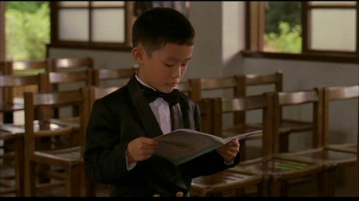

# ＜玉衡＞秘密的春天——《一一》及其他

**所有人的答案都很平凡，你知道这是你想看到的，你将看到的，你将作答的，你将涂抹的。你开始推敲每一个似曾相识的情节。比如父亲见了老情人生意不顺，女儿心仪的男孩在开了房间后逃走，两人一前一后回了家，像平常一样打了招呼，像平常一样各有心事。你想起自己和家人和恋人和朋友的每一个不经意的照面下浮动的暗流。**

 

# 秘密的春天——《一一》及其他

## 文∕吴昕悦 (Wellesley College)

 

我们每个人都想成为，摄像机后的摄像机。----恰克.帕拉尼克

又及：这篇不成影评的影评只是一些从上周开始便在脑海中浮动的念头，在一个无心复习薛定谔方程的晚上牵牵带带地在液晶屏上成形。

和文晔在昏暗的楼道里找到放映室，拉上窗帘把黄昏留在外面，空荡荡的大教室，音响有些模糊，演员已经勾好妆，灯光已经调试完毕，所有的悲欢离合爱恨情仇蓄势待发，你还在等什么？

不，不，不是这样的。重新开始。

春天，钢琴曲，啼哭，婚礼。婚礼结束，双喜字的气球被摘下的时候泄了气，和睦融融的全家福在照相机喀嚓一声以后散了宴席，钢琴淡出，生活淡入。

整部电影讲述的是简家的琐事——NJ在事业上磕磕碰碰又遇到了老情人，婆婆中风病倒，女儿婷婷懵懂的三角恋，儿子阳阳天天被女孩子欺负，邻居家的偷情，小舅子的新婚娇妻和前女友不共戴天……没有主角，甚至没有一个面部特写。它以一种细腻而流畅的姿态，将生活平铺给你看。

在这熟悉和共鸣中，你不会笑尽气也不会愁断肠，因为这三个小时当中，你笑的是自己，哭得还是自己。所以你知道不论是怎么样，它都会继续下去。

这部电影的主角是生活，或者说是观众本身。

我们看过很多电影，知道有的主人公注定从默默无闻奋斗成无敌小强，有的结局最终注定所有阴谋阳谋都水落石出。可是生活不是励志片也不是警匪片，正义并不必胜，结局无人揭晓。我们都是野心勃勃的演员，每个人都一口咬定自己是主角——好像渴求别人瞩目的人应投生做面镜子，如此他定能被所有人最深情的流连返顾所淹没。

但是我们手里只有自己的剧本，我们只能看到生活的一部分——而谁又能说得清到底发生了什么？生活是一本注定读不完的的艰涩教科书，我们是考场里裸考的学生，限时七十年，现学现卖，开卷有益。囫囵吞枣地翻过去，各自作答，各自心照不宣。我们半掩着自己的卷子，一边偷眼看别人的答案，闪烁的眼光交织成流言蜚语。

杨德昌在《一一》中所做的就是将你看不到的事情，用一种优雅平淡的方式放在你面前。所有人的答案都很平凡，你知道这是你想看到的，你将看到的，你将作答的，你将涂抹的。你开始推敲每一个似曾相识的情节。比如父亲见了老情人生意不顺，女儿心仪的男孩在开了房间后逃走，两人一前一后回了家，像平常一样打了招呼，像平常一样各有心事。你想起自己和家人和恋人和朋友的每一个不经意的照面下浮动的暗流，你突然明白他们的角色并非“你的家人”、“你的恋人”、“你的朋友”，他们的舞台各自有一小块与你共用，只是偶尔到你这里跑个龙套——那是他们的剧本上写的，是你永远看不到的篇章，你手里的剧本上字里行间的空白都在讲自己的故事。

讲述数个同时发生的事情就像同时铺开所有生活一样困难。一个优秀的艺术家能够将二维的空间拓展成三维甚至四维，能够将一个情节发展出多重诠释的可能。另一方面，杨德昌在影片中体现了生活不同侧面间的循环反复和惊人的相似性——错恋、出生、死亡。每一个人都以静默的方式翻阅着自己的一本苦经。父亲的神情在孩子脸上流露，老人苍老的皱纹里时光勾勒的是少女的面庞。生活如此绝望，也如此生生不息——这样的绝望是灵魂最终的安宁，而要陷入绝望，你必须热爱过这个世界并且依然爱着——片名《一一》也是取自“一生二，二生三，三生万物。”

我以前曾经想过设计一个话剧，整剧没有对白，舞台是一栋楼的横截面，角色是人们。你看着他们说话，听不见内容。你看着他们相遇时嘘寒问暖，关上门恶语相向。你看着男人和保姆偷情，女人搬弄是非。有那么多的故事交织，你一次只能看见一个。

我和无为说了这样的想法。他说如果他会雕塑，他要用一个盘曲的树干，每一个树洞上都填了水泥，至于名字，就叫做：“秘密”。

 

（采编：孙梦予；责编：徐海星）

 
