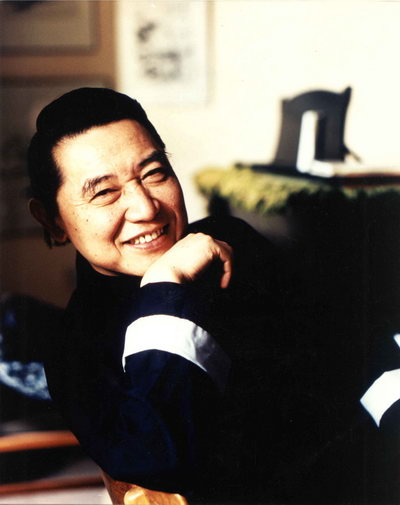
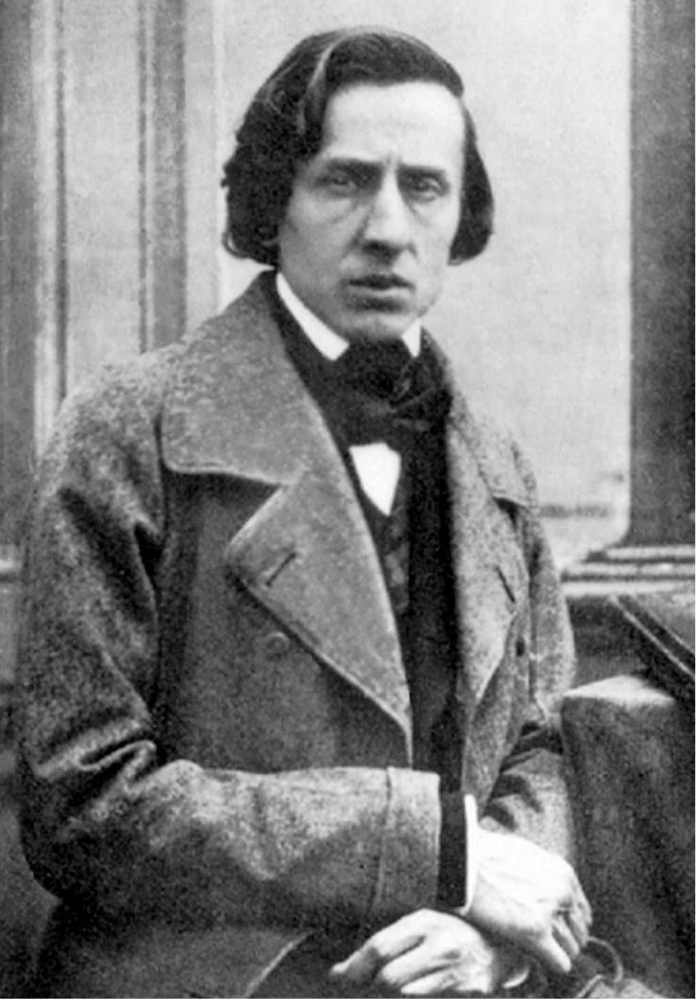

# ＜玉衡＞稀缺的宽容

**我们可以训练出众多的First class pianists和数量更为庞大的Second class pianists，但却难以拥有一个能生长出outstanding pianist的土壤，除去前辈们已经展现出各种各样的可能性之外，还有观众的心态问题，正如在百米赛道上，已经有很多人超越了刘易斯、约翰逊的记录，但又有几个像博尔特这样桀骜不驯的天才能被人记住呢？ **

### 

### 

#  稀缺的宽容

### 

##  文/周皓（北京化工大学）

### 

### 

### 

1955年那届肖邦大赛造就了一个隐士冠军和一个指挥家，同时还造就了一个被新中国逼得家破人亡的傅聪。

当12月4日傅聪在国家大剧院音乐厅缓缓走上舞台的时候无论是衣着还是样貌气质都活像一个老神仙，或者至少也是个在峨眉山人际罕见之处独自修炼的世外高人。当他坐在琴凳上，在那架北京舞台上少有人用的92键贝森朵夫钢琴上弹出第一串音就让我瞠目结舌，我想象过种种的可能，但却没有能猜到傅聪现在的演奏已如此“另类”。 傅聪指下的肖邦具有超长的音乐线条和较为随意的音符，勾勒出的却是一个十分生动的肖邦，这个肖邦看不见清楚的轮廓界限但却仿佛触手可及。其弱音的功夫也很罕见，无论弱到怎样的程度剧院里每一个观众都能听清。几首曲子下来傅聪甚至带给了我八十年代唱片中霍洛维茨的感觉，一样的不拘一格和自然真切，同时也一样具有大把自然的错音。老实说今晚舞台上的傅聪绝对对得起其七十多岁的高龄，如果愿意可以轻易找出错音所在，甚至有忘谱的时候，但这丝毫没有影响他绘制一个毫不做作的肖邦，在演奏练习曲的时候已经慢的不能再慢，有的时候线条长的甚至让熟悉的曲目变得面目全非。他对于rubato的掌握几乎到了化境，他不是针对某一个音符或者某个小节，而是整个曲子都在rubato，他对伸缩速度的把握完完全全融汇到了整个音乐思维之中。 不过正如现在没有几个人能像Thielemann这样指挥出正统的贝多芬一样，被演奏滥了的肖邦也正在遭遇同样的尴尬：循规蹈矩很容易带来被埋没的命运，创新却又会冒着被指责装腔作势的风险。如果一位十六岁少年以傅聪今天这样演奏方式他很有可能面临着没有老师愿意教的境地，但对于一个在数十年前就成名的钢琴家来说，他拥有足够的公众宽容度来发挥他认准的肖邦。在错音、忘谱和失去几分弹性的线条面前，我也可以用他的年龄和大师的身份来宽慰自己；极慢但却有极佳的音乐性的练习曲演奏也会启发我思考：我们到底该不该在心里给肖邦设立一个“标准”？ 

### 

### 

面对一个老人，我们给予了充分的理解。但假如面对的是一个二十多岁的新人，我们能给予其同样的宽容么？

走出大剧院的时候我的左右两侧分别出现了沉稳淡定的傅聪和信心满满的阿芙蒂耶娃两张大海报，我十分恶意的想象下周一些观众以失落的表情走出音乐厅的场景，因为如今的肖邦冠已经很难像几十年前的冠军们那样的到认可。这应该完全归咎于我们所处的时代，我们可以训练出众多的First class pianists和数量更为庞大的Second class pianists，但却难以拥有一个能生长出outstanding pianist的土壤，除去前辈们已经展现出各种各样的可能性之外，还有观众的心态问题，正如在百米赛道上，已经有很多人超越了刘易斯、约翰逊的记录，但又有几个像博尔特这样桀骜不驯的天才能被人记住呢？ 自列夫·奥博林获得首次肖邦大赛“冠军”之后，我们这个世界一共出产了14位金牌获得者，除了现在从不开独奏会的阿格里奇和怪异直率的奇摩尔曼之外，剩下几位中有如哈拉谢维兹齐、布宁这样难寻踪迹的隐士，也有获奖后数年止步不前甚至有所下降者，当然还有像布列哈兹、奥尔森这样不温不火的冠军，像波利尼这样“健康”的大师无论对经纪公司还是乐迷来说，实属稀缺之物。 下周阿芙蒂耶娃很有可能面临这样的窘境，许多抱着去看新科状元钢琴家的期待去看她的独奏会，但却会因为她的百米速度仍然在九秒七附近而抱怨，虽然她已经比约翰逊快很多了。 在之前七十多年有唱片记录的时间里，无数的大师已经展现了各种各样的可能性，他们的演奏在今天来看也许是属于打破桎梏的类型，但在这数十年间，他们却也有意无意的成为了桎梏的缔造者。 

### 

### 

（采稿：栾溪 责编：乔淼）

### 

### 
