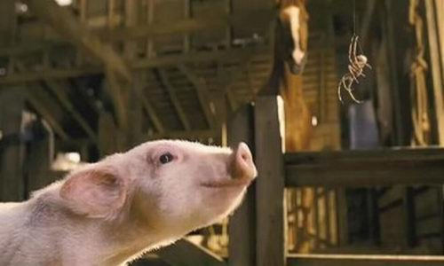

# ＜玉衡＞童年的暗号——读《夏洛的网》

**不惜笔墨，去复述夏洛与威尔伯的故事，在于获得一种精神的体验。对于童话而言，故事是它的血肉，灵魂在阅读的行走中从地平线升起。当汹涌的成年席卷而过，无利不往，无名难图，所有的童年似乎卑微到幸福的低谷。完整地去了解这个故事，就是叫出那个隐匿在自己心中的魔鬼，只有叫出它的名字，才能获得救赎。就像是一面镜子，照进成人世界关于友情、宽容、信任这些美好纯粹的品性，也投下我们缺失的阴影。**  

# 童年的暗号——读《夏洛的网》

## 文/修思1984（江西教育学院）

 

**题记：在一个理想的世界里，应该只有两种人存在，一种是读过《夏洛的网》的人，另一种是将要读《夏洛的网》的人。**

**－－严锋**

无意中，在新浪微博看到网友热议再版的《夏洛的网》，被誉为美国最伟大的儿童文学作品，傲居傍首云云。面对如潮的好评，自己仿佛是桃源遗民，不知秦汉，无论魏晋，只有思忖《夏洛的网》到底是什么作品，喜欢的人好多，知道的人太少。

书渡有缘人，月初在一书社偶遇上海译文版的《夏洛的网》，任溶溶翻译，图文并茂。两个晚上的时间倚卧床头读完，意兴阑珊，掩卷入梦。一位23岁的老男孩，手捧一本童话，津津乐道。喜感的画面，但何尝不是生活最好的广告呢？

“谷仓很大。它很旧了。里面有干草的气味，有肥料的气味。里面有干活累了的马的汗味，有吃苦耐劳的母牛的极好闻的气息。谷仓让人闻上去感到天下太平，什么坏事都不会发生，它充满了谷物、马具套、车轴油、橡胶靴和新绳索的气味…”隽永而清新的文字，浓郁纯朴的乡村气息扑面而来。对于这样的描写，自己总是没有任何抵抗力，缱绻流连其间。得承认，由于成人的傲慢，几乎错失这部童话作品。相见恨晚，一本小书为这个忙碌于案头的秋天凭添一份诗意的想象，涌上心灵的清泉。

一天清早，阿拉布尔先生拿着斧子准备处理掉刚出生的落脚猪，八岁的女儿弗恩难抑激动的情绪，眼泪汪汪地恳求爸爸不要杀它。阿拉布尔先生温和地告诉女儿，要学会控制自己，落脚猪的麻烦很大。最精彩的反驳出现了，“生死攸关的事，你还说什么控制自己。”弗恩叫道，“要是我生下来的时候很小很小，你也把我杀了吗？”开篇读到这里，若没有弗恩的倔强、较真、善良和机智，一篇伟大的童话也许就要与小猪一起夭折了。当然，我们也不能忘记阿拉布尔先生的通情达礼和对女儿的怜爱宽容。拥有这样一个女儿，对每一位成年读者都是一种恩赐，几乎言寓着所有美好的性情，充实着对生活最殷切的爱意和希望。

阿拉布尔先生把小猪送给了弗恩，弗恩给自己的宝贝猪取名“威尔伯”。弗恩爱威尔伯胜过一切，以至于课堂上老师问她宾西法尼亚的首府在哪里时，弗恩像做梦似地脱口而出“威尔伯”。看到这一节时，连笑点一向很高的自己，也不忍嗤笑，有读书入神喝墨水之趣。

在小猪出生5个星期后，食量大增，通过父母的建议，弗恩不舍地把威尔伯卖给了开农场的霍默舅舅。威尔伯安置在新家后－－朱克曼先生家的谷仓底层，童话里不止有王子和公主，青蛙和巫婆，小猪的周围有了一群恬噪的动物新伙伴，成熟世故的老羊，毛噪多嘴的母鹅，贪婪自私的老鼠…虽然有安逸的新家，丰富的美食，可这样的生活让威尔伯愈发寂寞无聊。是的，在一只小猪的身体里，它觉醒的生命第一次体会到“寂寞”这个词。尤其是在母鹅的怂恿下，经历了一次从猪圈失败的逃亡后，“我独自一个去闯世界实在还太小”，在自言自语的悲悯中，孤独刺激着威尔伯敏感脆弱的心灵。在离开弗恩的怀抱后，它需要有一个可以聊天、可以交流的朋友－－这也是一个人最单纯的品性。可农场的动物几乎没有一个愿意和它交朋友，这莫说是对一只小猪甚至是对人最大的打击了。

孤独不会是永远的。就在威尔伯心灰意冷的时候，一个声音如一道温暖的光出现在黑暗中，“你要一个朋友吗？威尔伯”那声音说，“我可以做你的朋友。我观察你一整天了，我喜欢你。”蒋勋在《孤独六讲》中告诫：“当你被孤独感驱使着去寻找远离孤独的方法时，会处于一种非常可怕的状态；因为无法和自己相处的人，也很难和别人相处，无法和别人相处会让你感到巨大的虚无感。想要快速打破孤独的动作，正是造成巨大孤独感的原因。”孤独是每一个人必须独自面对的困境，没有谁可以代替承受。可当你遭遇求学落榜、求职失意种种挫折陷于孤独时，一个朋友对你说：“我就在你身边儿，明天早晨就可以看见我了”。这是一份超越孤独的品质，它给人的蔚藉并不亚于当初夏洛给威尔伯的惊喜。

在获得友谊的时刻，夏洛那凶猛残忍的外表，也许使许多读者和威尔伯一样悚然，难以释怀。这大抵是童话对成人世界的嘲讽－－一切超出理性认识外的，就像一只蜘蛛竟可以成为朋友那么荒唐。在E.B.怀特的笔下，平常让人生厌的蜘蛛、老鼠也格外有亲近感。一天饱经阅历的老羊，告诉威尔伯，朱克曼一家养肥它只是为了圣诞节能够多顿熏肉火腿。这可把小猪吓坏了，以至长期生活在世界末日的阴影下，而它的愿望是如此纯粹：“我要呼吸美丽的空气，要躺在美丽的太阳下。”

“你不会死。”一个神谕般的声音从夏洛的口中脱出，“我救你。”夏洛安慰它的新朋友，鉴定而又诚恳。一只小小的蜘蛛怎么能够救一只小猪呢？在读者还在迷茫的时候，夏洛已经开始忙碌了，带领我们攀上想象力的高峰。它利用自己出色的结网功夫和智慧在网上分别织下了“王牌猪”、“了不起”、“光彩照人”三个词，农场周围无数的人把网上出现的字，视若神明的暗示，而威尔伯无疑是神迹。在夏洛的精心策划下，威尔伯赢得了动物同伴们的尊重，更是让四面八方涌来的人们刮目相看，惊叹这一辈子都没见过这样一只小猪。读者看到这一幕，成人的世界几乎可以媲美《皇帝的新衣》。所有的这一切，都源于夏洛对威尔伯忠诚、真挚而深沉的友谊。

友谊和人格的力量是惊人的，自从蜘蛛开始扶助威尔伯后，它就尽力活得跟它的名声相称，从敏感、脆弱、胆小的泥沼中爬起来，夏洛的网说它是王牌猪，威尔伯尽力让自己看上去是只王牌猪；夏洛的网说它了不起，威尔伯就尽力让自己看上去了不起，夏洛的网说它光彩照人，它尽力让自己光彩照人。这是友谊最美的篇章！

秋天来临后，威尔伯请求夏洛一起参加县城的集市。在集市上，油尽灯枯的夏洛使劲最后的生命为威尔伯在网上编织了“谦卑”二字，也为朱克曼一家赢得了奖牌，彻底解救了威尔伯的性命之忧。而夏洛却在集市的尾声时，孤独地死去。在它死的时候，没有任何一个谁陪在它身边，不胜悲伧。威尔伯有着和读者一样的困惑，为什么夏洛会为它做这一切呢？读夏洛与威尔伯最后的对话，感人至深：

“你为什么为我做这一切呢？”它问道，“我不配。我没有为你做过任何事。”“你一直是我的朋友，”夏洛回答说，“这件事本身就是一件了不起的事。我为你结网，因为我喜欢你。再说，生命到底是什么啊？我们出生，我们活上一阵子，我们死去。一只蜘蛛，一只忙着捕捉和吃苍蝇是毫无意义的，通过帮助你，也许可以得到一点我生命的价值。谁都知道人活着该做一点有意义的事情。”

不惜笔墨，去复述夏洛与威尔伯的故事，在于获得一种精神的体验。对于童话而言，故事是它的血肉，灵魂在阅读的行走中从地平线升起。当汹涌的成年席卷而过，无利不往，无名难图，所有的童年似乎卑微到幸福的低谷。完整地去了解这个故事，就是叫出那个隐匿在自己心中的魔鬼，只有叫出它的名字，才能获得救赎。就像是一面镜子，照进成人世界关于友情、宽容、信任这些美好纯粹的品性，也投下我们缺失的阴影。激起人们重新索引童年留在我们生命里的美好年华，一路走来一路失，它需要一个暗号去解开时光的密码，给当下的人生重添信心和勇气，朴素而又坚定，而《夏洛的网》无疑是案头最好的编程码。

 

（采编：麦静；责编：麦静）

 
