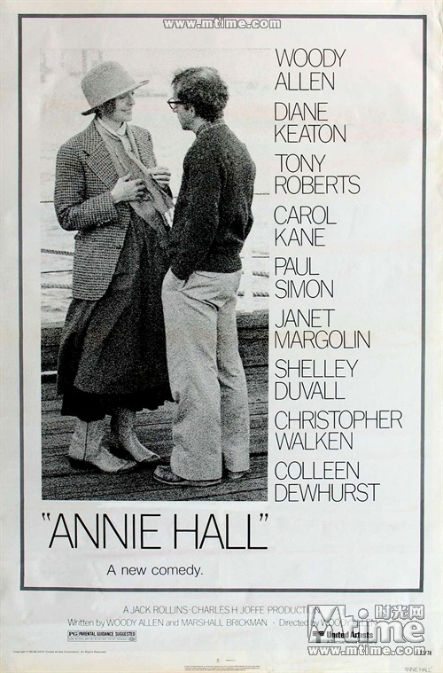

# ＜玉衡＞脑淫也是一种黑色幽默

**初遇安妮，在夜晚的街道，艾维尔不合时宜地问道：“现在我可以吻你吗？因为要是现在不吻，等一下我怕会尴尬。”这样的场景真是货真价实的喜剧桥段。接下来的每一幕，督促女友去成人大学，阅读关于死亡的书籍，他们争吵，又和好，庸常而普通，陷入恋爱的既定模式。**

 

# 脑淫也是一种黑色幽默

## 文/张睿（中南财经政法大学）

 

一副黑框眼镜，身材瘦小，目光敏锐，第一次接触伍迪艾伦，浑身上下透露出的“坏孩子”气场居然让我有忍俊不禁的感觉，头上顶着卷曲的发丝，这个犹太人把自己的乖戾与叛逆全部写进电影中。

总的来说，《安妮霍尔》不是一部情节性很强的影片，但又难以将它归入纯文艺的范畴，开头伴随着主人公的几分钟独白，凌乱，自顾自地谈论着自己的生活，接下来开始倒叙他与女友安妮的一些回忆录，相识的部分被短短略过，这不是一个以爱情为重心故事，即使在泛旧的画面中，还是让人体味到一种被理性洗涤过的浪漫。

撇开那些高明的艺术手法与采光技巧而言，《安妮霍尔》只是一个“脑淫”患者的单口相声剪辑，喋喋不休讲述着鸡毛蒜皮的生活，主题不明，去向不辨，黑色幽默情调渲染着美国式偏见与自嘲的碰撞，这不是什么高明剧本，不过是一段恋情的由始至终，但很遗憾，我们都紧紧陷入这样令人匪夷所思的关系中，并且不能自拔。

**屌丝的自嘲**

“你知道吗，我看了15年的心理医生，从小生活在过山车下面的房子里，然后从一开始就知道宇宙在膨胀这件事”，这是艾维尔.辛格，也是伍迪艾伦。一脸呆滞，又带有某种厚颜无耻的骄傲，矮小，瘦弱，像是一种长在雨天的苔藓，叠叠不休的表情让人觉得可笑。

电影伊始，艾维尔喃喃道：“不用担心，我不是一个悲观主义者。”那种鄙夷而害怕的表情不禁让人哑然失笑，他蓬乱的头发，干枯，糟乱，一张脸缺少了生机，祥林嫂一样重复着那些笑料，真是美国版屌丝的纯粹写照。

怀旧的基调，不着边际的语言渗透于影片的每一个枝节。艾维尔在镜头前卖弄着卑微的语言，能言善辩地维持着自己脆弱的自尊心。做爱时不接受女友大麻的刺激，完全的占有让他具有强大的安全感，不管是否真实，压抑在无人赏识的欺骗中，这也是伍迪艾伦的自我写照。

爱情让人沉醉，艾维尔清晰地分辨着所谓生活效率最大化，自作聪明地认定赢家的归属非自己莫属，但是在大声疾呼爱情自由的国度中，爱情已经逐渐远离，这才是文艺患者的巨大讽刺。

**不合时宜的“脑淫”**

初遇安妮，在夜晚的街道，艾维尔不合时宜地问道：“现在我可以吻你吗？因为要是现在不吻，等一下我怕会尴尬。”这样的场景真是货真价实的喜剧桥段。接下来的每一幕，督促女友去成人大学，阅读关于死亡的书籍，他们争吵，又和好，庸常而普通，陷入恋爱的既定模式。尽管从相遇到热恋，每一幕都带有一些赘余的荒谬，艾伦还是把对于剧情发展的掌控发挥到了极致。安妮穿着男式西裤，戴着领带，和与自己身高相差不远的男友斗嘴，即使拥吻也不似普通的情侣浓情蜜意，自然简单，拍摄手法也不见得多么繁复，配乐不多，整个影片显示出一种聒噪的气氛。

灰色的基调中将人与人之间关系的无奈细细道来，最后艾维尔貌似恍悟地说到我很开心，那个冷笑话恰好划过他的大脑皮层，我的兄弟生病了，他觉得他是一只鸡，医生问道为什么布袋他来，他一脸淡定地说因为我需要蛋。每个人都需要蛋，所以细心保护可以生蛋的母鸡，世界上有那么多正常的聪明人，可是他们偏偏不是那只以为自己是母鸡的疯子，“脑淫”患者就是偏执狂的直接写照，因为我们很聪明，所以我们很骄傲。

**幸福的都是傻子**

很容易就幸福的人往往是一群简单的傻子，我想艾伦这样认为。他一直孜孜不倦地找寻爱情与自我的平衡，即使早就发现满足感总是扎根在那些较为光滑的大脑皮层里，他还是高傲地陷入一个“脑淫”的自我催眠。

每个时代都幸运地拥有那么一批“门萨的信徒”，心地善良，也带有知识分子的尖酸刻薄，思考，再躺在自我陶醉的草垛上呼呼大睡，不太需要旁人的知会，自我封闭，真可惜，这样的人们游走在“可怕”与“可悲”之间的缝隙，就成为既要体验可怕，又要时常可悲的那一种，我想这一点我也帮不上什么大忙。

在思考与体验中，我推荐后者的原因就在于毕竟经历过后还有分辨美好的可能，不至于让一开始就百分百成为一个可悲之人，你说呢?

 

（责编：应鹏华）

 
