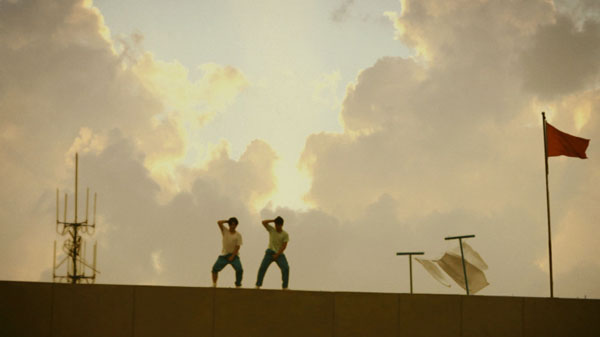
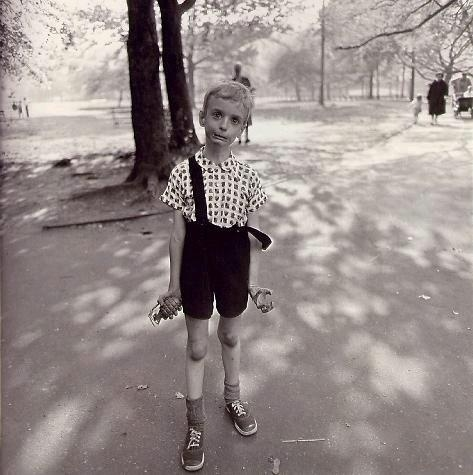
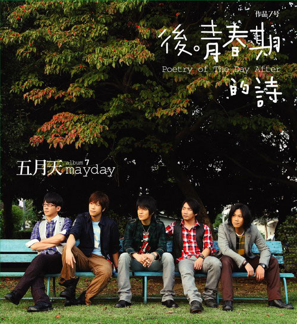
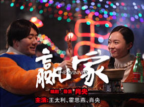

# ＜玉衡＞致以所谓残酷青春

陈丹青第一次到美国的时候，大吃一惊：街上的年轻男女，人人都长着一张没受过欺负的脸，那笑容绝不是某种高压下的矫揉造作，而是纯粹天然地发自内心。

至于我国国民，你们知道的，上下五千年来惯受欺负，危机中年自不免满脸愤懑，青春少年也是长期一脸苦相。

**《老男孩》**

** **

****

** **

第一次看《老男孩》，我就想到了Mr.Children的《Kurumi》，这个MV是我中学时候第一次看的，现在再看依然十分感动，现在各大视频网站上还都有，我会链接在文后，个人觉得比《老男孩》拍的好。

《老男孩》的剧本情节明显取材于《Kurumi》。其实早在《老男孩》之前，陈琳的《13131》就复制过《Kurumi》了，只不过陈琳的MV拍摄团队比较不争气，直接抄人家的都抄不好，所以这个MV没能火爆起来，反而在网上被网友各种调侃挤兑。

在我看来，陈琳的《13131》之所以没能走红除了制作水平和宣传力度以外，很大的原因在于“不合时宜”。《13131》是2005年发行的，2005年，奥运还没办，世博会还没开（因为没开，所以期望在），中国股市（到目前为止）最大最长的一轮牛市正酝酿着启动，房价还没像现在这么高到离谱，刚刚和鑫鑫还没成名，民众普遍对未来的生活充满希望和信心，哦，对，还有互联网并没有像现在一样的影响力和普及度，这个时候捣鼓什么《13131》，只能是一次矫揉造作的自我呻吟，砸不出什么大水花。

《老男孩》出来的时候就不同了，这几年国内是个什么状况想必大家比我清楚多了，80后无梦的一代开始缅怀青春，这些都成了《老男孩》能走红的基础。

说实话，每次看到《老男孩》我都为Michael Jackson老师叹一口气。就好像前一阵子来华的Bob Dylan一样，他们都是被善于炒作的中国媒体和跟风的民众消费的大众符号罢了。

杰克逊最红的时候，中国根本没几个人知道流行歌曲是什么。崔健那帮窝在北京的孩子可能知道，那是八十年代，他们在描绘中国摇滚美好的明天。其余的人，顶多是在“精神污染”的阴影下偷偷摸摸通过三洋收音机听听邓丽君罢了。而更多的人，连邓丽君都没听过。

乍一看现在网上那么多模仿MJ跳舞的视频，我还以为咱和美国人一样，都是听着MJ的歌看着MJ的演唱会长大的呢，但仔细想一想，09年之前你能看到几个这样的视频？

说到底，这些外国歌手对中国人的影响加起来还没有小燕子或者F4多。巧就巧在，MJ在09年去世了，欧美媒体开始感慨流行音乐的最后一个超级巨星陨落了，欧美这两年经济不好，MJ的死很容易现在这帮欧美中生代回忆起八九十年代“鱼翅捞饭”的黄金时代。一时间，MJ的死成了一个绝佳的象征，象征着充满理想和激情的青春一去不复返。

这种追思蔓延到国内，就变成了停滞时局下苦闷年轻人宣泄失败情绪的一个出口。

想想吧，当老版初中英语课本里的韩梅梅和李雷都能成为一种符号，一种逝去的美好的象征，这是一代年轻人的集体感怀。

一个频繁回忆的时代，一定是在当下出了问题。

**“残酷青春”**** **

刘瑜在《长达一生的青春》之中说：

有一段时间甚至有人为此类文艺作品起了个类型名称，叫做“残酷青春”。简直没有比这更无赖的词：什么叫残酷青春？老年残不残酷？残酷到人们都懒得理会它的残酷。童年残不残酷？残酷到孩子们都无力表达它的残酷。更不要说倒霉的中年，残酷到所有人的残酷都归咎于它的残酷。所以说到残酷，青春哪有那么悲壮，简直可以垫底。

她还说：

其实满世界都是这样的人……他们看透了世界之平庸，但无力超越这平庸。他们无力成为“我”，但又不屑于成为“他”。他们感到痛苦，但是真的，连这痛苦都很平庸。这世上有多少人看透人生之虚无并感到愤怒，这愤怒早就不足以成为个性。

我深以为然。

“残酷青春”这个概念是从日本过来的。其实，整个东亚的文化生产线，基本上是日本影响台湾和韩国，台湾通过香港影响大陆，韩国直接影响大陆。岩井的《燕尾蝶》，《关于莉莉周的一切》等作品早就成了残酷青春代表作。

我有想过，为什么残酷青春这个东西会在日本起源，并最终感染整个东亚。

结论是：东亚这些地方的年轻人太苦闷了。

就说中国和日本。经济上，日本自从被美国修理了一把，已经停滞了很多年，中国除了物价从来没停滞过，从实质生活水平上来说，这几年已经进入了某种程度的停滞甚至倒退状态；政治上，日本很奇怪，非常奇怪，虽然他是公认的民主国家，但民众很少上街或者罢工，政坛平静地如一潭死水，这一点想想自民党能连续执政38年，首相年年换而不出现大的社会动荡就知道了，而中国的政治现状就是你不可以说它的政治现状.

多说两句日本，其实日本出现这种情况是很正常的。日本再怎么西化，毕竟根子上还是东亚泛中华文化圈，长幼谦卑，差序稳定，老人集团这些东西，是很难抹去，新加坡不也如此么？ 

年轻人进入社会，发现经济停滞，政治上也难有作为，难免产生失落的幻灭感，一个年轻人这么想，叫顾影自怜，十个年轻人这么想，叫深有同感，一千万个年轻人这么想，叫亚文化，一亿年轻人这么想，还是叫亚文化……没办法，是不是主流文化不是看你人多不多，而是看你有没有掌握最核心的社会资源，而在东亚文化圈里，这些资源都是在老头子手里的。若有一天你在那档每天晚上七点准时开播的节目之中听到要弘扬残酷青春文化，那它就成了文化，并将迅速成为下一个亚文化的靶子。

**“五月天”** ** **

****

** **

有一阵子，初中那会儿，我也挺喜欢听五月天，后来就渐渐不听了。

我想，那是因为我的成长已经到了下一个阶段了，开始面对着全新的BOSS，而五月天，还停留在“后青春期”，他所面对的BOSS，怎么也打不死，叫做“残酷青春”。

你们都知道，五月天崇拜披头士，但我想，永远18岁永远后青春期的他们永远也成不了披头士，不只是影响力上，更是乐队成长阶段上。

披头士刚出道的时候，基本和现在的偶像团体没差，四个挺帅的小伙儿，弹着吉他，唱着情歌，热情洋溢地，引来一众女粉丝追捧。而披头士之所以成为了披头士，关键在于乐队发展后期对于政治，宗教乃至哲学的介入，1967年的《Sgt.Pepper's Lonely Hearts Club Band》让摇滚乐成为了一种严肃的艺术，是一张摇滚乐历史上留下名字的唱片。

披头士和同时代的年轻人是一同成长的。刚开始，大家就是对沉闷的战后社会秩序有点不满，想来点刺激的，做点想做的，但随着冷战，越战，第三世界民族独立运动的发展，这场青年人为主导的社会暗潮很快和世界局势乃至人类命运发生了千丝万缕的关系，越发严肃化，最终在1968年形成了一场席卷整个发达资本主义社会的社会运动。

而五月天，像是饱受青春期综合症困扰的孩子们的精神保姆一样，站在18岁的门槛上，一手梦想，一手爱情地给他们喂奶。十年之后，18岁们成为了社会人，成为了父亲母亲，回头一看，这几个快四十的人还在那后青春期呢。

不过不要紧，就算你28岁了，天天朝九晚五，还着房贷，像条狗一样，梦想早就成为幻想，你还是可以找到精神保姆的，去看《老男孩》嘛。

这也是无可厚非的，后工业社会就是这样，存在即合理，有需求的地方一定会有供应。当年听五月天的你现在28岁了，但总还有18岁的孩子们在，他们和当年的你一样对爱情和梦想充满向往，对成人的世界充满失望和不信任，最关键的是，他们中的大多数和28岁的你们中的大多数一样，是实现不了自己的梦想的。这个时候，一个精神保姆的出现，告诉他们世界是残酷的但爱是美好的梦想是要坚持的有挫折也是要忍耐的，多好。

这是一个分工明确的文化抚养系统。十三四岁的时候，男孩子们有武侠片，女孩子们有偶像剧，告诉你们成长多好江湖多好婚纱多好，十七八岁的时候，有残酷青春有五月天有九降风，告诉你青春就是要和世界碰撞要坚持爱与勇气，二十七八岁的时候，有老男孩老女孩告诉你过去的都回不来了现在缅怀一下小小伤感一下抒发一下情绪也是不错的，三十七八岁的时候，有《赢家》告诉你人生不应该这样过钱不是万能的亲情友情爱情才是可贵的，五十七八岁的时候……不好意思，中国大众文化的发展还没到这个年龄段，过二十年我会告诉你答案。

问我，这些话难道不对吗？

对，当然对，因为太对了，所以意义不大。

总有些话是道德正确的，比如说每个人都要爱别人，比如说钱不能给你带来所有你想要的，比如每个人都应该全力追求自己的梦想。

这些话就像万金油一样，无论是当做自己的观点，还是反驳他人的论点，都是一击毙命，也许暴击。

我忍不住想到了成功学中的那些经典观念：你要追随自己的内心，保持身心平衡，审视自己的人生……

这种高瞻远瞩视野开阔的话基本是等同于废话，但偏偏有很多人会去喜欢。也许他们根本就不会也不知道怎么去实践，只是听了之后觉得有所收获，好像自己获得了提升，由此产生了一种虚妄的满足感。

我想，这是没有办法的事情，我国国民的惯受欺负不仅仅是经济物质上的，更是精神思想上的，我们的教育，我们的环境没有告诉我们怎样去独立思考，没有告诉我们怎样去实践行为，它只是一味的鞭打你，让你顺从，并在你受伤之后给你提供一些安慰剂来安慰你。

**《赢家》**

** **

****

** **

我总觉得，真正的好作品，是不那么直接的，是一种隐忍的表达，一种深层次的渗透而不是表面化的宣泄甚至强势插入。如果你的作品够优秀，那就不需要像《赢家》一样生怕观众看不出来你想贩卖什么，而非要最后明明白白地写上字幕：当我们懂得珍惜平凡的幸福，就已经成了人生的赢家。

在这一点上，内地导演和演员水平明显偏低。冯小刚拍《唐山大地震》，就非得让徐帆老姐姐像当年的倪萍一样扯着嗓子鬼哭狼嚎，嚎的我心在滴血肾在颤抖，差点忍不住要暴走。而侯孝贤拍《童年往事》，一组长镜头，不多说话，也不给你明显的符号暗示，却让你整个心都蒙上了悲戚，不重，但雾气般难以散去。因为他的剧情铺垫，镜头语言已经提供了一个强大的场。

筷子兄弟以后会怎么样，商业上我不知道，作品上我不认为会出什么大动静。前面说了《老男孩》只是赶了个巧。虽然拍的不怎么样，但总比十一度青春里面别的那些莫名其妙的要好，以至于借着中国人都知道但都不熟悉的MJ都能红。有了《老男孩》愉快的尝试，和中国那些只有一部优秀作品的导演一样，筷子兄弟已经找到了一种自以为屡试不爽的法宝，我相信会一直用下去的。这并不是什么艺术创作，只是一种流水线生产罢了，就好像五月天再出专辑，大抵还是残酷青春美好爱情范儿的，《读者》再怎么出版，也无非是一些安慰剂似的心灵鸡汤。

有人说，你怎么就光否定啊，而且是否定这些道德正确的道理，有意思吗？

我只是觉得，这些表面上的苦痛实质上的自我宣泄，这些心灵鸡汤似的安抚，并不能解决什么实质性的问题。

每个国家的人都有青春期综合症，都有想不开的那几年，但为什么在今日之中国如此之严重，一堆二三十的成年人还要沉溺在后青春期残酷青春式的文化氛围之中自我哀伤呢？

一定是我们的现实出了问题，把这些最应该充满希望最应该干劲朝天的人逼到了狭小的虚拟社会，并在发现一个个和自己一样可怜的同伴之后互相拥抱相互取暖。

《赢家》的最后十分心灵鸡汤地告诉我们：当我们懂得珍惜平凡的幸福，就已经成了人生的赢家。

我无意细究这句话——细究也没用，这种话太道德正确了——但我不能接受这个答案，它太敷衍太开脱。什么叫平凡的幸福？我们现在的生存状况，生活在这样一个社会里,然后告诉自己，忍耐就是幸福，平凡就是幸福？

不，不应该这样，不可以这样，当我们这样欺骗自己，唯一的后果只能是我们的下一代，下一代的下一代继续忍受着这些，然后他们再通过他们那个时代的五月天，老男孩，读者，赢家，来安慰自己：当我们懂得珍惜。

行动起来，是的，行动，起来，行动了才能起来，而不是唱两句起来就能起来的。

我喜欢这句话：青春啊，你在忍什么？！

我们不需要更多的残酷青春，不需要更多的老男孩，我们需要更多的实干家，需要更多肩负起责任的男人。

再见，老男孩，再见，五月天，再见，读者，再见，残酷青春。请允许曾经经历过你们的我向你们致以崇高的敬意。并在道别之后头也不回地离开。走向前去。

（采编：安镜轩 责编：刘一舟）
