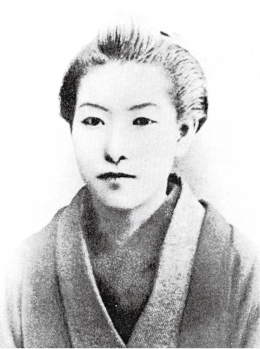
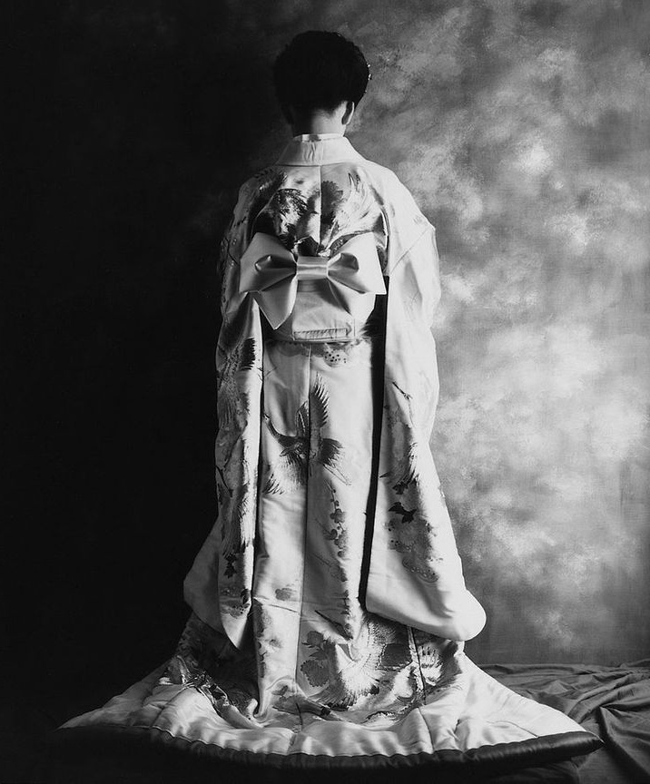

# ＜玉衡＞荒庭初雪兮心底哀：读《十三夜》

**一叶的文字是眉目柔顺的，她从未表现出什么对于现实生活的反抗，然而，做一个生活的贵族，本身就是对于苦难的最佳反抗。一种贵族式的从容自适，内里包涵的对美的执切坚守，莫能为世之所夺。因而一个真正的贵族，是永远不会被生活的苦难所击溃的。**  

# 荒庭初雪兮心底哀：读《十三夜》

## 文/ 麦静（中山大学）

 

此前从未听说过樋口一叶，是在书店偶然看见了新近出版的几种林文月先生的译著，其中便有这本《十三夜》。最初知道林文月先生，是有段日子里室友时时念叨要到台湾去买《源氏物语》的林译本，并一口咬定那是最好的中文译本，我一向对丰子恺先生的译本赏叹不已，心里便对文月先生的译笔存了疑。这次既可一读林氏译著，又为了那淡粉与雪白之间短短缀以一节嫣红与墨绿交杂相染的水墨画封面，便决意买下了这本不曾耳闻过的短篇小说集。

初读了《暗樱》和《下雪天》两篇，便对文月先生的译笔深慕不已。“放眼望去，大地一片敷盖着银沙，轻轻如飞舞的蝴蝶，枯木之上竟似春花满开”，这纤雅文笔里透出的古典情调、宛转情意，着实教人为之倾心。尤其是文中每见暗蹈和歌之处，都附以细细译注，真让我这种对日文与和文化一窍不通的读者，也能感到原文的好处了。其中所引和歌实多，但最喜欢的还是紫式部的一首：“降霏霏兮白皑皑，世事多忧我未谙，荒庭初雪兮心底哀”。

再读了几篇，直至忍不住一气将整本集子读完，脑海里浮起的印象竟也是一句“荒庭初雪兮心底哀”。樋口一叶委实是个可叹的才女。之所以称她为“才女”而非“女作家”，是因为才女多半年纪轻轻便已得名，有着与才华不相上下的美貌，当然最重要的是得有着悲惨的命运，宛若荒庭初雪，孤洁优美，仓促易逝。一叶生于士族之家，早年在有名的萩舍塾修习和歌与古典文学，后来家道败落，住进贫民区，孤女寡母开始从事劳动阶层的工作，过起了底层民众的生活。她从二十岁起执笔写作，初得声名，便在二十四岁的花样年华上因肺结核而故去，直如一片颜色鲜嫩的新叶，在风中凄凄冷冷地打了几个回旋便寂然落地。一叶，一叶，这名字太过清冷。

读开头的几篇小说，殊属优美，但却也留不下太深的印象，无非觉得一如“王朝文学”的哀靡绮丽，略带点泛滥的感伤。然而直至读到《比肩》与《十三夜》，却有了全然不同的感受。其中《比肩》尤为动人，少女美登利本应和她的玩伴们一样，无忧无虑地过完她的童年，但她却是个长在花街里的孩子，是花魁的妹妹呵，最后还是不得不梳起高高的发髻，步向卖笑的生涯，而她与青梅竹马的信如那段若有若无的情愫，引而未发，那么美好，却又显得成人世界如此残酷。而《十三夜》里，嫁入望族的寒门女子深夜归宁诉苦，想要与粗暴的丈夫离婚，但在听了家人的劝说后决定继续默默忍受，却在回去的路上无意邂逅年少时两相怀有好感的男子，近些年来他委顿自弃，终于从一个烟酒杂货铺的少东沦落成了人力车夫，两个人说了一些不失礼数的话，各自想起当年种种，但又能怎样呢，最终不过是“大路旁的柳条在月光中袅袅款摆着，漆木屐的声音轻轻凄凄。不管是村田的二楼，或是原田的广宅深处，世事多变，忧愁实多”。生活的苦难，对于在贫民窟里生活了多年的一叶，细腻敏感如伊，她是深深懂得的。

然而，一叶的文笔却始终是舒缓而从容的。“墙边盛开的牵牛花朝绽暮凋，尽其生命之本怀。人只要能辨知自己的身份际限，又何必为不如意的浮生种种多所忧虑愤恚呢？”这是一种贵族式的风致。我因而念及故去的姥姥，她出身大户之家，二十年代从大学毕业，可属那个年代的千金小姐了，其后遭受数十年风雨，饥荒折磨，文革折辱，然而在我小时候，她还轻声教予我，“美食不如美器”。后来每每想起，便觉得那才是一种贵族的气质，一种骨子里对于审美的执着，不因世事多舛而变更半分。读一叶的小说，写的多是底层生活，但字里行间浸着的却是一种贵族的态度。

若评论家要批判樋口一叶的作品，轻易便能找出许多说辞来，诸如缺乏革命性啦，受男权思想所缚啦，女性缺乏觉醒啦云云。一叶的文字是眉目柔顺的，她从未表现出什么对于现实生活的反抗，然而，做一个生活的贵族，本身就是对于苦难的最佳反抗。正如安迪在狱中拼上那么大的代价去播那一小段歌剧，华美的女高音带着空灵的自由在高墙里飞翔，“每一个人都相信，那是世界上最美好的事物，美得无法用语言描绘，美得让人心痛。歌声高亢悠扬，超越了囚犯们的梦想，就像一只美丽的小鸟飞进了高墙，使他们忘记了铁栏的束缚。此时此刻，肖申克里的所有人都感受到了自由”。一种贵族式的从容自适，内里包涵的对美的执切坚守，莫能为世之所夺。因而一个真正的贵族，是永远不会被生活的苦难所击溃的。

可叹这般的贵族精神，早已成为古典时代的遗珍了吧。

荒庭初雪兮心底哀，哀早逝的才女樋口一叶，亦哀那悄然远逝的古典时代。

（注：作者所读版本为《十三夜》/樋口一叶/林文月译/译林出版社/2011年出版）

 

（采编：黄美琳，责编：徐海星）

 
