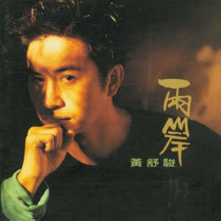
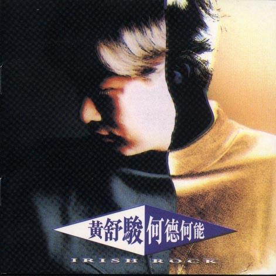

# ＜玉衡＞许久

**黄舒骏身上散发出来的浓厚而又自然的人文气息是我迷恋他最主要的原因，他的歌是隽永的，是寓深情于安静中的绵密厚实。既有细水长流的柔，也有历经沧桑的韧。每一首歌似乎都在讲一个故事，一个旅人的轶事。这些轶事不仅是自己的，也有别人的。**

### ** **

# 许久

### 

## 文/蔡梦璇（鲁迅美院）

“人一旦稍微上了点年纪，不小心就会想当初。”——虾米网友对黄舒骏《想当初》的评价中的一句。 出生在80年代最后一年的我并没有赶上黄舒骏辉煌的年代，很长时间之中也不知道他是何许人也。直到高中的某一天，在萌芽的某一期上看到徐璐小说中写道女主人公最喜欢黄舒骏的歌，不久有机会到网上找来听，发觉并没有什么，对于这个名字陌生的男人也就这样抛诸脑后了。直到后来上了大学，在一次感情挫折之后听到黄舒骏的《恋爱症候群》时，彷如头顶开了扇天窗，眼前霎时恍然了一些，心头也熨帖了不少。对于一个感情失落的失败者来说，也许各种安慰和逞强在此时都比不上一首歌的调侃和安抚，黄舒骏的睿智和温柔悄悄化解了心里的坚冰。 从那以后，这个细腻温柔的老男人和他的音乐就悄悄驻进了我心里。 

### 

### 

说他是老男人，其实他更像是个老男孩。这样说他，实在是因为哪有人年逾不惑还能敏感准确地捕捉和咏叹青春和爱情之美的？时光在流逝，却没有带走那颗愿意“执迷”于情的心。就是这份“执迷”，若不是有一颗孩子般不屈的心又怎能历久弥新呢？ 03年的时候，他曾出过一张名为《改变1995》的新歌+精选，其中同名歌曲《改变1995》还在电视台上热播了一阵，只是对于那时刚上初一没有任何阅历的我来说，这首歌连耳朵都没过完就忘记了，直到再后来听到那句“王菲变王靖雯又变回王菲”才想起这就是自己多年前曾听过的那首歌啊！那时歌里不懂的意蕴直到多年之后才明白。歌中对于世界的改变和物非人也非的伤感，以及人对于过去的执念深深地刺痛了我。有老话说“衣不如新，人不如旧”，当故人不在，我们的情感又该寄托何处呢？这首《改变1995》在时光的冲刷中慢悠悠地行进，到如今，歌里出现的很多人名都发生了命运的改变，张国荣跳楼了，王菲跟李亚鹏结婚了，陈水扁下台了，千禧年的阴影刚过，2012又要来袭……就像黄舒骏在歌里说的：属于我们的精彩早已经不复存在。对于很多人来说，他们的精彩确实在一点点被打磨干净，渐失光泽……这是谁的悲哀？又有谁能来负责？ 黄舒骏身上散发出来的浓厚而又自然的人文气息是我迷恋他最主要的原因，他的歌是隽永的，是寓深情于安静中的绵密厚实。既有细水长流的柔，也有历经沧桑的韧。每一首歌似乎都在讲一个故事，一个旅人的轶事。这些轶事不仅是自己的，也有别人的。所以常常让人产生深深的共鸣，对比自己产生自省的积极力量，这也是他的音乐中最重要的东西——不仅能够打动人心，还能够抚慰人心，甚至激励人心。 

### 

### 

2011年新出的EP《改变2011》中只有一首《想当初》，歌很简单，是关于人在爱的试炼中成长的故事。每个人都有自己的故事，每个刻骨铭心的爱情故事似乎都没什么善终，最好也不过无疾而终而已。爱是什么呢？他没有直接告诉我们，却用一连串的“想当初”缅怀旧日时光： 想当初 一点点纠结我就放开 想当初 什么都不忍耐 想当初 放弃的理由千奇百怪 如今看来真是太可爱 ...... 想当初 她痴心偏执接近变态 想当初 怪她脾气太坏 想当初 她动辄哭得死去活来 如今想来其实都是爱 ...... 想当初 爱总是来得像个意外 让自己突然沦落太快 想当初 结束的原因不明不白 这种遗憾至今 不能释怀 ...... 这连续痛苦的回忆让人不禁发问：“为何我如此孤单/欢喜悲伤都没有人管”？自以为是地“相信她还在远方，只是天不告诉我答案”，直到最后才明白“到如今只有你愿意为我悲哀，原来你是我仅有的爱，原来你就是我唯一的爱”。那爱是什么呢？是相知相许？是不离不弃？是平平淡淡？是蓦然回首那人却在灯火阑珊处的守候？仔细想想，你是否参透过真爱、遇见过真爱？又是否珍惜过呢？别把生命中最重要的东西丢了！ 实话实说，今天也正是这首《想当初》让我的眼泪决堤，泪流满面，许久没这样过了。昨天是我22岁生日，我22岁了，一点感觉也没有，又一个在平淡中度过的生日。却在一个深夜因为一个人的一首歌而泪流满面，不是触景伤情，只是感慨，人为什么只能在伤痛中经历成长，为什么有些事情总是“时候未到”地让我们兜兜转转地迷惘许久才能领悟呢？要懂事，总是要付出代价的，除非可以自私地总是选择蒙昧和伤害，然而成长这件事，却是无论如何任谁都无法拒绝的。也许这是我送给自己最好的生日礼物了吧…… 

### 

### 

（编辑：黄理罡）

### 

### 
