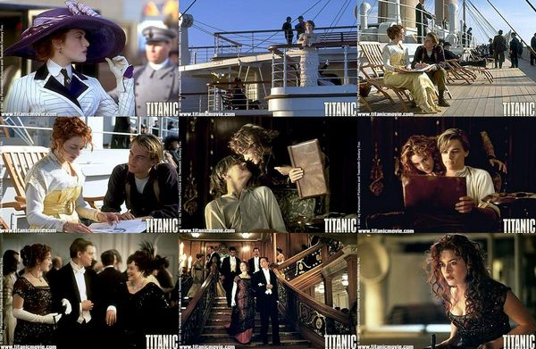

# ＜玉衡＞请爱我，趁年轻

**当年华如玉，太多太多的东西我们还看不清，那些渺茫的承诺许愿，我不敢说，你不敢听。我害怕屈服，可也不保证不会屈服；我愿拼尽一切去争取，可也不确定哪一日就没了力气与激情。我在此刻全心与你相恋，只是因为此刻全心爱你，没有瑕疵，不留余地；只是因为这过程已然美丽到令我不计结局。**  

# 请爱我，趁年轻

## 文/ 李明曦（北京大学）

 

1998年，我七岁。对于《泰坦尼克》仅有的记忆是一群男女在甲板上跳舞，虽隐隐预感到这电影于我的意义会很不同，却抵挡不住千斤重的眼皮，一时仿佛置身船舷，在无数双脚的起落间、在一条条裤管的摩擦中，渐渐失去了知觉。

2008年，我高三。没有大把时间可挥霍，于是分成上下两段，独自在电脑上认真地看完了《泰坦尼克》，抓紧时间哭过之后，还要心如止水地做卷子。仅仅一遍，我竟奇迹般地记住了几乎所有情节——这是我最喜欢的电影，我一直这么说。

我一直这么虔诚，但知道我只看过一遍的朋友恐怕要耻笑，这轻浮如同对个仅有一面之缘的姑娘冒昧说爱。所以3D版来的时候，我觉得有前去致敬的必要。

我喜欢《泰坦尼克》，理由很简单——假使你看过《恋恋笔记本》，也许会发现，最美丽的爱情，总少不了三样东西：自由、理想、青春岁月。

你看，Rose认识Jack不到三天，已经冒昧说爱了。女生动心或许很简单，但让她疯狂地抛下看得见的财富地位，去期许一个飘渺无定的未来；让她固执地与亲人朋友旧情人决裂，去依赖一个可能仅如流星般划过的人；让她勇敢地置生命于度外，上天入地只要与那一个人在一起。这样，便不简单了。这样，才值得人们津津乐道唏嘘叹惋。

你说Jack缘何有这般大的魅力？因为他是在合适的时间合适地点出现的合适的人，在他身上，Rose押上了自己对于自由和理想的全部热爱。

“世间男子总以为女子一片痴情，是在他们身上，其实女子所爱的哪里是他们，女子所爱的岂不也是春天的湖山，山间的晴岚，岚中的万紫千红，女子所爱的是一切好气象，好情怀，是她自己一寸心头万顷清澈的爱意，是她自己也说不清道不尽的满腔柔情。”

养尊处优的富家小姐，本该贤良淑德，安安分分地在上流社会繁衍生子，却太聪明、太贪心，不甘被枷锁套住，偏要向往外面的世界，向往大片大片的晴空、向往跑马的绿草地、向往奔腾的大江大河和以天为盖地为庐的激情。Rose是这样，《恋恋笔记本》里的Allie也是这样。所以才会命中注定，被那些放荡不羁，坚韧执着，擅长“旁门左道”，懂得享受生活和爱情的男子所吸引。只要这男子不是懦夫，敢于陪她一起对抗那些压得人窒息的大山，就瞬间成为英武的骑士，配得上她最纯粹最热烈的爱情——好看的电影里，公主不都是抛下王子，跟了骑士？

在《恋恋笔记本》里，这种权衡取舍更加纠结因而符合人性：已经跟军官Lon订婚的Allie，竟在婚礼前夕跑去乡下找少年时代的情人Noah。礼教时时克制却抵不过眷恋一朝决堤，短暂的故地重游终于演变成日日夜夜的温存。Allie裸身坐于阳台，面对好山好水怡然写生时，被赶来的母亲捉了个“现行”。有意思的是，管教素严的母亲铁青着脸带Allie去了当地林场，指着一个邋遢、平庸的工人的背影含泪讲述，当年我是怎样百折不回地爱着他，最后，却还是跟了你父亲。

从来都执着而不肯退让的心，似乎在某个时刻迟疑了——这两种生活，各有各的幸与不幸，因此每一种选择，都有其道理而无可厚非。

年轻的姑娘为了配得上岚间的万紫千红，往往毫不屈服地将爱情视为必需品。她们脆弱得一无所有，只剩下珍贵的炽烈的爱情；她们强悍得目空一切，瞧不上廉价的平凡的爱情。常跟朋友A发生如下对话——我：“你怎么都不给人家机会就拒绝呢？”她：“可是他才见过我几面呀就表白，多奇怪！而且我又不喜欢他……”我：“你一定要遇到一个你喜欢的然后去追他？”她：“不，我不会追的。”我：“那等着你喜欢的人来追你？”她（自己也忍不住好笑）：“是……吧……”

有多少人把自己陷在了死结里？

又有多少人，最终选择了屈服？

曾被朋友B指称“要求高”，我很是不服：“高吗？哪里高了？”她一本正经地说：“反正你不可能因为一个男生各方面都不错、又对你很好就接受他，是吧？”我只好无奈地笑。

你相信一见钟情么？我信。

你相信不必他追你或是你追他，两个相爱的人就莫名其妙地在一起了么？我信。

你相信能够在对一个人不甚了解时就存着真挚的喜欢、然后随着了解越来越喜欢、并且明知不该喜欢没有结果还是克制不住地喜欢么？我信。

该死的，我怎么都信。

我凭什么敢，奢求这样的幸运。

前些天看《天马茶房》，看到心属进勇的暖玉，在父亲的逼迫下同阿昌恋爱，两人无趣地散步到平时分手的地方，阿昌问：“不能再多走一段吗？”接着，这根寡淡的木头居然说了令人心头剧震的一句——“走多了，也会产生感情的。”

我笑了，又倒抽一口冷气——人性多可怕，走多了，也会产生感情。当你习惯了一个人为你送早餐、陪你上自习、送你回寝室、带你去逛去玩去看电影，习惯了他的好他的陪伴，不知不觉，就有了感情，哪怕这个人并不是你在茫茫人海里一眼相中的。

我害怕这样的屈服。

Allie与Noah被其父母强行拆散时，曾经歇斯底里地对母亲叫道：“你不懂爱情，你根本不爱爸爸，你从来不会用像我看Noah这样的眼神看着爸爸！”我所害怕的，正是曾经跃动着烛火的明眸渐成一潭死水，于是天不见了蔚蓝，山不见了葱绿，年轻的心啊，再没有了肆意驰骋的场地。

爱情其实是个奢侈品啊，可是人生总要奢侈一次。奢侈一次，趁溪水奔流、年华如玉。

妈妈：“真羡慕你的生活，你可要好好学习、好好恋爱。”我：“哎呦，老爸不是不同意么？”妈妈：“不用管他，我说了算，你喜欢就行。”

他：“xx说还是读PHD比较好。”我：“对呀，我也觉得。”他：“要出国五年呢！”我：“五年就五年呗。”他：“那你会不会不等我？”我：“哈哈哈，你居然也会问这个问题！这是有史以来第一次吧？”他：“什么？我说今天天气不错……”

当年华如玉，太多太多的东西我们还看不清，那些渺茫的承诺许愿，我不敢说，你不敢听。我害怕屈服，可也不保证不会屈服；我愿拼尽一切去争取，可也不确定哪一日就没了力气与激情。我在此刻全心与你相恋，只是因为此刻全心爱你，没有瑕疵，不留余地；只是因为这过程已然美丽到令我不计结局。

正如席慕容在《祈祷词》中祈盼的那般——

我知道这世界不是绝对的好

我也知道它有别离 有衰老

然而我只有一次的机会

上主啊 请俯听我的祈祷

请给我一个长长的夏季

给我一段无暇的回忆

给我一颗温柔的心

给我一份洁白的恋情

我只能来着世上一次 所以

请再给我一个美丽的名字

好让他能在夜里低唤我

在奔驰的岁月里

永远记得我们曾经相爱的事

我别无所求，只求一段倾心的相遇。

我喜欢《泰坦尼克》的结尾，喜欢Rose房里的照片，喜欢她绾着发骑在马背上，笑容爽朗，英姿飒飒。旷野延展形同怒放不息的生命，艳阳泼洒好似从未凋零的热情。“Love can touch us one time, and last for a lifetime.”

愿我们都有一段永不遗憾、永不后悔的爱情。当此际，凉风挟着青草香流过一树一树的荫；当此际，明媚的天光照亮金色的穹顶，乐声刚起，盛筵正开席；当此际，清朗的天空环抱鲜嫩的云，如同你的身影占据着我的心。

所以，请爱我，趁年轻。

 

（采编：应宁康；责编：陈锴）

 
