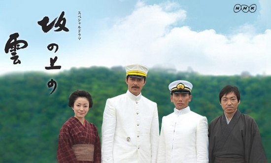
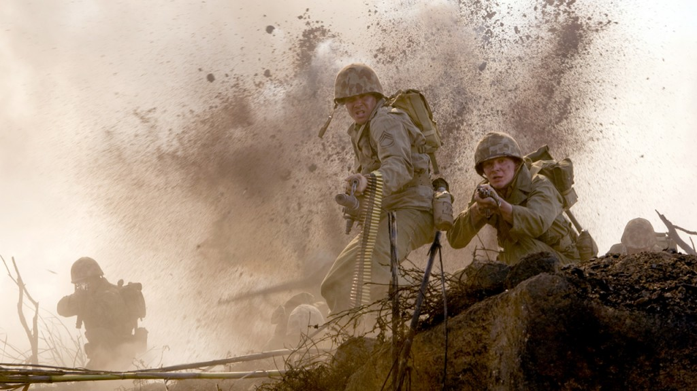

# ＜玉衡＞通向梦想的歧路——《坂上之云》观感

**而如今，据说，这另外一个东亚国家是强大起来了。那么，我们也许有必要弄清楚，那个在维新以后强大起来的日本，究竟是因为什么，一直大步向前迈进，却最终跌落深渊，而在这整个过程中，究竟有没有没有一天让国民过上最初所追求的幸福生活呢？究竟是因为什么，让这个国家走上了通向梦想的歧路呢？**

 

# **通向梦想的歧路**

# **——****《坂上之云》观感**

## 文/张舸( 清华大学)

 

“一个着实很小的国家，正在迎来她的开化期。”

这是这部电视剧的第一句旁白。《坂上之云》改编自司马辽太郎的同名小说，自2002年启动制作，经历编剧自杀、NHK会长因丑闻辞职、制作费超出预算等一系列事件，终于从2009年12月开始，作为NHK“21世纪特别大河剧”，分三年播放共13集。如今，最后一集的播放终于结束了。

正值经济上长期的萎靡不振，以及国际政治上局势动荡不安，在播出当时，这部描绘明治时代日本在面临亡国境地时奋发崛起，通过国民一致的努力，从一个“说到产业，只有农业；说到人才，只有300年来读书的旧士族”的小国，成长为列强之一的历史的电视剧，在日本本国赢得了相当的收视率。尤其是明治时代的、最初成为“国民”的日本人，那种不问出身、不问阶层，都敞开了上进渠道，都自信能够凭借自己的能力成就事业的“乐天主义”，在如今常被指摘为停滞的日本社会中，引发了相当共鸣。

而在日本以外，作为日本近代史上的直接关系者，中国的观众对于这部电视剧也有强烈的反响。尤其是，这部电视剧中着重描绘的、在日本的崛起历程中有着决定性意义的两场战争——日清战争和日俄战争，双双发生在中国的土地上，这更是让中国观众为之注目。除此之外，对于两国的历史爱好者和军事爱好者而言，这部电视剧对战争场面、战舰构型的严谨而宏大的描绘，以及由军服专家柳生悦子负责的军服造型和考证，都让人有耳目一新的感觉。作为电视剧，在这些方面的突破无疑是成功的。

然而，我并不想仅仅按照评价电视剧的方式来评价《坂上之云》。既然这部电视剧主要是因为所描绘的历史而引人注目，那么从这段历史入手评价剧情，也是合情合理的。尤其是，司马辽太郎在世时曾多次表示“不愿意（《坂上之云》）映像化”，以免作品被误解为“赞美战争”。那么，这部作品是否真正做到了避免赞美战争呢？为了评价这一点，考察这段历史也是必要的。

东亚人对日本的情感，不管是仇恨或者如何，都往往是始自昭和时代。而在某种程度上，作为这种情感的反应，一般的日本国民对历史的反省，如果其存在，也常常是集中在所谓“动荡的昭和史”，或者，作为其外延，扩展到“大正德谟克拉西”（大正民主）之失败和教训。然而，纵然走到这一步，也往往把罪责仅仅归咎于军部，或者寄望于明治时代的元老不曾如此快地凋零，于是便能抑止军部的独走。而在另外一个东亚国家，一些有良知的青年历史爱好者们，对太平洋战争的认识竟不及他们口中“不思悔改”的某群体，其注意力往往集中于坚船利炮、零式战机，水平稍高的，则是“威力强大之九三酸素鱼雷”，似乎日本的失败，仅仅是战争的失败，败在技术和力量上和酿成“人类惨不堪言之战祸”的原因却并不关心——他们只在意如何赢得战争，却并不在意如何避免战争。

而如今，据说，这另外一个东亚国家是强大起来了。那么，我们也许有必要弄清楚，那个在维新以后强大起来的日本，究竟是因为什么，一直大步向前迈进，却最终跌落深渊，而在这整个过程中，究竟有没有一天让国民过上最初所追求的幸福生活呢？究竟是因为什么，让这个国家走上了通向梦想的歧路呢？

也许这个问题，在这部电视剧中是能够得到解答的。的确，如剧中所描绘的，明治时代的日本，是一个年轻的国家。虽然贫困，虽然缺乏产业，虽然缺乏近代人才，然而这个国家却有着旺盛的生命力。为了能够发展出与列强相当的工业和经济，建立和列强相当的陆海军，上至天皇大臣，下至一般国民，都是竭尽他们的力量和聪明才智的。与此同时，为了日本的文明开化，为了在文艺上也符合近代国家的水准，日本的知识界也在尽其全力努力着——这正是片中三位主角的历程。也正是在这段时期里，日本确实在经济上和军备上立于列强之林。在战争中，先是击败了清国，又击败了俄国，而且成为了大英帝国数十年来第一个正式盟友。如此迅速的成长，不得不归功于国民的奉献：在整个明治时代，甚至以后的大正昭和年间，日本国民的生活水平一直在低位徘徊，产业工人薪水微薄（明治年间，纺织女工辛苦一日所得薪水，约可换米一升，也就是1kg），然而每有战争危险，国民却仍然踊跃捐献。可以说，这个国家、这支军队，是靠国民的牺牲来维系的。而国民之所以愿意做出这种牺牲，原因又是什么呢？在这里，看不到什么直接的、功利性的理由。战争胜利了，物价也不会降低，工厂主也不会加薪水。似乎，这更多的是出自对国家、对君主的那种淳朴的感情，那种认为国家越是强大，国民就越是自豪的感情。

正因如此，在舰队出航驶向战场的时候，在军港送行的那些普通日本人，才会为见到如此强大的、属于日本的舰队而欣喜。这些人，难道是我们所说的“热爱和平的日本人民”吗？而他们又何曾是什么军国主义分子？都不是。这些人中绝大部分也许并不懂得国际关系和现代政治，也并不理解这舰队的行动究竟意味着什么，以及日本国在这场战争中，究竟经历着如何危险的处境。这群人，只不过是经历了黑船来航，经历了幕末的动荡，即使此刻生活依旧艰难，依旧为成为“国民”而感到自豪，仍旧是一群拥有一颗希望自己生于兹长于兹的国度能够更加强大的质朴之心的，一群最最普通的日本人罢了。

然而，也正是这些普通的日本人，挣扎着推动日本走上了毁灭之路——并不是从昭和时代开始，而是从明治时代就已经开始了。的确，这个时代是昂扬而奋进的，这种奋进，最初也许是国民自身的奋进，是“自由、自主、自律、自尊”的国民的奋进，然而却逐渐演变成了作为国家的构成体的国民的奋进，以国家的方向为方向的奋进。将这两种奋进混同，将这个时代日本国的光荣等同于日本国民的光荣，这正是司马辽太郎时受诟病的所谓“明治荣光论”。

明治三十五年（1902年），日英同盟正式缔结。以卧薪尝胆为信条，忍受着沉重税收的日本国民，对此表现出了欣喜若狂的态度，如司马辽太郎本人的讽刺，“日本乐得像一个穷孩子被过继给富翁当养子”。然而，这个条约的签订，几乎意味着日本与俄国的矛盾，已经到了非战争不可解决的地步。很明显，这个条约的假想敌正是俄国。而与英国同盟，使日本获得了那个时代最强大的支援，于是，日本已经有底气开始一场与这个年迈却依旧庞大的帝国的战争。

然而我们很清楚的是，日俄之冲突，其首要在于在满洲和朝鲜的权益。那么从现代的观点，难免就要怀有这种疑问：究竟是由于何种理由，两个国家竟会以为自己对在第三国的权益有理所当然的所有权呢？以及，究竟为何竟能认为自己在第三国的行动自由是完全的、不受对方干涉的呢？当然，可以认为那个时代是“弱肉强食”的，然而日本既在维新以后已不是弱国，又何以孤注一掷的将自己的存亡寄托于大陆权益呢？

或许在一定程度上，正是这种毫无回旋余裕的外交方针，促使日本走上了最后的战争之路。而也正是这种对于危机的过敏意识，使得日本沿着一条强化国家意识，推崇国民团结奉献，极力强化国家实力尤其是军事实力的路线一路走下去，然而最终却远离了维新年代的梦想。

的确，这种危机感是伴随着整个日俄战争期间的。尤其是在旅顺战役期间，日本人几乎是在绝望中与时间赛跑。当儿玉源太郎在从奉天到旅顺的火车上喊出“日本有救了”，而引发这句话的事件，只是攻下了一个高地——尽管是对于战局极为重要的高地，然而毕竟只是一个高地。而海军呢？看着陆军在旅顺城下浪战竟月，而毫无进展，为此大发雷霆的秋山参谋，不也喊出了“眼下努力与否，关乎国家存亡”的话吗？同一时间，远在伦敦的高桥是清，同样也是怀着这样的心情，为了公债而拼命努力。不论是军界，还是政界，都认为这场战争就是国运本身。的确，日本在那个时候还远没有能力操控战争的始终，或者说，没有强大到让战争为政治服务，一旦战争开始，它就会和政治互相掐架。于是，这个国家究竟何去何从，就并非国民所能控制的了。

也许，正是因为这是一场惨胜，军部才更加要求自身的权限和力量的强化。“胜利的时候，更要系紧头盔的带子”，这是东乡提督在联合舰队解散仪式上的话。在短短的十年里，连续经历两场战争的日本，已经开始为以后的战争做准备了。然而又何止如此？在战争和扩张中，国民正渐渐地改变了对于军队和扩张的态度。连那个调侃“大和魂”的夏目漱石，也开始对曾是友人后来却从军的真之，由轻视转为依赖，“虽然是一个文人，在关键的时刻，还是要靠军人才能生存下去”，为如此的无力感所笼罩的知识分子，又该如何，又该为何，要去维护文民统治，制约军队独走呢？当夏目的“如果失败，日本会沦为殖民地，《我是猫》和‘前日之，丝瓜水，亦未饮’都无法用日语再读了，落语、歌舞伎、能、狂言也都完了”这种意识，成为知识界的共识，那么他们又怎么会不纵容军部的一切要求，不管是否无理呢？对低下头的夏目，也就是对军部、对国家主义、对日本的悲惨未来低下头的夏目。看着国家走向危险和灭亡，却不发言的国民，又有什么资格，把所有的责任都推给军部、推给元老呢？

日本帝国，并非亡于昭和。在维新之后三十七年，帝国已经在胜利中现出末期的征兆了。为了这场战争，日本几乎耗尽全力。在两年中，战费消耗达15亿日元，服役年龄由32岁上调到37岁，国家的动员能力已趋极限。然而即使经历了如此困苦的日俄战争，已经被发动起来的国民，仍然没有感到“够了吧，就到此为止吧”。在《朴茨茅斯和约》签订以后，对没有赔款、没有割地的和约深感不满的民众走上了街头。“撕毁卖国和约”“满洲军总进击”“斩国贼小村（外相小村寿太郎）以谢天下”这样的标语和口号遍布东京。渐渐汇集起来的“义士”们用飞石处置了美国大使馆和东正教教堂，又一不做二不休地烧掉了传闻劝说天皇见好就收的内务大臣芳川显正的官邸，以及抱持和平立场的《国民新闻》社，顺手点上了几个“镇压爱国义举”的派出所。这场持续三天的骚乱，后来被称为“日比谷烧打事件”。

既然在明治年间，国民的态度已然如此，那么所谓的“大正德谟克拉西”，又如何能够逆转这种潮流呢？这种虽有雏形却极脆弱的民主主义，本就无力与军部、藩阀所对抗，更不用说，这是国家主义而非自由主义的民主主义了。

的确，正如全片的末尾所说，历史并不仅仅是受害者的历史，历史是全部国民的历史。然而，在这样的时代里，国民难道不是同时就是受害者吗？当然，加害者也是不得不向国民自身来寻找的。这个时代，的确是乐天主义的时代，是在所有方面都飞速开化和进步的时代。“明治真好”，是的，的确如此。然而，这同样也是日本历史上，最恶劣的时代的开端吧。登上山坡遥望青天，看到的却非白云，而是风暴。

而今天，这场战争并非是尘封的往事。如今的有良心的爱国者们，不依然是那些在日俄战争以后的历史中，高喊着“对美七成”“八八舰队”的，唱着“月月火水木金金”的人们在现世的投影吗？难道，从这场战争中，我们只能学到战术和兵法？难道，只是因为技术的进步，历史的惨剧就不会重演？殷鉴不远。

作为结尾，这里也许需要一则逸话。

1905年12月22日，在东京新桥的满洲军凯旋式上，在满洲失去了两个儿子的乃木希典大将如此开始了自己的演讲：“吾乃木……吾乃杀乃兄乃父之乃木是也！”闻言，举座皆惊，垂首至于泣下。

 

注1：本文在写作过程中用到的史料多未经查证，如有讹误，请不吝指出。

注2：本文用到的地名、事件名多据日方习惯，请注意辨别。

 

(采编：周冰 责编：黄理罡)

 
