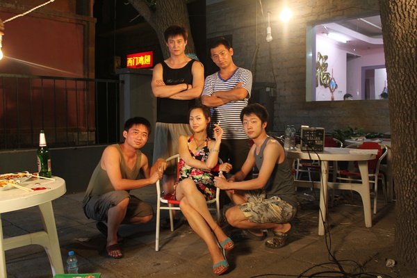

# ＜玉衡＞那些叫做令狐冲和杨康的sb少年

**回头大学时光，很多人都会问自己，我年轻的时候为什么就那么傻？无数可能存在，似乎存在，以及只在里存在的爱情和艳遇，在一次次回忆的涂抹下正在变得越来越单纯美丽，越来越像真的曾经发生过。好像人人都可以成为郭靖那样的幸运儿或者乔峰那样的偶像大哥，而所欠缺的只是一点点阴差阳错的运气。但是，不会的。我们只会是我们应该是的人，在那个时候，我们只会做我们会做而不是应该做的事。 **

# 那些叫做令狐冲和杨康的sb少年

## 文/ 酱油郎独占花魁

人生就像巧克力，不是一盒，而是一颗，不是阿甘说的，是我说的。 人生的幸福就是在万物凋零的加班时刻，从抽屉最深的旮旯里找到一颗不知道怎么存留下来的truffle黑巧克力。在事业和生活里艰难跋涉的空隙里，能看到《此间的少年》这样的电影，勾起一点点回忆，让那些曾经熟悉但已经陌生的视觉听觉嗅觉，在日渐油盐不进的大脑皮层里，激起一点点电波，也是幸福的一种。

我没看过小说，所以要说的只是关于这部电影。看上去，这是一个关于校园爱情的电影，郭靖喜欢黄蓉，黄蓉喜欢郭靖，乔峰暗恋康敏，穆念慈苦追杨康。可是，关于这片子，我想说的是，恋爱真的不是大学的全部，也不是这个片子的全部，甚至都谈不上是主要的部分。不理解这一点，就没办法理解那些叫做令狐冲和杨康的sb少年。

背着书包拖着行李，从家乡的小城市来到这个片子里叫做汴京现实中已经变成地产商乐园的城市，有多少人只是在期待着校园里的艳遇？回首刚进大学的时候，无异于经历了一次异次元穿越，像一条生活在鱼缸里的鱼，被连鱼带缸扔进大海里，自由快乐得无所适从。女生？好吧，比中学里多一点，成熟一点，衣服穿得更透更露一些，说话也更霸气一点，又怎么样呢？在我们令狐冲这样的sb少年心里，她们是像食堂鸡腿一般的存在，美好，总是在被谈论，但是大多数时候即使没有也没什么。

如果你曾经是一个令狐冲这样的sb少年，你没准已经想不起来，你在没有上课没有自习没有考前通宵临阵磨枪但也没有在单相思琢磨着泡妞的时候到底在琢磨些什么。也许在对着一本围棋书消耗脑细胞，也许一边翻着《时间简史》一边在脑海里穿越第11维，也许在考虑为什么全世界还有那么多苦难人民在等待着哥去拯救，也许就什么也不琢磨就在偌大的校园里骡子拉磨一样地转悠了一圈又一圈。

只是，这些注定都不会被今天的你想起。你能想起的只是当年为什么没有鼓起勇气给那个每天在图书馆遇见的女孩递上一张纸条，对不对？同样的道理，你会疑惑，为什么杨康就那么瞎，对穆念慈的深情视而不见，却跟令狐二哥帮别人搞什么扯淡的爱情咨询。为什么他那么二，完全感觉不到穆念慈已经倒数的时钟，生生放过最后的机会。如果你想不起那些你在校园里无所事事的时刻，你就没办法理解杨康。每个sb少年都很忙，忙着做他们觉得重要的事，有趣的事，甚至忙着无聊。他们宁愿跟别人合办“专业爱情咨询机构”，纸上谈兵地给别人出谋划策，也不着急朝着一个女孩子跨出现实的第一步。大学就像一场永远不会结束的电影那么长，有什么理由着急呢？一场校园恋爱的重要性，还没有被未来日渐猥琐的生活所放大。

回头大学时光，很多人都会问自己，我年轻的时候为什么就那么傻？无数可能存在，似乎存在，以及只在YY里存在的爱情和艳遇，在一次次回忆的涂抹下正在变得越来越单纯美丽，越来越像真的曾经发生过。好像人人都可以成为郭靖那样的幸运儿或者乔峰那样的偶像大哥，而所欠缺的只是一点点阴差阳错的运气。但是，不会的。我们只会是我们应该是的人，在那个时候，我们只会做我们会做而不是应该做的事。人生根本没什么道理可言。你觉得你应该有一个完美的大学，有机会谈一场纯洁到让岩井俊二羞愧退散的校园恋爱，你觉得你应该懂得怎样爱情学业双全，风流与智慧兼备，学校门口拉面馆的老板也应该主动给你打七折。这其实都是我们日后猥琐心灵里的臆想，就像令狐冲植物大战僵尸的梦境一样。从这点上来说，我倒真感谢大学里那些懵懂的时刻，感谢那些莫名其妙拒绝了女生春游的提议而去篮球场上把自己的脚踝崴断的决定。那些说不清道不明的无奈告诉我大学的真相。没有那些不知道是鬼迷心窍还是灵光一闪的时刻，怎么能称为优质的sb少年？

有人说令狐冲的角色在片子里很失败，沦为了一个讲述者而缺乏自身形象的树立。我觉得正相反，令狐冲和杨康才是这部片子的精华所在，才是所有商业制作的爱情电影里不会出现也拍不出来的角色。郭靖的幸运，黄蓉的垂青，康敏乔峰的姐弟恋，甚至穆念慈的单相思，都太容易被一些粗制滥造的麻醉剂电影重复了。而令狐冲和杨康则不会，因为本质上，他们并非爱情的符号，而只与青春有关。你以为令狐二哥那些“留学西域，学成归国报效朝廷”的话单是说来搞笑的吗？那些学业上的压力，考试前夕的紧张，不甘于人后的少年心气，对未来和世界的迷茫，都是隐藏的背景，从来没有在片子里有所提及，但却无处不在。没有考试在前，星际，dota从来不会那么好玩。没有军训缺油少盐的大锅菜，小卖部的泡面火腿肠不会那么好吃。没有一个又一个无聊的夜晚，图书馆里那些隐藏着人类最高级的智慧，也是最高级的无聊的书，也不会有那么多如此认真的读者。这些埋藏在玫瑰色回忆最底层的大学的另一面，被时间在每个人身上隐藏的那么好，以至于你自己都忘记了它的存在，直到某一天，也许，像我一样被这样一部电影所提醒。

当你开始回忆大学，写一部关于校园的小说，拍一部关于大学的电影，你总会从爱情开始，但是到结束的时候，你也许会分不清你要说要写的，究竟是爱情，还是别的？凤凰花开了......每个周日的晚上，听到毕业纪念册的时候，都以为是在听别人的故事，觉得那么远，那么不真实。而一转眼连毕业纪念册和郑阳温暖声音都已经消失了好几年，细想起来这是多么的荒诞啊。然而，作为渐入中年的令狐冲和杨康，面对逝去的大学时光，你不应该为你虚度四年光阴而羞愧，也不应该为你在校园爱情上的碌碌无为而悔恨，当你逐渐沦为你所嘲笑的猥琐大肚中年男的时候，你还是应该有胆色理直气壮地宣称，你已经拥有过你最壮丽的青春--作为一枚优质sb少年.

仅以此文献给曾经此间以及彼间曾经sb过的少年们。

（采编：陈锴；责编：陈锴）
