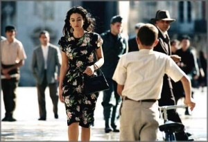
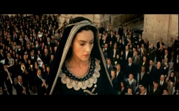

# ＜玉衡＞那纷纷的情欲——西西里美丽传说

**也许每个男人都有这么一个记一辈子的女人。你并非不能再遇到像她一样好的姑娘，你不过是只能年轻一次。妇女们像对别人一样和她打招呼，把菜塞给她，女人间的纠纷恩仇就这么泯然。也许她们的敌人不是玛莲娜，而是美丽。玛莲娜回到了西西里，而罗纳多呢？他是否正要离开？他是否终要回来？**  

# 那纷纷的情欲——西西里美丽传说

## 文∕吴昕悦 (Wellesley College)

 

这是一部让人看很多遍的电影。它有很多看头，其中最让人心驰神往趋之若骛的当属性感天神莫妮卡贝鲁齐三点全露，男人可谓人间尤物，女人当叹我见犹怜。也许这就是电影的原名为“玛莲娜”的原因。而“西西里美丽传说”无疑属于难能可贵的出彩中译版本，远好于不知所云的“真爱伴我行”。然而影片播出后，莫妮卡贝鲁齐说：“性感的不是我，而是意大利”。 

传说一向是在人口相传中添添补补，在时间磨转中剥离真相的。一个传说，完全可以没有确定的人物，没有确凿的剧情，每一个人都是龙套，每一个版本都只有一支桨，在粘稠的时间里摆渡圆圈。西西里美丽传说，这是一个发生在一个确切地点的故事，却遗失了主人公，人人都是龙套，而主角，与其说是“玛莲娜”，不如说是“美丽”本身。 

第一次看的时候，觉得主角是骑着单车的少年。从一开始少年就在和爸爸纠缠自己不是穿短裤的小孩了，应该像大人一样穿长裤。每一次的提议都在一片鸡飞狗跳中不了了之，暴躁的父亲，宠溺的母亲，神经质的姐姐，意大利语独特的节奏将每一个重音押在倒数第二个音节，穿插在影片开头俨然是交错在浓淡绿色中的地上海诙谐诗——在一片热闹中少年的单车弹跳着，以一种年少人的姿态穿入人群。 

三三五五这样的单车穿插在古老小镇的每一个门拱，每一个石桥，每一个小巷，只为了制造不经意的遇见——玛莲娜。色欲熏心的男人们拦着她进行最贪婪的吻手礼，男孩子的单车只是在西西里的巷弄上吱吱呀呀地折转，然后被扔到路边，他们安安静静地看着她路过，从出现，经过，到离开。然后跳上单车，飞驰向下一个她将出现的路口。 

“命运是怎么结在一起的？只是一个擦肩而过，然后丝绳就这么系上。” 

然后就是该影片著名的桥段，将男人的性幻想演绎到了极致。从好莱坞电影到神话传说，从学校里的胡思乱想到藤蔓缭绕少年律动的床。钱钟书在《猫》中说，十八九岁没有女朋友的男孩子心中藏的女人，往往比得上皇帝三十六宫的数量。在这部影片中，无疑是从一个印记上，生根发芽了万般巧笑，千种风情。她贞洁不屈，又热情如火，是生命之光，也是罪恶之火。 

当玛莲娜丈夫死讯传来，随着玛莲娜的一步步堕落，影片开始推向高潮。而少年，也就在一个从未有过言语的女人的悲剧中蜕变。他想在她痛哭时对她说我会陪着你。他祈祷，请你保护她。他在她家窗边的树上看到玛莲娜被律师强暴，跌下来摔断了手臂。于是他去教堂，用自己的石膏手打断了圣彼得石膏像的手。他向馋涎她的男人酒杯里吐口水。但是他不能阻止失去经济来源穷困潦倒的玛莲娜变成暗娼，明妓，最后被驱逐。 

在影片最后少年罗纳多做出了两件与玛莲娜有直接间接关联的事情，是一个男孩最后的帮助。若干年后他写信告诉玛莲娜残疾还乡的丈夫她搭上了前往何方的火车。当这个荒颓的妇人傍着她残疾的丈夫重返西西里后，在一次市场里的“偶遇”，他第一次面对她，捡起了她掉落一地的橘子，他说谢谢。少年跳上单车，一边晃晃悠悠地蹬着一边回头看。松松垮垮的裤腿绕在小腿上，不知道是否个子长得太快。 

旁白是：后来，我的生命中出现过许多女人，她们在我怀里问：你会不会记得我？但是我知道，那个让我记一辈子的女人，她从不曾问过。玛莲娜。 

也许每个男人都有这么一个记一辈子的女人。你并非不能再遇到像她一样好的姑娘，你不过是只能年轻一次。 

第二次看的时候，主角就被幻化成了玛莲娜。名符其实。莫妮卡贝鲁齐的精彩演绎脱离了台词。同时不得不赞叹特纳托雷天才的展现手法。玛莲娜的三个形象每一个细节都配合到了极致。伊始，是白色连衣裙，黑色波浪长发，白色高跟鞋，一枚项链在胸前的位置高一分是修女低一分是荡妇，地中海的阳光给连衣裙加上了半透明的暧昧效果。在人群中，玛莲娜始终低眉而昂首，吃她自己静默的自矜——葡萄，你是吃不到的。玛莲娜被逼良为娼是以一个艳冶而哀的高调转变开始的。火红的短发（后来染成金色），浓妆的容颜，黑色的套装，她挑衅地穿过人群，坐在他们中央，她低下头，然后很多很多男人伸手来为她点烟。玛莲娜终于不是一个传奇，因为所有在梦中不清净的男人终于有了名正言顺的机会，传说，变成了艳闻。最后，当玛莲娜再次回到西西里的时候，特纳托雷将她改成了缺乏打理的短发，棕色的宽大套装，平底旧皮鞋，走路外八字，她穿过人群，低眉然而不再昂首。她回来了，美丽已死。玛莲娜的美丽并不在她被嫉妒的女人们驱逐时消逝，而是经历了一个完好的含苞-盛放-凋零的过程，只是因为被加速而带有悲剧式的引颈就戮。但是美丽，几多能长久？ 

第三次看的时候，主角其实绕回了莫妮卡贝鲁齐的话——是众人。玛莲娜三次出现在广场上的时候，众人的反应堪称经典。每个龙套都很到位。从嫉恨的主妇，馋涎而不愿惹麻烦的男人，到浪荡的妓女。玛莲娜和罗纳多可谓两个在众人中独立的角色。老态横生的玛莲娜像所有的主妇一样去市场上买菜，她出现的时候是一秒钟微妙的寂静，糅合了猜疑，羞愧和宽容。妇女们像对别人一样和她打招呼，把菜塞给她，女人间的纠纷恩仇就这么泯然。也许她们的敌人不是玛莲娜，而是美丽。玛莲娜回到了西西里，而罗纳多呢？他是否正要离开？他是否终要回来？ 

上次看是学期初的时候，一直没有机会写这篇影评。我也不知道影评正确的格式是什么样的。很多内容已经记不清，好像传说本身，只留下了一种朦胧的美感。只记得上一次把旧录影带放进播放机里，波士顿鹅毛大雪，西西里情欲纷纷。   原文链接： [http://blog.renren.com/blog/249693315/456843043?from=249693315#id1985596969 ](http://blog.renren.com/blog/249693315/456843043?from=249693315#id1985596969
)  

（采编：孙梦予 ；责编：徐海星）

 
