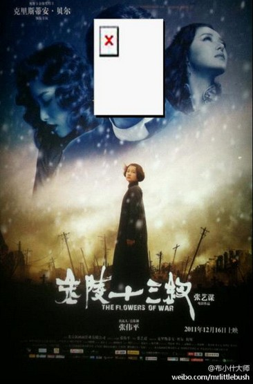
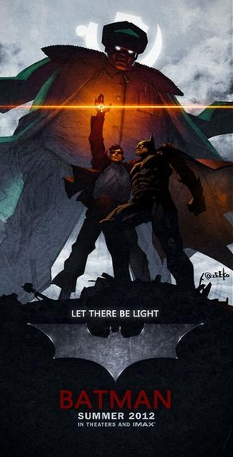

# ＜玉衡＞金陵十三钗，反日仇恨的廉价狂欢

**王小波说过：“鼓励大家去仇恨一些人、残害一些人、比如宣扬狭隘的民族情绪，这可以迎合人们野蛮的劣根性。煽动仇恨、杀戮，乃至灭绝外民族，都不要花费什么。煽动家们只能用这种方法给大众提供现实的快乐，因为这是唯一可行的方法。”很不幸的是，一部《金陵十三钗》，恰恰给这一句话作了注脚。这样的狂欢，虽然造价6亿，但它仍然无比廉价。这也许不是张艺谋的错，而是狭隘民族主义的错。**  

# 金陵十三钗，反日仇恨的廉价狂欢

## 文/朱睿

 

刚看完《金陵十三钗》的那一刹那，我甚至有一丝欣慰：中国导演终于能讲圆一个故事了。但这丝欣慰马上被如潮的失落乃至恶心代替，因为张艺谋花了6亿，除了反复灌输仇日二字，除了制造一场民族主义的廉价狂欢，又带给了我们什么？

 

《金陵十三钗》新海报，供大家欣赏

#### 从三钗到十三钗

多年之前，电视上曾经播过一部电影《避难》，讲的是1938年春，我国南方某小城被日军攻陷。美国主教霍尔登所在的教堂成为避难所，名妓杨柳风、胡翠华和戏子小彩月跑来避难，把教堂搞得一团糟。霍尔登请求红十字会的克另斯把她们和唱诗班少女一起带走，不料又有中国伤兵来避难。日本军官服部先闯入杀了伤兵，又企图对少女施暴，被霍尔登阻止。负责营救的克另斯没有来，紧要关头，杨柳风三人挺身而出，上了日军汽车。杨柳风拉响炸弹，三个苦难的女子以生命抗议入侵者的暴行，与日本人同归于尽。

眼熟吧？跟《金陵十三钗》除了人数上不同之外，有什么区别？《避难》的导演有两个，其中一个叫做韩三平。三爷的大名，你一定如雷贯耳，而在编剧里面你能看到一个名字：严歌苓，《金陵十三钗》的作者。（此处我犯了一个非常严重的错误：严歌苓的前夫是李克威，作家李准的儿子。《避难》是二人的共同作品。原来跟喜欢电影的朋友聊八卦时听了一耳朵，没查实就写了出来，误导之处向大家道歉。）

话说回来，严歌苓对旧作的包装，也不过是玩噱头。避难中的三个妓女，一个华贵、一个泼辣、一个温婉，恰恰对应了《金陵十三钗》里的三个妓女：玉墨、红菱、豆蔻。除了她们三个之外，其它的妓女们的面孔模糊不清，完全沦为打酱油，这一点在电影里也得到了完美的再现。在数量上扩容，然后套“金陵十三钗”的噱头，恰恰和张艺谋喜欢玩人多、玩大场面的毛病不谋而合，这不能不说是一种天意。

#### 抗日战争还是抗“日”战争

八卦完了，回到电影《金陵十三钗》上来，你会发现，这场抗日战争，不过是一场抗“日”战争。

电影开始时满街的尸体告诉我们，这是战争。而凡是看电影的观众都会明白，这场战争的背景是南京大屠杀，然而，极其诡异的是，整部电影对屠杀几乎只字未提。有人会说，满地尸体了还不是屠杀吗？不好意思，凡是战争都会有满地的死尸，这里的尸体，与南京无关，与屠杀无关。有人又会说了，豆蔻被三刀致命，还不是屠杀吗？不好意思，那不叫屠杀，那叫奸杀。

这就是张艺谋的失策之处，但回头想想，这其实是张艺谋的聪明之处。跟任何人讨论南京大屠杀，数字问题都无法绕过去。爱国青年们无法对数字自圆其说的时候，总会说一句话：“别说30万，5万也叫屠杀！3个人也叫屠杀！”每次看到这样的论调，我就哭笑不得：占据道德制高点真是万用灵药！中国式的爱国，可以不要数据、不要科学统计，只需要一个模糊的屠杀的概念，一个仇恨的理由。谁质疑数据，谁就是不爱国，谁就是亲日派汉奸卖国贼。而这种论调盛行的结果是：既然数字不重要，那么死3个人和死30万个人没有区别。而这些年，这片神奇的土地上各种各样的死法花样繁多，围起一个村庄让他们慢慢饿死或者是软禁瞎子胖子瘸子……让他们与外界隔绝已经是仁至义尽，屠杀已然无法刺激国人的重口味。于是强奸便成了致胜法宝。只有这样，才能直插观众的心灵。在观影的过程中，我隐隐约约听到周围传来“禽兽”、“操你妈的小日本”之类的声音，那一刻，我知道，张艺谋又成功了。

所以，张艺谋有意无意地抽掉了“战争”和“屠杀”的意境，整部电影下来，只有两个字：强奸！日本兵追唱诗班女孩是意图强奸、佟大为及其部下殊死搏斗是保卫女孩们不受强奸、日本军官派人驻守教堂是养着女孩让上层军官们强奸、日本兵抓到了豆蔻更是进行了赤裸裸的强奸……明明是一个战争与反战争的故事，却莫名其妙地演变成了强奸与反强奸的故事，故事的核心俨然跑到了脐下三寸那个基本点上！我们不如把电影里的日本兵换成黑社会，或者是领导干部，你会发现：完全讲得通！

#### 处女膜保卫战

在强奸与反强奸这个主题确立之后，另一个极其讽刺的议题立刻浮出水面：谁该被强奸，谁不该被强奸？整部电影下来，有一个价值观贯穿始终：保卫贞操，保卫12张完美无瑕的处女膜。

关于处女情结，我以前曾经说过：处女情结是这个世界上最傻的思想之一，有这种想法的男人把女孩子所有的价值都凝结在一层膜上。由于人格上的极端低劣，他们的人生价值只剩一根屌的主权，所以他们才会强调这根屌被拥有的惟一性；但同时由于性格上的极端自卑，他们可怜到连在屌上跟人竞争的勇气都没有，从心底最深处害怕自己比不过女孩的前任。而科学统计，85%以上的早泄是由于心理因素造成的，因此，这种男人的性能力大多是渣水平。总而言之，拥有处女情结的男人是这个世界上最可笑最可怜最无能的撸sir。

越是没有人权没有平等的国度，有这种思想的人就会越多。将这种思想放大，就变成了《金陵十三钗》的矛盾所在：同样要被强奸，妓女去，还是处女去？玉墨的台词给了我们答案：“我们姐妹什么样的男人没见过？但你让那些女娃子怎么办？我们回来还活得下来，可她们能吗？”在这里，她还用了一句诗：商女不知亡国恨，隔江犹唱后庭花。红菱的台词是：“让他们看看，我们也是人！”而影片中还有这样一个情节，日本兵闯入教堂意图强奸，一个女学生从楼上摔下来惨烈。电影用这种方式告诉我们：妓女是下贱的，不爱国的妓女更是下贱的。处女是高贵的，我们死也不把处女给你们。妓女要想洗刷自己下贱的原罪，就必须去爱国，而只要爱国了，她们瞬间摇身一变，从妓女变成了处女。于是电影进入了最后的高潮：一群妓女打扮成处女，慷慨走上了被强奸的正面战场，那一瞬间，她们浑身上下，散发着处女的神圣光辉。而观众也恰恰在这种意淫中达到了爱国与处女膜保卫战圆满胜利的双重高潮。

事实证明，谁敢妨碍这种高潮，谁就该死。当妓女们走向日本军车时，一个妓女害怕了，退缩了。在这样的关头设置这样一个矛盾冲突显然是聪明的，破坏爱国地被强奸的和谐气氛，马上得到了观众的情绪反弹，在电影院中，我清清楚楚地听到焦急的倒抽凉气的声音，还有一个男观众直接喊了出来：“操你妈的，又多事！”这告诉我们这样一个道理：即使你爱国了，你还是婊子。别以为你爱国了，你就不是婊子了。有些人配爱国，有些人不配爱国，你们这些婊子，不过是用来换处女的牺牲品而已。

#### 没有反战，只有反日

一场荒谬的爱国秀后，电影落幕。张艺谋的6亿人民币，打造出了一场华丽版的八国联军兽行录——对这个不熟的可以自行百度——南京大屠杀的题材可不可以拍？当然可以！但终极目的应该是反战争，反罪恶，而不是煽动反日情绪，整部电影下来，你看不到对战争的反思和控诉，有的只是对日本兵的强奸行为的极度渲染，有的只是对反日情绪的极度煽动。王小波说过：“鼓励大家去仇恨一些人、残害一些人、比如宣扬狭隘的民族情绪，这可以迎合人们野蛮的劣根性。煽动仇恨、杀戮，乃至灭绝外民族，都不要花费什么。煽动家们只能用这种方法给大众提供现实的快乐，因为这是唯一可行的方法。”很不幸的是，一部《金陵十三钗》，恰恰给这一句话作了注脚。这样的狂欢，虽然造价6亿，但它仍然无比廉价。这也许不是张艺谋的错，而是狭隘民族主义的错。

最后要说的是：你也许看到了，我基本上没提贝尔大人。贝尔大人是我最喜欢的演员之一，而他的东师古之行，更让我看到，他才是真正的斗士，真正的蝙蝠侠！这种重视自由、重视个人的价值的思想，十部《金陵十三钗》都拍不出来。

 编者注：本文配图海报由作者提供。  

（采编：徐海星，责编：黄理罡)

 
