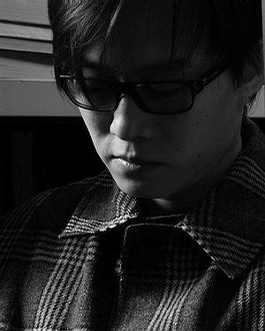

# ＜玉衡＞青春仿佛因我爱你开始 却令我看破爱这个字

**我也知道，我如此荒唐地希望他不曾参透爱欲，究竟是为了什么。因为我也曾顽劣地刺痛过很多人，最后又回归孑然一身。而我也学会了开解旁人，听着他她她他的故事，安抚倔强或委屈的灵魂。我也开始通透世情，变得不懂悲伤，没能力多愁善感。青春仿佛因我爱你开始，而终令我看破爱这个字。而这时，我又禁不住一厢情愿地，秘而不宣地希望，希望把林夕留在那里，祭奠那时那地的我和你。**  

# 青春仿佛因我爱你开始 却令我看破爱这个字

## 文/秋水（香港大学）

 

我一向后知后觉，是被流行远远抛下的人。依稀记得小学的时候，班级里有个家伙酷爱《龙拳》。那年夏天，“周杰伦”这个名字刚开始在街头巷尾蔓延。不久他来到温州。母亲看着屏幕上那个耍着双截棍的瘦小身影，因为听不清他在唱些什么而大摇其头。我已记不清那场表演，现在回想起来，只是无端端地觉得那时的周董大概也如同那时的我一样青涩——低眉顺目，貌不惊人，出色得十二分平庸。多年之后，小学同学聚会。当初喜欢周杰伦的那个小子已远走荷兰，不再念书，不久将为人夫。说起往事，他只是淡淡地带过一句：“比不得你们读书好的。”

是在初中的时候开始不同的吧。像每一个青春期的男孩子一样，面色苍白，内心狂热，有喜欢的歌手，有暗恋的女孩，而最大的梦想，就是有一天可以唱歌给她听。那时候，还没有自己的随身听，所能做的只是关起书房的门，把电脑的音量调到最大。是那样荒腔走板地学唱着孙燕姿的歌，心中有一点惶然，有一点迷醉，说不上期待什么，却似乎有一种憧憬若隐若现，仿佛天可以一直蓝下去，夏天永远不会终结，而我可以一直唱下去，把所有见不得天光的情愫，隐秘地，灼热地一一烙在那些青春岁月。

后来他们开始对方文山集体崇拜，而我结识林夕，大略与知道陈奕迅同时。一开始，当然是那首被唱烂了的《十年》。而后有了《爱情转移》，而我并无“流浪几张双人床”之类的体验，

更遑论“开往地老天荒”的奢望。那些情情爱爱，似乎与一个高中生无关。

之后的故事未及等到林夕上场。被一段友谊折磨得精疲力竭，而《最佳损友》是黄伟文的作品。大概我的室友们都还记得那一句“姚木姚卡似丫木姚”，而唱到声嘶力竭的我，最后也不过落得一个“我什么都木姚”的境地——那时还是深夜听着医生那把声，恍如娓娓道来而有落泪的冲动的年纪。那时还没尝过所谓的爱情。那时还听不懂林夕。

林夕和爱情一同来临。

这位大人先生的好处，全在于他不惜把自己的千回百转都鲜血淋淋地掏出来给人看。那些飞蛾扑火的决绝，欲说还休的猜疑，到痛彻心扉，到哀莫大于心死，又忽而释然，却总是强作达观而终不能忘情，他都一一记录在歌里。仿佛一个化学家，在试管里调制了林林总总的悲伤来品尝，而所有的实验材料，都是从自己身上取下来的。明年今日，富士山下，依然人来人往，风景不殊。而二丁目早成永诀，下一站，纵然于天国再会亦难拾回前尘。总有某几行字曲曲折折地绕到你心底，让你禁不住泪水泫然。你以为他是懂你的。而从头到尾，他只不过是在自言自语，自怜自伤。

大概学佛前的林夕自己也不知该拿自己怎么办。他终归没有自杀，“舍不得璀璨俗世”也好，“怪大地众生太美丽”也罢，大概只能，只能在一片苍茫而不见前路而“假如让我说下去”之际，勾惹芸芸俗子们，陪着他同声一哭罢。

“一切文学，余爱以血书者。”如此说来，林夕本可成为一个真正的艺术家。

而艺术家总是活得太过浓烈，鲜血滚烫以至于时有焚身之厄。终于林夕还是选择了自我稀释，去信他的佛，去传他的道，救他的世，点他的心灯。他也写出了《北京欢迎你》。我很替他欢喜，却还是忍不住觉得可惜。但这是一个读者的大自私。我没有忘记谁都有好好活下去的权利。而林夕自己也明白的，“如能忘掉渴望，岁月长，衣裳薄”。

我仍时而关心一下他的新作，仿佛凭吊一片荒芜的古战场，细看来，每一寸土仍都红得惊心动魄。可他已放下了。一步三回头，也终归是渐行渐远。他炮制的开示和慰藉，于我已不足观。

我也知道，我如此荒唐地希望他不曾参透爱欲，究竟是为了什么。因为我也曾顽劣地刺痛过很多人，最后又回归孑然一身。而我也学会了开解旁人，听着他她她他的故事，安抚倔强或委屈的灵魂。我也开始通透世情，变得不懂悲伤，没能力多愁善感。青春仿佛因我爱你开始，而终令我看破爱这个字。而这时，我又禁不住一厢情愿地，秘而不宣地希望，希望把林夕留在那里，祭奠那时那地的我和你。

十年了。口齿不清的男孩已贵为周董，叫燕姿的女生已久不唱歌，大陈红遍了大江南北，也永远地失掉了他的小谢。就算，就算我能再回到拥抱的现场，也不过证明——

就像那个叫林夕的人曾说过的那样，感情总是善良，而残忍的是，人会成长。

 

（采编：何凌昊；责编：尹桑）

 
