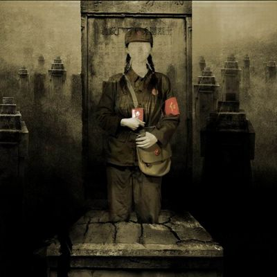
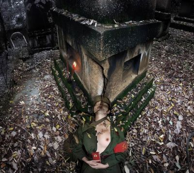

# ＜玉衡＞革命的聊斋——死亡与性的精神志

**关于纪念的意义何尝不也是处于真假之间——在表面上纪念是为了死去的故人；但是在实质上却永远是为了活着的人；正因为要为活人着想，所以才用精神话语作为死者的祭品**。  

# 革命的聊斋——死亡与性的精神志

## 文/冯原（中山大学传播与设计学院副教授）

死亡就其场所而言，有特定的空间属性，那就是墓场。中国古代的帝王甚至比营造现世的宫殿更为热情地构建他的死亡之宫——陵墓。这是因为中国人普遍相信灵魂世界的存在。皇家的寝陵尽管雄伟非凡，它们在追求永生的意义上与升斗小民的坟墓并没有本质上的区别。凡夫俗子们虽然只能听天由命，但他们最为惧怕的不是活着的苦难，而是「死无葬身之地」。百姓的「亡灵之家」在地表上的造型常常只是一个隆起的土堆，它刚好能够容纳卑贱的肉身，相比之下，石刻的墓碑与短暂的肉身相比较，它不仅界定了死者的身份；还是使飘荡的灵魂有所归依的证据。然而，没有什么要比风水术更能表达中国人特有的生死观念，在堪舆术的框架之内，肉体的死亡被赋予了久远的经济学意义。死者的躯体可以成为某种干预后代的材料，只要选准了山川河流之间充满「气」的穴位，腐朽的肉体就有可能转化成富含能量的「福气」惠及子孙后代。对于活人世界而言，丧葬的空间选择关乎到自然地理的优劣，还关乎后代的政治经济利益，使得「好穴位」成为风水先生谋生的秘密和值得死者家属争抢的稀缺资源。千百年来，关于坟墓的所有学问——阴宅风水术真正成为现实世界中最具有影响力的游戏规则之一。所以，传统的死亡仪式，是把个体肉身转变成家族遗产的程序。每逢清明，中国人到亲人的墓前祭祀亡灵，这种仪式早已成为无形的而又坚实的精神纽带，以联接死者和家族的归属关系；此外，又有多少中国人在祭奠的仪式中期盼潜藏在坟墓中的先祖力量，能为他们及他们的后人在纷乱的现世中创造福祉。

与根植于中国人意识深处的亡灵经济学形成反差的是，中国式的墓场空间完全处在生活世界的反面，它常常位于远离城镇乡村的荒郊僻野，墓场的典型景观在白天是荒凉的，而到了夜间却令人心生畏惧。可能正是因为农耕民族极端注重现世生活的务实态度，墓场实际上变成了无人管理的死者的公共空间。在中古世界的漫长黑夜中，布满坟墓的山岗是所有孤魂野鬼的飘来荡去的舞台；也是那些吓唬小孩子的鬼故事的发源之地。即使是到了近世，墓地依然是大地上最让人恐惧的景观。在西方世界里，中古时期的坟墓意象属于那位生性敏感的丹麦王子哈姆雷特。在莎士比亚的笔下，美丽的死亡本身就是美丽的——因失恋而精神错乱的奥菲利亚死在洒满鲜花的溪流之中，而这种纯洁的死亡在教会的眼中却是非正常的，因此身为贵族的奥菲莉亚没有资格在教会的墓地里下葬，这就为我们展示出另一种死亡的空间景观——城外的荒坟野冢。借着哈姆雷特与掘墓人的一场绝妙对话，莎士比亚勾勒出与中国人完全不同的另一种生死观——这种对于死亡的讨论既是经验主义的；也具有解剖学的背景。哈姆雷特不厌其烦地询问掘墓人，人的尸体在下葬后要经过多少年才会腐烂，这就使得肉身的腐朽变成为实证的知识。当掘墓人从地里挖出一个掉了下巴的骷髅头骨，并告诉他这个骷髅是在地下埋了23年的国王弄人郁利克时，头骨成为了绝佳的联接阴阳两界的符号，而这个符号却并不指涉鬼神世界，它是活人直视死亡的解剖学证据。

既然死亡无法避免，那么对于死亡的恐惧就只能通过解释去化解。如何去解释死亡是每一种社会要创建社会认同的必要条件之一。二十世纪以来，传统的死亡解释逐步被一种全新的革命意识形态学说所取代。伟大领袖曾经教导我们说：「人固有一死，或重于泰山；或轻于鸿毛。」在毛氏话语的体系中，个体死亡获得了抽象的精神意义，革命语境中的死亡不再是庸俗的死亡，它被改称为「牺牲」。一般的生命总是简单地重复由生到死的过程，牺牲则不一样，除却死亡这个俗套的结果之外，牺牲是死亡的高尚版——能够为某种抽象的意志或观念添砖加瓦。在牺牲的语义里，死亡既不属于世俗的经济学；也没有学究般的解剖学内涵；它甚至也与宗教无关。与牺牲最为相像的死亡方式是古代社会中的献祭仪式，然而因为仪式的关系，献祭具有强烈的展演特点，在仪式中，肉体既是作为奉献给神灵的祭品也是感召活人的象征符号。与献祭相比较，牺牲是事件性而不是仪式性的，没有为牺牲事先准备的场面。但是这并不意味牺牲要比献祭更为抽象，它需要的是事后的仪式。与献祭的死前仪式相比，牺牲的死后仪式具有更为强大的精神力量，所谓「一个人倒下去了，千千万万个人站起来了」，牺牲的功用就在于用个体死亡来复制献身精神，这个模式可称为「牺牲效应」。

因为要追求「牺牲效应」，那就要把牺牲式的死亡改造成崇高而值得纪念的精神仪式。因为是死后仪式，所以它们也被改称为纪念形式。千万不要小瞧纪念仪式所蕴含的魔力，稍纵即逝的生命仅仅凭借某种纪念形式，对于死亡的生理性恐惧居然就能成功地升华为「激情的事业」。为了值得纪念，人们不惜成为某某精神的牺牲品——这些精神常常打着国家或主义的旗帜，它使得反复无常的个体生命不再惧怕死亡，赴死者甚至把死亡当成为追求崇高和永恒的事业。与容易腐烂的肉身需要坟墓作为空间象征一样，牺牲者的永恒精神也需要标示它存在着的场所——这就是——纪念碑。本尼迪克特-安德森曾经说过：「没有什么比无名战士的纪念碑或墓园，更能鲜明地表现现代民族主义文化了。这些纪念物之所以被赋予公开的、仪式性的敬意，恰好是因为它们本来就是被刻意塑造的......尽管这些墓园之中并没有可以指认的凡人遗骨或者不朽的灵魂，他们却充塞着幽灵般的民族的想象。」他还接着说：「如果我们试着去想象，比方说，『无名的马克思主义者之墓』或者『殉难的自由主义者衣冠冢』......做这种想象有可能不让人感到荒谬吗？毕竟，马克思主义和自由主义都不怎么关心死亡和不朽。」也许安德森只说对了一半，如果他看过四十年前发生在中国的革命热潮，看到过像重庆的红卫兵墓园一样的成百上千的烈士墓地，那他就应该重写关于纪念碑的定义，很显然，纪念碑和墓园并不一定只属于民族主义的无名英雄，它们也是革命者解释牺牲价值的符号工具。

在广泛的意义上，纪念是对死亡的一种肯定方式，因为有了纪念，或者说因为有了纪念这种仪式，人们才能用牺牲的激情去战胜死亡，而死亡愈是需要去战胜；就愈是需要加重纪念的形式感。反过来说，当庄严的纪念形式本身沦为断垣残壁时，纪念就走向了它的反面——纪念被遗忘所彻底击垮。正是在纪念与遗忘的矛盾意义上，田太权的作品走进了我们的视野，他以重庆的红卫兵墓园为主题创作了一批令人震惊的影像作品，使得他成为了探讨纪念与遗忘的先知先觉者。

如果不是那个仅存的红卫兵墓园已经变成了田太权的影像素材，我想我并不太愿意在这里追忆三十九年前那一段诡异的历史。因为各种各样的偶然性，重庆的红卫兵墓园——这个「牺牲效应」的象征性场所居然能够「存活」到了今天，成为见证那段历史岁月的独特标本。在今天看来，它虽然还算是一个墓园，很可能是所有的墓园中最接近于濒死状态。然而，没有什么会比荒凉和破败的景象更能唤起对那段历史的想象，幸亏有了它，我们还可以透过这个令人心悸的景观去勾勒出那些历史事件的外貌。纪念碑和墓园是历史所特有的定形方式，它们的存在就是为了昭示世人必须回顾过去。同时，更因为有了田太权的影像作品，过去的历史又以某种诡异的方式重新复现在我们的眼前。其实，历史的复现方式要比所谓的历史更有意味，在考古学的意义上，纪念碑和墓园是理想的埋葬地；也是历史留下的物质遗嘱；它们影射过去发生的历史事件。而荒凉阴冷的坟墓却告诉我们另一种自反的逻辑：之所以要纪念是为了对抗遗忘，当纪念的物质证据如同破碎的织物一样瓦解时，纪念碑所影射的信念或精神理想也将走到纪念的反面——遭到遗忘。我认为，真正值得我们注意的不是那个即将坍塌的墓园，而是田太权在这一套以墓园为主题的影像作品中预设的提问方式，这种提问方式使得这批作品超越出个人式艺术创作的层面；重要的是，它们构成一套关于历史与证物的直观解释方案。

通过一系列使用迭合、拼贴等手法重构出来的影像，田的作品提出了若干个问题，而且这些问题都是以成对的方式呈现出来：纪念与遗忘；死亡与性感；信仰与肉身；牺牲与冤案，等等。墓园在田太权的镜头中成为一种奠定基调的素材。在影像中，墓园虽然还是历史的证物，但是纪念碑的庄重性早已荡然无存，这分明是一个鬼魅阴间的入口，充满了阴森森的鬼气。实际上，田太权巧妙地利用了这个墓园去再造了复现历史的语境，在这种语境中，正史被改写为野史；庄严被改写为凄凉。从反面来看，影像中的改写逻辑也同样可以逆推，死亡被反向改写为性感；尸骨被改写为肉身。不过，田太权真正要塑造的主角不是墓园，而是鬼，确切地说，是女鬼。把那些绿军装下若隐若现的白晰肉体置入到破败的墓园里，等于把鬼魂和性幻想调和到一起，一并装进这个阴森的世界。这些影像作品为狂热的革命者塑造了一个阴间镜像，从而也为我们创造了一个革命叙事的「聊斋版本」。

那个对生死充满幻灭的哈姆雷特和他的鬼魂父亲构成了西方世界中父权制鬼魂的典型，而在东方世界里，鬼是冤的化身，最令人恐惧的鬼往往是长发披肩的女性，因为鬼本来就是属于阴性的。女鬼对于阳间现世来说是一种影射，所谓的阴魂不散——她们全都与冤情有关。冤死鬼的冤情是死亡中不能死亡的因素，她们不停地游走，寻找害死她们的仇家。所有这一切都给各种女鬼的传说赋予了颇为矛盾的想象：女鬼是死去的性感化身；死去的美艳要比阳间的迷人多了一层令人恐惧的意象，而这种恐惧又成为性想象的另一种催化剂。女鬼的大众形象基本上都差不多——无处可归的女野鬼总是化装成活人的影子在坟墓之外游荡，她们像白色丝绸一样柔软；又像一团气那样聚散不定。最为经典的中国式女鬼肯定属于蒲松龄的《聊斋志异》。几个世纪以来，女鬼的故事像烟雾一样缭绕在文人墨客的书房床帐边上；也是黑夜中的乡村在油灯下最耸人听闻的谈资。中国式的鬼魂想象完全超越了尸体的解剖学特征，它甚至根本不需要肉体的凭据直达「精」的境界——「妖精」是鬼的升华版；她们是拥有专业能力的鬼神。相比之下，哈姆雷特对于骷髅的想象受到了头骨的局限，而中国人想象的「白骨精」——由解剖学的证据向「精」的转化，令人作呕的骷髅头便能够转化为美艳的女鬼——白骨精。在这种想象的逻辑中，肉和骨头不过是生产妖精的「沼气池」，鬼和妖精的化学公式是「阴气」，它是无形的，游走于阴阳两界的变幻影子；它又是有形的，当她们现形之时，就是阴森森的美艳「沼气」既将被点燃的时刻。可能没有什么东西更能够像墓园那样反映一个民族的精神秘密，所以，墓园的景观相当于一个民族感悟死亡的精神志。朱大可在谈到他的扫墓经历时写道：「坟地荒凉而阴冷，弥漫着令人骇怕的气息，仿佛有许多亡灵在空气中闪烁。它们就分布在我的四周。我看见一株小树无缘无故地摇晃起来，仿佛有个精灵在泣诉它的苦痛。纸钱的灰烬在风中飞旋，形成一个V字。在家乡的传说里，那是死者怨气的表达......恐怖就是亚细亚墓园的特征。坟墓的阴森意象无疑是对生者的一种警告，它要确立关于死亡的惧怕，并要求人们因这种惧怕而求乞现世的长寿和永生。」看一看田太权的影像，我们一点也不怀疑墓地给人们造成了恐惧感。然而，田太权所创造的女鬼幻觉肯定要比墓园更能揭示出我们这个民族的集体潜意识，那些重新从裂开的坟墓中爬出来的女鬼是害人和被害的混合体，一方面，她们是尸骨转化的精灵，与害人的妖精一样，把美艳的肉体当成诱人的幻影；另一方面，她们又是冤死的厉鬼，因为阳间的冤仇不能安息。

死因为不可知而可怕；死又因为纪念而变得崇高。这个可变的双重性最终使得人类把死亡仪式化，通过丧葬的仪式为活着的人解决阴阳两界的困惑。中国人向来都懂得如何解释亡灵世界与现实世界的关系。当中国人在葬礼和扫墓时用冥币、纸糊的房屋用品慷慨地施舍给他们的先祖之时，却又要用货真价实的果品和食物来供奉在先人的坟前。这种玩弄真假游戏的本事体现出中国人精神深处的人生态度，它既是现实主义的；也充满了戏虐神鬼世界的成份。所以，我们丝毫也不应该去怀疑，对于中国人来说，与烧掉那些不值钱的纸房屋、贵重物品相比较，一套解释死亡的话语可能要比所有祭祀的道具更具有感召力。就像在这个墓园中反复出现的伟大诗句：未有牺牲多壮志，敢叫日月换新天。它使我们不能忘记，革命式的理想和浪漫曾经是祭祀死者的祭品，我想，中国人其实在内心里非常明白这个道理，食物具有祭祀和供活人享用的双重功能，仪式过后还要回到餐桌上来；冥币本来就是假钱，可以慷慨大方地施舍到永无消息的阴间。关于纪念的意义何尝不也是处于真假之间——在表面上纪念是为了死去的故人；但是在实质上却永远是为了活着的人；正因为要为活人着想，所以才用精神话语作为死者的祭品。

在纪念和遗忘的对立之间，愿那些在影像中飘浮的灵魂安息！愿那些栖身于衰败的墓园里的灵魂安息！

）

 

（采编：许鹤立；责编：应鹏华）

 
