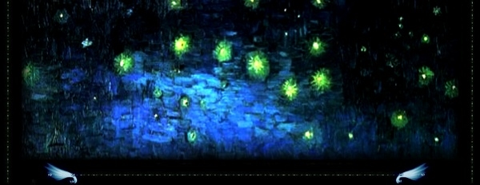
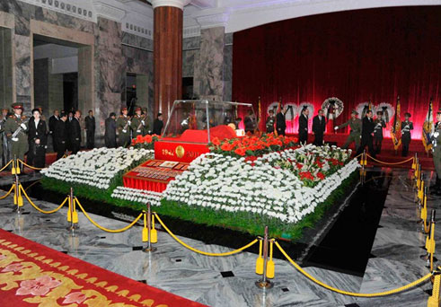
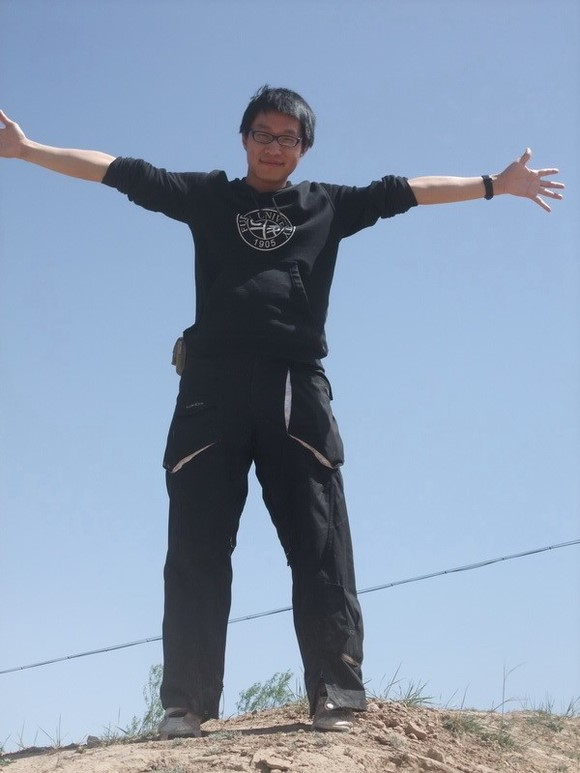
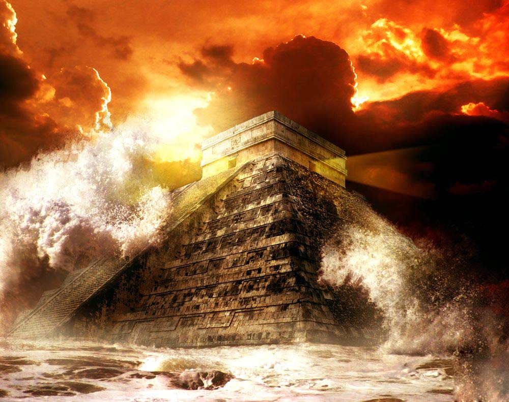

# ＜瓢虫君年终策划＞2012将至未至

**按语：** **2012就要到了，瓢虫君还没有过一个生日呢！** **瓢虫君诞生于2011年四月，是华语大学生人文思想门户——北斗网在人人网打造的一个思想交流平台和信息传递门户。瓢虫君关注的是在公共意见领域里冷静睿智的思考的回音。将这些传递给大家，是瓢虫君的目标，也是瓢虫君的荣幸。** **一路走来，瓢虫君形象渐渐深入人心，靠的是各位人人好友的支持。2011年终之际，瓢虫君想通过这个简单的年终策划把与大家共同见证的2011总结给大家。通过这些散落的事件的记述，也许你能重拾思想中的线索，重新思考那个虽然宏大得不可信但一定能引起你心底微妙变化的问题。2012年来了，2012会不会来呢？** 

#  2012将至未至

## 

### **上篇：2012****将至——****理想的颠覆**

2012现在在流行的话语中，不是一个年份这么简单了。2012，要么上船，要么完蛋。2012话题的普遍流行，不仅仅是一个玩笑那么简单，它反映的人类的一种情绪：自杀。人类现在公认的价值中，是将自杀视为一种病态的，但在这种想把一切推倒重来又找不到方向的时候，只好为自己设想一种不可抗拒力的毁灭了。就让我们不用负责地离去吧。而这事实上是在宣告，人类的各种理想，意识形态领域里的诸神，都在某种程度上破产了。这一点在中国体现得似乎更明显。

#### **微语大事记**

**黄薄码live：**某豆友：“昨天被车撞了，还没等司机下车，我就赶紧跑了，我这样做对吗？”众豆友：“LZ真是捡了条命啊！！！！！！！！！！” **韓屹.zip:** 一國兩制，從蒙牛做起。 **張楷東 :** 看了国务院关于三峡的新闻，基本讲了3点：1、三峡是上届政府建的，与本届政府无关；2、本届政府在三峡问题已经做了大量工作；3、出现的问题只能让下一届政府去完善了。 **怡婷eating :**清华大学新闻学院李希光老师：“真维斯楼”是“真理维护者居于斯楼”。班尼路同意，他们将冠名哲学系大楼，意为“班班读尼采，人人走大路”；鸿星尔克冠名图书馆，意为“鸿鹄飞星，尔辈克己”；但杜蕾丝冠名食堂失败，“杜康之醇品于味蕾斯斯入扣”意境不高，被杰士邦击败——“杰出之士护国安邦”。 **宋健 :**郭美美就是一只傻傻的小蝴蝶，她只是轻轻扇动了几下翅膀，于是起风了：风刮到了她背后的那个人，刮到了红十字会，刮出了一个庞大的伪善的利益集团，刮出了人们的失望、震惊和愤怒，形成了一场席卷全国巨大的风暴。。。 

 **潘德宸:** 某官员被举报强奸妇女，到警察局接受询问。警察：您带套了么？官员：没有。警察：手套呢？官员：没有。警察：事发时，床上有被套么？官员：没有。警察：枕套呢？官员：也没有。警察：……您炒股吗？官员：炒啊，用公款。警察：有股票被套吗？官员：有啊！警察松了口气：有套就不算强奸！ **丁云峰 :**晚上理发，有人在说这次动车事故，老板帮我吹着头发突然默默的说：“老子他妈买个500块钱的电子狗，都知道提醒老子前方几公里测速，前方几公里有服务站，超速了还提醒减速，前面是左转还是右转！这花了几百几千个亿的东西，前面停个那么大的东西，居然没反应！直接撞上！真他妈的神奇 

 **舟亢:** 李阳一上讲台，在场的人便都看着他笑，有的叫道，“李阳，你又打你老婆了！”李阳便涨红了脸，额上的青筋条条绽出，争辩道，“打外国老婆不能算打……外国老婆……扬我大中华国威的事，能算打老婆么？”接连便是难懂的话，什么“I enjoy losing face”之类，引得众人都哄笑起来，充满了快活的空气。 **叶翀:** 当联防队员踏进杨武家里的时候，悲剧就已经不可避免了：他没冲出去，被道德超人们骂为懦夫；他冲出去秒了施暴者，他就成了夏俊峰；如果他含恨在心之后血亲复仇；他就成了杨佳。在这个法律和功德都已丧尽的社会里，魔鬼找你跳舞，你能做的只有等音乐结束 **李悦茹:** 中国的良心被一个拾荒的捡起来了；中国的丑恶被一个瞎子看到了。 **曾庆飞 SS**: 金狗bye，金狗bye，金狗on the way~ 

 （内容来源于瓢虫君栏目《七星微语》）  **出路？争论！** [面对如此失望的社会，去还是留？](http://blog.renren.com/blog/362359989/726105487) [想改变这个社会，暴力还是非暴力？](http://blog.renren.com/blog/362359989/729346360) （内容来源于瓢虫君栏目《七星视点》） [向左走，向右走？](http://blog.renren.com/blog/362359989/732566101) （内容来源于瓢虫君栏目《七星论道》） 

### **下篇：2012****未至——****文明的遗产**

人之所以为人，是因为有意义和价值。那些意义和价值或被人利用，来达到权力和利益的目的，便成了意识形态。正是意识形态，才容易破产，因为它太容易被识破它的虚伪性。但是除了这些体系化的理想的背后，还有一些颠扑不破的价值在支持着人的精神，这些就是人类文明的遗产，这些就是人性的产物。康德说：“有两种东西，我对它们的思考越是深沉和持久，它们在我心灵中唤起的惊奇和敬畏就会日新月异，不断增长，这就是我头上的星空和心中的道德定律。”但对我们来说，很多时候有些东西并不能说清道明，但我们仍然信仰。正如在我们中间，也流传着一句名言：“是的，虽然自知终须一败，但请再多坚持一会，别向这个操蛋的世界投降。”

 **那些不投降的人们** 

 [吴恒——一个过路人的故事](http://blog.renren.com/blog/362359989/734637852) 

 [许志永的中国梦](http://blog.renren.com/blog/362359989/792479251) （内容来源于瓢虫君栏目《七星人物》） 

### 终篇：2012到来——文明的复归

科幻作家刘慈欣在他的杰出作品《三体》中记述了人类社会在外星三体文明的威胁下全盘崩溃，经历了一个大低谷时期，社会的价值、秩序、角色都不复存在，人类曾面临灭亡的境地。而这时人们变得超脱却激发了创造的能力，大低谷后来过去了，从绝望到复兴这个过程的精神状态给了人们启示，人们塑造了一个纪念碑：给岁月以文明，而不是给文明以岁月。它的意思是关注文明能延续多久，不如关注经历着的岁月能在多大程度上实现文明。文明的价值不在于延续而在于升华，不在于负责而在于享受。这样文明才能更文明，岁月才能更文明。

而对于个人，2012将至未至，这不是一个确切的时间点，而是一个过程，一种心境，一段经历。不论你或焦虑还是或坦然地等待着未来，反观自己的内心才是最重要的。

（编辑：刘一舟）

 
