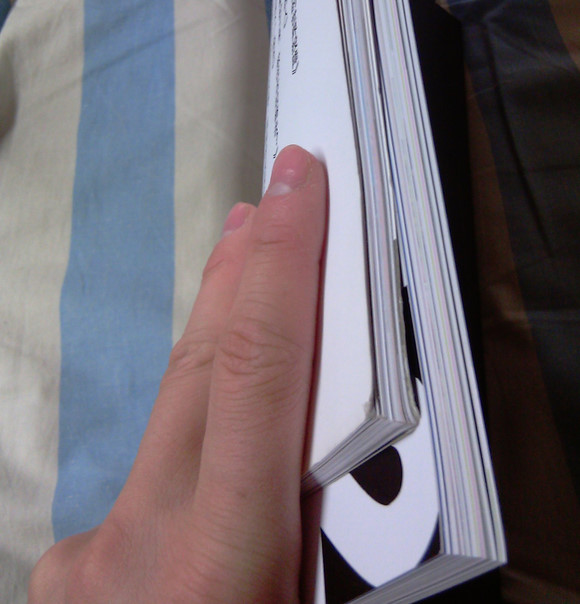
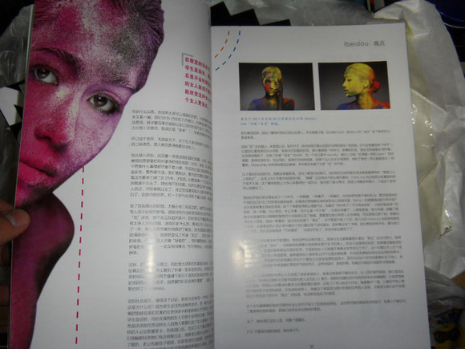
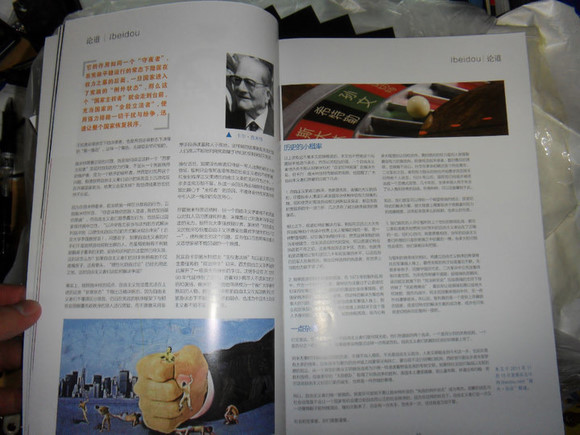
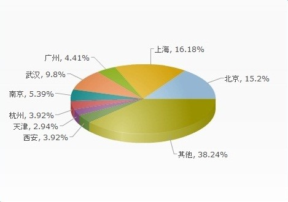

# ＜站务＞北斗2011.6-2011.12精选集半年刊的正式通告

 

# 北斗2011.6-2011.12精选集半年刊的正式通告

## 

  **我想大家都已经久等了。精选集在北京部分地区试运营已经一周了，但迟迟没有正式的宣传，欲购买者也总被告知继续等待。这是完全是考虑到以后可能出现的混乱，做了一些部署。当然，目前部署并未完全完成。但已经可以向读者发放了。以下就是本次精选集的正式通告。** 

#### 目的：

首先仍然说明一下北斗为什么要制作精选集：北斗制作精选集完全没有利益上的目的，为精选集所做的定价也完全是考虑到印刷成本，运输成本，以及运营中可能的失误造成的额外成本而定的。精选集的工作人员不会得到任何金钱上的利益。（实际上，上次精选集我们的工作人员赔了很多钱）。 北斗制作精选集的目的主要有以下几点： 1 .精选集是交流圈内成员之间情感，增加认同感的一种方式。 2. 起到对半年来网站内容的总结、纪念、收藏的作用。 3. 入选精选集是北斗对一篇文章以及一个撰稿人的最高肯定，北斗希望借此能激励更多撰稿人写出更优秀作品。 4. 精选集是撰稿人、责编、美编、运营人员通力合作的结果，是集结斗内最优秀的资源做出的产品，是北斗实力与形象的一个最佳展示。 **因而，购买北斗精选集完全取决于读者自愿。** 精选集的目录已经提前放出，[http://blog.renren.com/blog/182792098/809776630](http://blog.renren.com/blog/182792098/809776630)。其中的文章在我们主站(ibeidou.org)上全都可以找到。不愿购买的读者可以在主站上免费阅读。 

#### 参数：

本次精选集采用A4大小，105g铜版纸印刷，内页108页，封面和封底为250g铜版纸。 

 和去年80g铜版纸的对比，略微厚一点，手感更为结实，耐用，更适宜做蹂躏的对象~ 

 今年的最大亮点就是专业的排版。前后三位排版人员参与其中，从版面的美观，阅读的流畅，概念的表达三方面仔细斟酌。力求使读者在翻阅精选集时，除了思想的碰撞外，还能得到审美上的享受。 

#### 关于购买方法：

首先要告诉读者的是，上一本精选集我们的工作人员赔了很多钱。原因是多方面的，邮件收发过程中的信息核对错误，被邮局没收、快递寄错后的赔付，以及银行卡汇款信息无法核对造成的没汇款就发货等。上次的经验使我们感受到，北斗在应对大规模邮件来往及交易时，仍显得力不从心。 所以本次精选集经营，为了尽可能地避免错误，也为了读者的实惠，本次精选集将采取自取为主，邮购为辅的方式。在全国在八个主要城市——北京，上海，广州，武汉，天津，南京，杭州，西安——设立代理，在以上城市的读者鼓励向当地负责人当面拿取。（这些城市的选取原则是城市的大小，往年发放的情况，调查问卷的结果，以及当地是否有北斗工作人员。）在此附上调查问卷的结果： 

 可以看出，八大城市占据全国60%左右的份额，考虑到京沪的数据可能偏于保守，所以需要邮购的应该不足40%。 

#### 关于价格：

由于找到了比较好的印刷厂以及印量加大到了1000本，所以比上次大幅降低了成本。 **本次精选集定价15元。** **而选择邮购的朋友需自付运费。**由于北斗精选集是没有刊号的非正规出版物，走邮政会被扣下。我们统一选择国内口碑最好，丢包率最低的顺丰快递，采用顺丰到付的形式。顺丰到付为首重1kg以下20元，距离较近可能12元。请在接受这个运费的情况下再向我们邮购。 由于运费较高，所以鼓励联合同一学校的几个人组团购买，这样可以分摊运费，也能减轻工作人员的运营成本。 

#### 邮购付款方式：

上次的运营的另一个错误来源就是银行转账信息很难确认。实际上，银行转账是很难查询转账来源的卡号、姓名等信息的，所以分不清究竟是谁付的款。所以这次我们请读者尽量选择支付宝。如果您实在实在实在实在厌恶支付宝，实在实在实在实在热爱银行转账，那也可以。但请加上校验位，即在15元整的小数点后面加个零头，如15.12元。校验位将作为您个人的独有信息帮助我们确认付款信息。 

#### 八大城市代理：

（名字是超链接，可直接点击）  北京：清华@应宁康，北大@王也，人大@于灵歌，北大医学部@龙匡夔，首师大@姜元昊，中国传媒大学@李东瑶 上海：同济@刘一舟，卢湾区@広川護 武汉：武大@田军 广州：华南理工@苗硕 南京：南大本部@钱广盛 杭州：浙江工商大学@钟欣格 天津：天津大学@黄希敏 西安：西安科技大学@徐海星  在以上八大城市的读者可就近选择代理点当面自取。鉴于有些精选集还没到送到代理人手上，请先向代理人询问并预定。**请相信，您的一点点不便，在工作人员这儿将会被放大几十倍甚至几百倍。** 

#### 邮购方式：

本次邮购将有北京和上海方面的工作人员同时运营。 江浙沪和安徽的读者需要邮购的，请**通过邮件**向上海方面联系。 上海方面邮箱：jingxuanjish@gmail.com  全国其余地区需要邮购的，请**通过邮件**向北京方面联系。 北京方面邮箱：jingxuanjibj@gmail.com 

#### 邮件格式：

邮件名 [省市-姓名-本数] 邮件内容：[邮编-详细地址-手机号-选择支付方式] 发邮件后，会有工作人员和您联系。  再次强调：邮箱只针对需要邮购的同学，能够当面自取的请直接联系代理人员。  如果还有任何疑问，可直接向北京邮箱询问：jingxuanjibj@gmail.com 

 

### 最后，要对关注北斗的朋友们说一声谢谢，是你们的支持才使我们走到现在。

 
