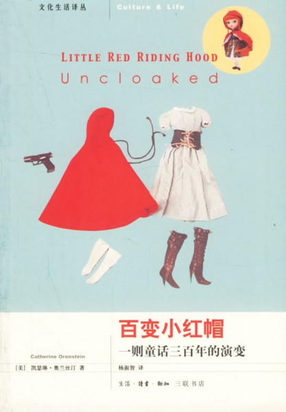
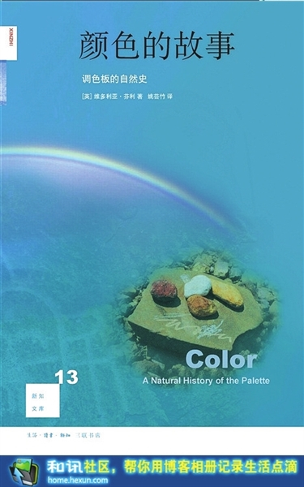
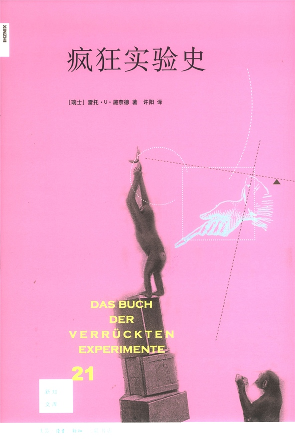
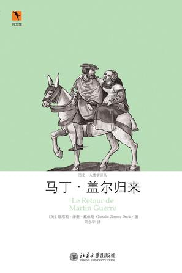

# ＜荐书＞本期主题：这货不是历史书

### 

### 

# 本期主题：

# 这货不是历史书

### 

## 荐书人 / 杜慧颖（南京大学）

### 

### 

我至今记得大二的时候马克思主义哲学原著选读课考试，问马克思的实践概念：实践到底是什么？考试时我们扯了一大堆概念，结果老师说，其实答案就是吃喝拉撒。 我们看到过很多宏大叙事的历史书，告诉你历史上的战争、政治、经济、文化、科技，然而很少有能够通过一个小巧精致的切入点，带你管中窥豹看待历史背后的文化，关注处在不同历史环境中，真实的个体的真实的生活。这种历史就是实实在在的，最终落实到吃喝拉撒里去的生活。以下这些书都是一些去掉了学究气，丢掉了一本正经的历史书，是仿佛还冒着热气就端到你眼前来的一场真实还原。 

### 

#### 推荐书籍（点击书目可下载）：

**1、 [《百变小红帽》](http://ishare.iask.sina.com.cn/f/12358357.html)**

**2、 [《颜色的故事——调色板的自然史》](http://ishare.iask.sina.com.cn/f/13319181.html)**

**3、 [《双轨：现代世界的意外起源》](http://ishare.iask.sina.com.cn/f/13243052.html)**

**4、 [《疯狂实验史》](http://ishare.iask.sina.com.cn/f/10944578.html)**

**5、 《马丁•盖尔归来》**

**6、 《屠猫记——法国文化史钩沉》**

### 

**[《百变小红帽》](http://ishare.iask.sina.com.cn/f/12358357.html)**

### 

### 

### 

“嗨，小红帽！”大恶狼在森林里发现这个女孩时说，“现在我将卸下你的小红帽，拉高你的小红裙，脱掉你的小红内裤，尽情享受鱼水之欢！” 我不得不承认，我是怀着毁掉各位的童年的念头向大家推介这本《百变小红帽——一则童话三百年的演变》的。 谁不认识小红帽？然而在当历史回翻三百年，那个在森林里遇见野狼的小女孩在外婆的床上被野狼真的只是吃掉了么？还是……？请接着往下想，一则童话故事的背后到底能够隐藏多少历史？ 几百年前《小红帽》曾经是法国宫廷里的成人故事，后来成为道德教育的入门书，随着女性主义兴盛，小红帽学会自行脱险甚至征服野狼。之后，大工业化时代的小红帽姑娘擦着蜜丝佛陀的口红等待“野狼”的出现。现代化以至于后现代化的脚步推动着剧情越来越需要打上马赛克：艳舞女郎小红帽，SM女王小红帽……女性角色越来越主动出击，社会地位和阶级显著上升。而相比之下，男性形象却从诱奸者，到保护者，最后成为了——异装癖。 我们常常用单纯的眼光来看待童话故事，然而童话故事却能够供人们透视社会、透视文化，以及社会变迁的过程。 

### 

**[《颜色的故事——调色板的自然史》](http://ishare.iask.sina.com.cn/f/13319181.html)**

### 

### 

### 

如果发动一场战争，目的不是为了抢石油，而是为了艺术为了颜料，听上去是不是会浪漫很多？胭脂红因其鲜艳的色彩而成为许多画家不可替代的选择，然而它却是用西班牙殖民地的一种仙人掌上的小虫的血液做成的（这放到今天动物保护主义一定不干了），因而把这种小虫偷出来打破西班牙垄断又是一个充满历险的故事。如今化工合成颜料已经取代了那些原始的颜料产生方式，而画家也不用去太担心褪色的问题。就好象科学家揭下彩虹的面纱一样，看来艺术虽然终于不再沾着战争和殖民的鲜血了，但是仔细想想，仿佛又少了一点点鲜活的味道。 这本《颜色的故事》不同于一般意义上的艺术史美学史的书，作者并没有将其按照历史年代划分，而是借着不同的颜色带你探寻全世界各个角落。可千万不要小看一管颜料，其背后可能是殖民、战争或者是爱情故事。 

### 

**[《双轨：现代世界的意外起源》](http://ishare.iask.sina.com.cn/f/13243052.html)**

### 

### 

### 

这是一本很奇怪的书。首先这是一本科技史书，但是他并不是按照时间顺序，也不是按照国家、人物或者任何一种你能够想到的方式编撰的。然后阅读这本书的方式很奇怪，在一个章节内，所有单数页码串联起来是一个故事，双数页码串联起来也是一个故事，而两个故事同首同尾。即由同一个历史事件触发两支故事路线，最后到达同样的一个结果。其三，这本书简直可以说是一本非常非常琐碎的八卦史，里面没有完整地叙述过一件完整的事情，而整本书就是由一连串多米诺骨牌似的事件构成的。把这些故事串联起来，就是现代世界的起源。 说到这里，这本神奇的书，到底想要说明什么的？ 正如这本书的名字透露给我们的，现代世界的起源正是源于这一系列的意外。历史，不是必然性的推导过程，而是由偶然性构成的。 

### 

**[《疯狂实验史》](http://ishare.iask.sina.com.cn/f/10944578.html)**

### 

### 

### 

这本书里搜集了14世纪以来全世界各种疯狂的试验，有成功的有失败的。揭示人类怎样一步一步通过实践认识世界的过程。令人感觉震撼的是最后的几个心理学实验。心理学实验对于伦理问题的讨论显得尤其深刻，不是教你如何才能搭到车的那四个。 

### 

**《马丁•盖尔归来》**

### 

### 

### 

马丁•盖尔其实是一个16世纪，法国靠近西班牙交界处的一个小农民而已。然而围绕“马丁•盖尔”却发生了一件至今看来也是“离奇的案件”。马丁•盖尔年轻的时候离家出走，多年之后有一个长相酷似，又能够回忆起许多小时候故事的人回到这个村子里，宣称他就是马丁•盖尔。于是这个新马丁•盖尔爬上了妻子的床，履行一个丈夫、继承人、哥哥和村民的角色，没有一个人识破。直到有一天，马丁•盖尔的叔叔将其告上法院，说他是个冒牌货。正当法官的天平开始倒向支持这个新马丁的时候，一个瘸腿的马丁•盖尔出现了。 这本书通过对于这个案件的还原，也同时还原了16世纪法国农村的宗教、法律、经济贸易、习俗等等风貌。对于历史的研究，有宏大的战争和经济，宫廷，政治，城市，然而农村历史以及渺小的个体在这当下的历史环境中如何实在地生存，是容易被人遗忘的东西。 然而我们看似作者已经还原了历史，她最后却问了一句，这是不是庞赛特（冒牌马丁•盖尔）又演出了一次？ 

### 

**《屠猫记——法国文化史钩沉》**

### 

### 

### 

相类似的书还有《屠猫记——法国文化史钩沉》，不过此书中文译本是个坑。总之，这本书讲的是18世纪巴黎的印刷所工人，由于厌恶那为主人宠爱而夜夜嘶叫的猫，于是设计让主人下命令去赶走它们。他们趁机抓住那些猫，还上演了一个有模有样的审判仪式。作者用风趣的语言来描绘这场闹剧，最终直指法国文化史——当时的人们是如何思考的？ 

### 

### 

（采稿：徐毅磊 责编：徐毅磊） 

### 

### 
