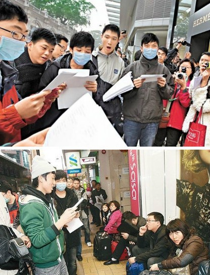
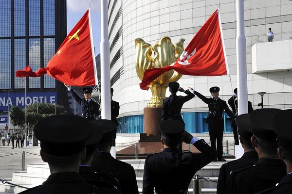

# ＜香港“忍够了”专题＞你的名字比我生命更重要

**这个世界从来没有绝对的是非。道理和立场本身就是连着的，讲道理，就是把对方拉到自己的立场上，和气地解决事情。**  

# 你的名字比我生命更重要

## 文/ 郑佩思(香港浸会大学)

 

我的爱国，倒没有上升到要齐家治国平天下，或者非得牺牲小我成全大我的境界。

我只是有中国人的意识，我更清楚自己是深圳户口，在分类上自己是内地人。这个定位，到了香港我依然没有改变过。再尴尬也好，我也必定在一连串流利的广东话之后告诉local，对，我真的是mainland。

我比很多内地生听得更多，因为和local共事，和他们相处久了他们自然就忘了我的内地生身份，言语里更加坦率。现在的舆论环境十分敏感，我的用字总归是要小心。只是在我接触的许多local当中，不少人都不信任内地，表现在害怕和mainland做roommate，谈起内地依然还是“到了公厕会被人肢解”的印象，诸如此类。

听他们讲这些的时候，我还是低着头干自己的事情，或者礼貌地笑一笑。我希望自己没有闪过什么不愉快，因为我想听听他们还能讲出什么话。心里纠结成一团，我甚至后悔过自己上庄，因为很多事情，眼不见为净。是我自己非得握紧通往另一个世界的钥匙就像咬紧牙关一样，这里不赘述。只能说，接纳另一个立场本身就是一件非常让人无力的事情。

我爷爷年轻时当海员，周游列国，籍贯是宝安县，就是现在的深圳。后来举家偷渡到了香港，在香港落地生根，没有人再会知道他们曾经也是内地人。我的亲戚们，有英语老师，有时装设计师，有在港铁工作的职员，包括我爸，也对香港的发展有过微薄的贡献。这样一帮人，也不过有内地人的血统，但不知道是谁，非得将两者割裂开，本是同根生，怎么分清谁是local谁是mainland？

再说那些港人眼中的蝗虫，我作为一个在香港读书的学生，确实深为内地庞大的自由行游客所困惑，因为旺角街头全都是内地人，街道堵得水泄不通，这些我当然是不满。但当不满变成语言，骂出来的竟然是“蝗虫”二字，还要上报，香港作为自由文明之地，标榜自由，应该明白自由必然建基于尊重吧。

香港明明就是在享受内地带来的巨大消费力，也许又有老派的港人会说那时候没有回归，香港还不照样非常繁荣？是，没错，90年代初香港的经济是黄金时代，我爸当时在一家外资的家私公司工作，收入比起回归后丰厚得多，但是后来还不照样随着金融危机成了一团泡沫，我不歌颂国家，但当时中国确实为香港经济复苏承担了不少责任。

香港人大多不太关心政治，对历史也颇是冷感。他们只对眼前的生活比较感兴趣，他们不清楚抗战的过程，不知道中国之独立有多艰难，更不会明白，香港回归的意义到底在哪里。而由于他们从父辈那听来的内地的混乱，他们至今还对内地保有非常古老的印象，而且拒绝更新。

我常常觉得，如果一个地方，连年轻的力量都拒绝新思想的交流，这个地方该有多脆弱。我很不愿意重复一些内地人对香港人的评论，诸如眼红内地现在发展快或者说香港人过桥拆板什么的，这些我都没办法说出口，因为毕竟两方都是自己人，何必把话说绝？我只是担心，今天一句“蝗虫”，还有之前地铁上进食等等事件，总有一天，累积成巨大的矛盾，成为阻碍交流的高墙。我猜想，有的人看到会很开心。

我是相信阴谋论云云的。所以眼下的状况大概有些人在看热闹看得特开心，说得严重些，我想到那些台独分子估计看得很是带劲，巴不得香港人和内地人打起来吧。现在我们在这边你一句我一句，暗地里别人都在笑呢。一家人相煎何太急，事情本身不大，是不怀好意的舆论和愚蠢的某些人炒热罢了。我今天突然想讲话，纯粹是做理性分析，顺便讲讲自己这些月来的感慨。

这个世界从来没有绝对的是非。内地人站在香港的土地上，道理就是在香港人上，这个没法说。你内地人说得再多再礼貌，别人一个“微妙的用字”就可以把你的话掐灭，甚至给改成别的什么话。换做是内地也一样。道理和立场本身就是连着的，讲道理，就是把对方拉到自己的立场上，和气地解决事情。我们今天对“蝗虫论”耿耿于怀，与香港人恶语相对，矛盾何时才能化解？

是不是应该冷静一点，想一想自己中国人的身份，即便平时你谩骂多过赞美，不满多于欣赏，也请你挂着中国人的脸面，不要再骂了。目光放长远些，无理性的争吵没有未来。

对于港人，我只能说，作为一个内地生，作为一个在香港就读新闻系的内地生，我真的很心痛。心痛他们忽视新闻道德，心痛文明之地说出那样暴力的言语，心痛还能一呼百应那么多人看不清真相。我想象要是有一天内地稍微行差踏错，香港人会不会暗地里还笑话她，明明自己也受到波及？

现在，内地开始醒了，我很开心有些理性的声音敢于发声，自由文明需要时间和耐心去灌溉，回归的好处是有一个自由文明的样板放在那，我们可以学一学，然后具体分析，最后自由一把。发展本来就需要时间，但重要的是她正在发展，所以请不要再那么多的谩骂——香港却还沉睡在未回归的梦里，省省吧，说真的。

今天我在这里说这些话，可能没什么作用，仅仅做单纯的理性分析，当然里面还是夹杂着不解和难过。听到“蝗虫”两个字真是瘆人，心里都是冰凉冰凉的，这么说话未免太野蛮。我不知道自己可以做什么，或许也就是讲讲内地的好，讲讲自己在深圳活得多自在，何况我和我的庄员也很少谈论政治，平日里也能和睦相处，其实很少能改变他们些什么。

你的名字比我生命更重要，是一首爱国歌曲，不知道香港人听过没听过。什么时候，我们都能执着于一个中国人的身份，在同一个立场上说话，那会是多么可爱的时光。

 

（采编：应宁康；责编：陈锴）

 
